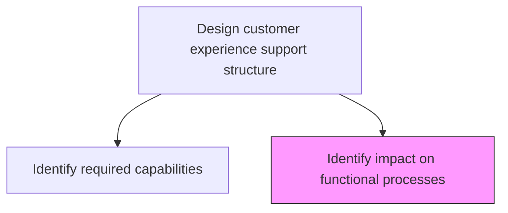
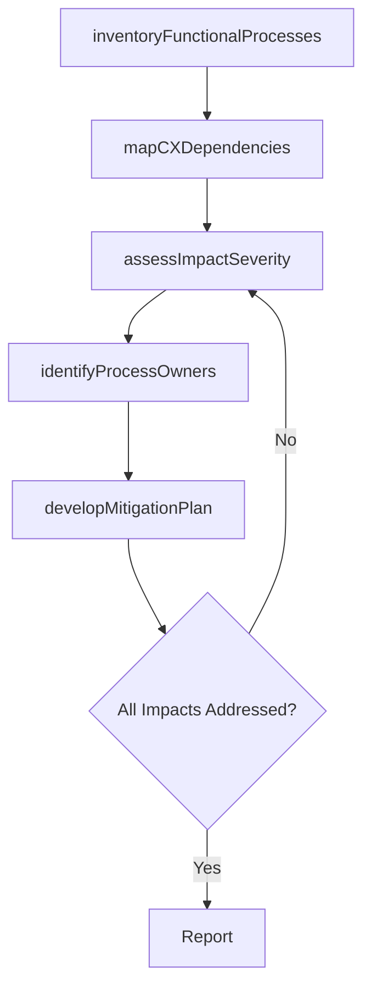

# Identify impact on functional processes

> Business-as-Code definition for CX process impact assessment. Models the analysis of how the customer experience support structure affects existing functional processes across sales, service, marketing, and operations.

## Overview

Identifying the affect of customer experience through customer experience support structure on other functions of customer services related to customer.

## Process Hierarchy



## GraphDL

```yaml
identify:
  object: Impact On Functional Processes
  actor: ProcessAnalyst
  result: FunctionalImpactAssessment
```

## Actions

| Action | Description |
|--------|-------------|
| inventoryFunctionalProcesses | Catalog the functional processes that interact with or support customer experience |
| mapCXDependencies | Document how CX support structure changes affect each functional process |
| assessImpactSeverity | Evaluate the degree of change required for each affected process |
| identifyProcessOwners | Determine the owners of each impacted functional process |
| developMitigationPlan | Create plans to address disruption and manage process transitions |

## Events

| Event | Description |
|-------|-------------|
| functionalProcessesInventoried | All CX-related functional processes cataloged |
| cxDependenciesMapped | Dependencies between CX structure and functional processes documented |
| impactSeverityAssessed | Change severity evaluated for each affected process |
| processOwnersIdentified | Owners of impacted processes confirmed and notified |
| mitigationPlanDeveloped | Transition and disruption mitigation plans created |

## Searches

| Search | Description |
|--------|-------------|
| getImpactAssessment | Retrieve the functional impact assessment report |
| listAffectedProcesses | Access processes affected by CX changes filtered by severity or department |
| getDependencyMap | Retrieve the CX-to-functional-process dependency map |
| getMitigationPlan | Access the mitigation and transition plan for impacted processes |

## Process Flow



## RACI Matrix

| Activity | Responsible | Accountable | Consulted | Informed |
|----------|-------------|-------------|-----------|----------|
| inventoryFunctionalProcesses | ProcessAnalyst | VP Customer Experience | Operations | IT |
| mapCXDependencies | ProcessAnalyst | VP Customer Experience | CXDesigner | BusinessUnitLeads |
| assessImpactSeverity | ProcessAnalyst | VP Customer Experience | ProcessOwners | Finance |
| identifyProcessOwners | ProcessAnalyst | COO | HR | DepartmentHeads |
| developMitigationPlan | ProcessAnalyst | VP Customer Experience | ChangeManagement | AllAffectedTeams |

## Related Processes

| Process | Relationship |
|---------|-------------|
| 1.2.7.3.1 Identify required capabilities | Upstream - capability gaps inform process impact analysis |
| 1.2.7.4 Develop CX roadmap | Downstream - process impacts feed into roadmap planning |
| 1.2.3 Coordinate and align functional and process strategies | Parallel - functional alignment supports CX process changes |

## Related Departments

| Department | Role |
|-----------|------|
| Customer Experience | Identifies CX-driven process changes |
| Operations | Assesses operational process impacts |
| Sales | Evaluates impact on sales processes and workflows |
| Customer Service | Assesses impact on service delivery processes |
| IT | Evaluates technology process and system impacts |

## Related Occupations

| Occupation | Involvement |
|-----------|-------------|
| Process Analyst | Leads functional process impact assessment |
| Change Management Specialist | Plans mitigation and transition strategies |
| Operations Manager | Validates operational process impact findings |

## KPIs

| KPI | Description | Unit |
|-----|-------------|------|
| Processes Assessed | Number of functional processes evaluated for CX impact | Count |
| High-Impact Process Count | Number of processes requiring significant changes | Count |
| Mitigation Plan Coverage | Percentage of high-impact processes with approved mitigation plans | % |
| Transition Completion Rate | Percentage of process transitions completed on schedule | % |

## Usage

```typescript
import { identifyImpactOnFunctionalProcesses } from '@headlessly/identify-impact-on-functional-processes'

const impact = identifyImpactOnFunctionalProcesses()

// Inventory functional processes related to CX
const processes = await impact.inventoryFunctionalProcesses({
  departments: ['sales', 'service', 'marketing', 'operations'],
  cxTouchpoints: ['onboarding', 'support', 'renewal']
})

// Assess impact severity
const assessment = await impact.assessImpactSeverity({
  processIds: processes.map(p => p.id),
  cxChangeScope: 'support-structure-redesign',
  severityLevels: ['critical', 'major', 'minor', 'none']
})

// Develop mitigation plan for high-impact processes
const plan = await impact.developMitigationPlan({
  assessmentId: assessment.id,
  severityFilter: 'critical',
  timeline: '6-months'
})
```
