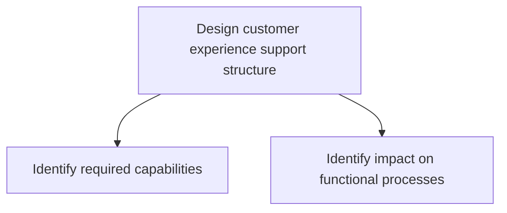
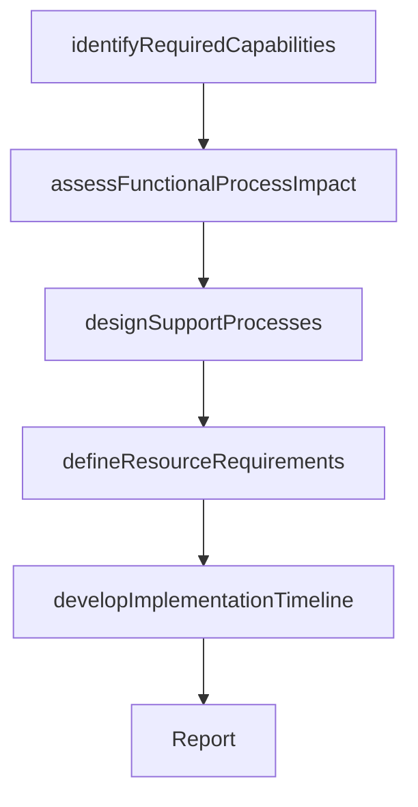

# Design customer experience support structure

> Business-as-Code definition for CX support structure design. Models the identification of required capabilities, technology platforms, organizational processes, and resource requirements needed to deliver and sustain the target customer experience.

## Overview

Creating a roadmap for customer experience support with an overall approach, process flow, and impact timeframe.

## Process Hierarchy



## GraphDL

```yaml
design:
  object: Customer Experience Support Structure
  actor: CXManager
  result: CXSupportStructureDesign
```

## Actions

| Action | Description |
|--------|-------------|
| identifyRequiredCapabilities | Determine the skills, tools, and platforms needed for CX delivery |
| assessFunctionalProcessImpact | Evaluate how CX requirements affect existing functional processes |
| designSupportProcesses | Create the operational processes for CX support delivery |
| defineResourceRequirements | Specify the staffing, budget, and technology investments needed |
| developImplementationTimeline | Create a phased implementation plan for the support structure |

## Events

| Event | Description |
|-------|-------------|
| requiredCapabilitiesIdentified | CX capability requirements documented |
| functionalProcessImpactAssessed | Impact on existing processes evaluated |
| supportProcessesDesigned | CX support operational processes created |
| resourceRequirementsDefined | Staffing and investment requirements specified |
| implementationTimelineDeveloped | Phased implementation plan completed |

## Searches

| Search | Description |
|--------|-------------|
| getRequiredCapabilities | Retrieve the CX capability requirements catalog |
| getProcessImpactAssessment | Access the impact analysis on functional processes |
| getImplementationTimeline | Retrieve the CX support structure implementation plan |

## Process Flow



## RACI Matrix

| Activity | Responsible | Accountable | Consulted | Informed |
|----------|-------------|-------------|-----------|----------|
| identifyRequiredCapabilities | CXManager | ChiefCustomerOfficer | IT | HumanResources |
| assessFunctionalProcessImpact | CXAnalyst | CXManager | Operations | ProcessEngineering |
| designSupportProcesses | CXManager | ChiefCustomerOfficer | CustomerSuccess | Engineering |
| defineResourceRequirements | CXManager | CFO | HumanResources | VP Strategy |

## Sub-Processes

| ID | Name | Description |
|----|------|-------------|
| 1.2.7.3.1 | Identify required capabilities | Determining the necessary skills and competencies required to efficiently collect customer experienc |
| 1.2.7.3.2 | Identify impact on functional processes | Identifying the affect of customer experience through customer experience support structure on other |

## Related Processes

| Process | Relationship |
|---------|-------------|
| 1.2.7.2 Design customer experience | Upstream - experience design defines support requirements |
| 1.2.7.4 Develop CX roadmap | Downstream - support structure feeds implementation roadmap |
| 1.2.4 Create organizational design | Related - CX support may require organizational changes |

## Related Departments

| Department | Role |
|-----------|------|
| Customer Experience | Leads support structure design |
| Information Technology | Evaluates and implements CX technology platforms |
| Operations | Integrates CX support into operational processes |
| Human Resources | Plans staffing and capability development |

## Related Occupations

| Occupation | Involvement |
|-----------|-------------|
| CX Manager | Leads support structure design and planning |
| CX Analyst | Assesses process impact and capability gaps |
| IT Solutions Architect | Designs technology infrastructure for CX delivery |

## KPIs

| KPI | Description | Unit |
|-----|-------------|------|
| Capability Readiness | Percentage of required CX capabilities in place | % |
| Process Integration | Number of functional processes updated for CX support | Count |
| Implementation Progress | Percentage of support structure milestones completed | % |

## Usage

```typescript
import { designCustomerExperienceSupportStructure } from '@headlessly/design-customer-experience-support-structure'

const cxSupport = designCustomerExperienceSupportStructure()

// Identify required capabilities
const capabilities = await cxSupport.identifyRequiredCapabilities({
  experienceDesignId: 'cx-design-2026',
  categories: ['technology', 'talent', 'process', 'data']
})

// Assess functional process impact
const impact = await cxSupport.assessFunctionalProcessImpact({
  capabilityIds: capabilities.map(c => c.id),
  functionalAreas: ['sales', 'marketing', 'service', 'product']
})
```
