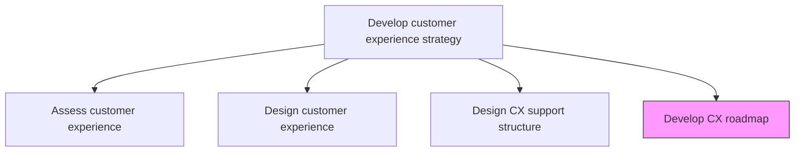
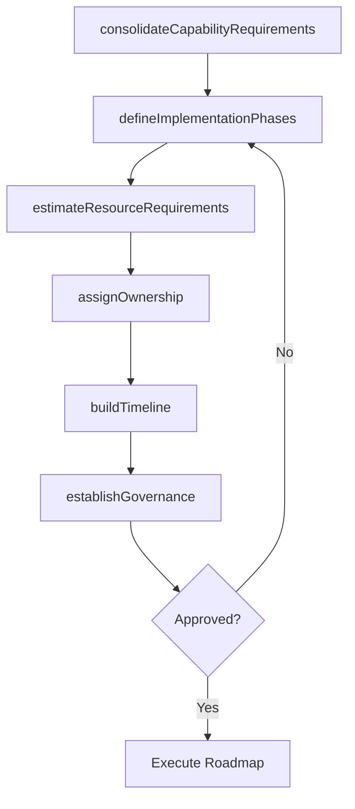

# Develop customer experience roadmap to develop and implement defined capabilities

> Business-as-Code definition for CX capability roadmap development. Models the creation of a phased implementation plan that sequences capability investments, defines milestones, and aligns talent and technology resources to achieve customer experience goals.

## Overview

Defining a standard guideline to create and execute the capacities of registering customer experiences in a timely manner. Create a common understanding of what behaviors are required to implement the strategy. Define what talent/skills your organization needs to reach customer experience goals.

## Process Hierarchy



## GraphDL

```yaml
develop:
  object: Customer Experience Roadmap To Develop And Implement Defined Capabilities
  actor: CXProgramManager
  result: CXImplementationRoadmap
```

## Actions

| Action | Description |
|--------|-------------|
| consolidateCapabilityRequirements | Aggregate all identified capability needs from CX design and support structure analysis |
| defineImplementationPhases | Sequence capability investments into logical phases with clear milestones |
| estimateResourceRequirements | Determine the budget, headcount, and technology resources needed per phase |
| assignOwnership | Designate accountable owners for each roadmap initiative and milestone |
| buildTimeline | Create a time-bound implementation schedule with dependencies |
| establishGovernance | Define review cadences, decision gates, and escalation paths for roadmap execution |

## Events

| Event | Description |
|-------|-------------|
| capabilityRequirementsConsolidated | All CX capability needs aggregated from design workstreams |
| implementationPhasesDefined | Roadmap phases and milestones sequenced and documented |
| resourceRequirementsEstimated | Budget and resource needs quantified per phase |
| ownershipAssigned | Initiative owners designated and confirmed |
| timelineBuilt | Implementation schedule with dependencies created |
| governanceEstablished | Review cadences and decision gates defined |

## Searches

| Search | Description |
|--------|-------------|
| getCXRoadmap | Retrieve the current CX implementation roadmap with phases and milestones |
| getRoadmapStatus | Access progress tracking data for roadmap initiatives |
| getResourceAllocation | Retrieve resource allocation by phase and initiative |
| getRoadmapGovernance | Access governance framework, review schedule, and decision gates |

## Process Flow



## RACI Matrix

| Activity | Responsible | Accountable | Consulted | Informed |
|----------|-------------|-------------|-----------|----------|
| consolidateCapabilityRequirements | CXProgramManager | VP Customer Experience | CXDesigner | Operations |
| defineImplementationPhases | CXProgramManager | VP Customer Experience | IT | Finance |
| estimateResourceRequirements | CXProgramManager | CFO | HR | Procurement |
| assignOwnership | VP Customer Experience | CEO | BusinessUnitLeads | AllStakeholders |
| buildTimeline | CXProgramManager | VP Customer Experience | PMO | Executive |

## Related Processes

| Process | Relationship |
|---------|-------------|
| 1.2.7.2 Design customer experience | Upstream - experience design defines what capabilities to build |
| 1.2.7.3 Design customer experience support structure | Upstream - support structure defines capability and process gaps |
| 1.3 Execute and measure strategic initiatives | Downstream - roadmap initiatives feed into strategic initiative portfolio |

## Related Departments

| Department | Role |
|-----------|------|
| Customer Experience | Leads roadmap development and capability prioritization |
| Project Management Office | Supports timeline management and milestone tracking |
| Finance | Validates budget feasibility and phase funding |
| HR | Plans talent acquisition aligned with capability roadmap |
| IT | Delivers technology capabilities per roadmap phases |

## Related Occupations

| Occupation | Involvement |
|-----------|-------------|
| CX Program Manager | Leads roadmap creation and ongoing management |
| Project Manager | Manages individual roadmap initiative execution |
| Change Management Specialist | Drives organizational readiness for capability changes |

## KPIs

| KPI | Description | Unit |
|-----|-------------|------|
| Roadmap Milestone Completion | Percentage of roadmap milestones achieved on time | % |
| Capability Delivery Rate | Number of new CX capabilities delivered per quarter | Count |
| Budget Adherence | Variance between actual and planned roadmap spend | % |
| Time to Capability | Average time from roadmap approval to capability go-live | Months |

## Usage

```typescript
import { developCustomerExperienceRoadmapToDevelopAndImplementDefinedCapabilities } from '@headlessly/develop-customer-experience-roadmap-to-develop-and-implement-defined-capabilities'

const roadmap = developCustomerExperienceRoadmapToDevelopAndImplementDefinedCapabilities()

// Consolidate capability requirements
const requirements = await roadmap.consolidateCapabilityRequirements({
  sources: ['cx-design', 'support-structure-analysis', 'capability-gap-assessment'],
  prioritization: 'strategic-impact'
})

// Define implementation phases
const phases = await roadmap.defineImplementationPhases({
  requirements: requirements.prioritized,
  horizons: ['0-6-months', '6-12-months', '12-24-months'],
  dependencies: true
})

// Build the implementation timeline
const timeline = await roadmap.buildTimeline({
  phases: phases.map(p => p.id),
  startDate: '2026-Q2',
  milestoneFrequency: 'monthly'
})
```
