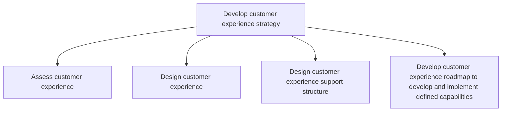
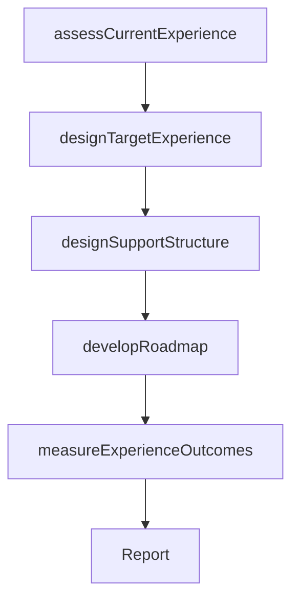

# Develop customer experience strategy

> Business-as-Code definition for customer experience strategy development. Models the end-to-end process of assessing current customer interactions, designing target experiences, building support structures, and creating implementation roadmaps.

## Overview

Defining a roadmap to meet customer expectations while considering how it will affect the business.

## Process Hierarchy



## GraphDL

```yaml
develop:
  object: Customer Experience Strategy
  actor: ChiefCustomerOfficer
  result: CustomerExperienceStrategyPlan
```

## Actions

| Action | Description |
|--------|-------------|
| assessCurrentExperience | Evaluate the current state of customer experience across all touchpoints |
| designTargetExperience | Define the desired customer experience including personas, journeys, and brand alignment |
| designSupportStructure | Create the organizational and process infrastructure to deliver the target experience |
| developRoadmap | Build a phased implementation roadmap with milestones and capability requirements |
| measureExperienceOutcomes | Track customer experience metrics and validate strategy effectiveness |

## Events

| Event | Description |
|-------|-------------|
| currentExperienceAssessed | Customer experience audit across touchpoints completed |
| targetExperienceDesigned | Desired customer experience defined with personas and journey maps |
| supportStructureDesigned | CX support infrastructure and process flows established |
| roadmapDeveloped | Phased implementation roadmap created and approved |
| experienceOutcomesMeasured | CX metrics collected and strategy effectiveness validated |

## Searches

| Search | Description |
|--------|-------------|
| getCXStrategy | Retrieve the current customer experience strategy and roadmap |
| getTouchpointAnalysis | Access customer experience scores by touchpoint |
| getJourneyMaps | Retrieve customer journey maps by persona |
| getCXMetrics | Access customer experience performance metrics |

## Process Flow



## RACI Matrix

| Activity | Responsible | Accountable | Consulted | Informed |
|----------|-------------|-------------|-----------|----------|
| assessCurrentExperience | CXManager | ChiefCustomerOfficer | CustomerSuccess | Marketing |
| designTargetExperience | CXDesigner | ChiefCustomerOfficer | ProductManagement | Sales |
| designSupportStructure | CXManager | ChiefCustomerOfficer | IT | Operations |
| developRoadmap | CXManager | ChiefCustomerOfficer | VP Strategy | ExecutiveTeam |

## Sub-Processes

| ID | Name | Description |
|----|------|-------------|
| 1.2.7.1 | Assess customer experience | Measuring customer feedback in regard to product and services effectiveness based on overall satisfa |
| 1.2.7.2 | Design customer experience | Creating a design of how customers interact with the business by analyzing data captured through var |
| 1.2.7.3 | Design customer experience support structure | Creating a roadmap for customer experience support with an overall approach, process flow, and impac |
| 1.2.7.4 | Develop customer experience roadmap to develop and implement defined capabilities | Defining a standard guideline to create and execute the capacities of registering customer experienc |

## Related Processes

| Process | Relationship |
|---------|-------------|
| 1.1.2 Survey market and determine customer needs and wants | Upstream - customer needs data feeds CX strategy |
| 1.2.2 Define and evaluate strategic options | Related - CX strategy is a key strategic option |
| 3.0 Market and sell products and services | Downstream - CX strategy shapes marketing and sales execution |

## Related Departments

| Department | Role |
|-----------|------|
| Customer Experience | Leads CX strategy development and implementation |
| Marketing | Provides customer insights and manages brand experience |
| Customer Success | Delivers post-sale experience and provides feedback |
| Product Management | Ensures product experience aligns with CX vision |
| Information Technology | Builds technology infrastructure for CX delivery |

## Related Occupations

| Occupation | Involvement |
|-----------|-------------|
| Chief Customer Officer | Accountable for CX strategy and outcomes |
| CX Manager | Leads day-to-day CX strategy execution |
| CX Designer | Creates journey maps and experience designs |
| Customer Insights Analyst | Provides data-driven customer experience analysis |

## KPIs

| KPI | Description | Unit |
|-----|-------------|------|
| Net Promoter Score | Customer likelihood to recommend the organization | Score (-100 to 100) |
| Customer Satisfaction | Overall customer satisfaction with experience | Score (1-10) |
| Customer Effort Score | Ease of customer interactions across touchpoints | Score (1-7) |
| Roadmap Milestone Completion | Percentage of CX roadmap milestones delivered on time | % |

## Usage

```typescript
import { developCustomerExperienceStrategy } from '@headlessly/develop-customer-experience-strategy'

const cxStrategy = developCustomerExperienceStrategy()

// Assess current customer experience
const assessment = await cxStrategy.assessCurrentExperience({
  touchpoints: ['website', 'mobile-app', 'contact-center', 'in-store', 'email'],
  metrics: ['NPS', 'CSAT', 'CES']
})

// Design the target customer experience
const design = await cxStrategy.designTargetExperience({
  personas: ['enterprise-buyer', 'self-service-user', 'technical-evaluator'],
  brandValues: ['simplicity', 'reliability', 'innovation']
})
```
