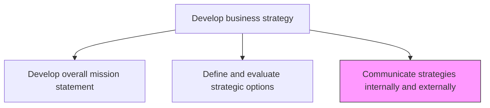
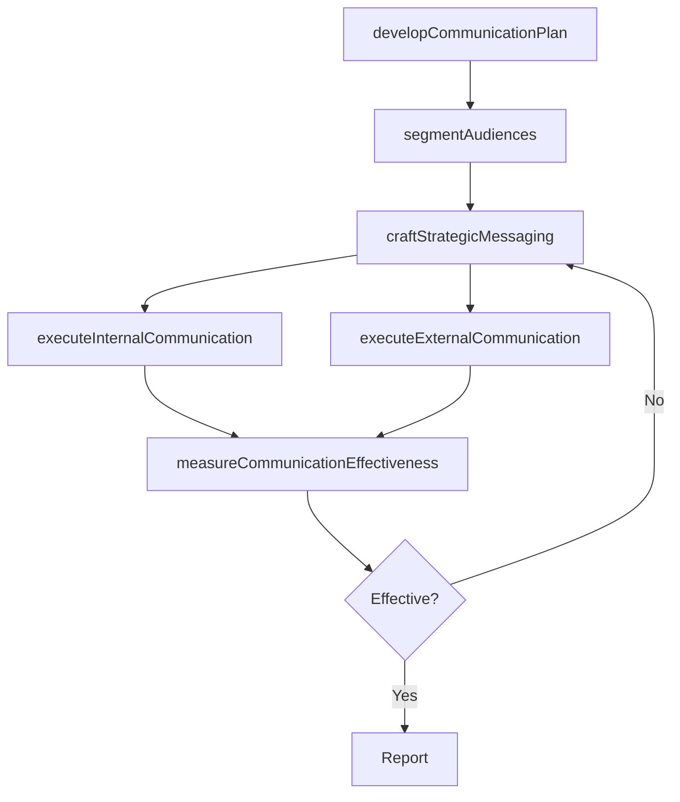

# Communicate strategies internally and externally

> Business-as-Code definition for strategic communication management. Models the dissemination of organizational strategy to internal teams, partners, investors, and other external stakeholders through structured communication programs.

## Overview

Conveying planned procedures and methods to both internal departments and external stakeholders like customers, suppliers, etc., in an effective manner based on organizational objective.

## Process Hierarchy



## GraphDL

```yaml
communicate:
  object: Strategies Internally And Externally
  actor: CorporateCommunicationsDirector
  result: StrategyCommunicationPlan
```

## Actions

| Action | Description |
|--------|-------------|
| developCommunicationPlan | Create a structured plan for cascading strategy to all audiences |
| segmentAudiences | Identify and categorize internal and external stakeholder groups |
| craftStrategicMessaging | Develop tailored messages that translate strategy for each audience |
| executeInternalCommunication | Deliver strategy communications to employees through town halls, emails, and intranets |
| executeExternalCommunication | Share strategy with investors, partners, and customers through appropriate channels |
| measureCommunicationEffectiveness | Track comprehension, engagement, and alignment across audiences |

## Events

| Event | Description |
|-------|-------------|
| communicationPlanDeveloped | Strategy communication plan created and approved |
| audiencesSegmented | Internal and external stakeholder groups identified |
| strategicMessagingCrafted | Tailored strategy messages developed for each audience |
| internalCommunicationExecuted | Strategy delivered to employees and internal teams |
| externalCommunicationExecuted | Strategy shared with external stakeholders |
| communicationEffectivenessMeasured | Comprehension and engagement metrics assessed |

## Searches

| Search | Description |
|--------|-------------|
| getCommunicationPlan | Retrieve the current strategy communication plan |
| getAudienceSegments | Access the list of stakeholder groups and their communication preferences |
| getMessagingByAudience | Retrieve tailored strategy messages for a specific audience |
| getCommunicationMetrics | Access engagement and comprehension metrics by audience and channel |

## Process Flow



## RACI Matrix

| Activity | Responsible | Accountable | Consulted | Informed |
|----------|-------------|-------------|-----------|----------|
| developCommunicationPlan | CorporateCommunicationsDirector | CEO | VP Strategy | Marketing |
| segmentAudiences | CorporateCommunicationsDirector | CEO | InvestorRelations | HR |
| craftStrategicMessaging | CorporateCommunicationsDirector | CEO | VP Strategy | Legal |
| executeInternalCommunication | InternalCommunicationsManager | CorporateCommunicationsDirector | HR | AllEmployees |
| executeExternalCommunication | InvestorRelationsManager | CorporateCommunicationsDirector | Legal | BoardOfDirectors |

## Related Processes

| Process | Relationship |
|---------|-------------|
| 1.2.1 Develop overall mission statement | Upstream - mission provides the foundation for strategic messaging |
| 1.2.2 Define and evaluate strategic options | Upstream - selected strategies provide communication content |
| 1.2.5 Develop and set organizational goals | Parallel - goals are communicated alongside strategy |

## Related Departments

| Department | Role |
|-----------|------|
| Corporate Communications | Leads strategy communication planning and execution |
| Human Resources | Supports internal strategy cascading and culture alignment |
| Investor Relations | Manages external financial and strategy communications |
| Marketing | Aligns customer-facing messaging with strategic direction |
| Legal | Reviews external communications for compliance and accuracy |

## Related Occupations

| Occupation | Involvement |
|-----------|-------------|
| Corporate Communications Director | Leads strategy communication program |
| Internal Communications Manager | Executes employee communication activities |
| Investor Relations Manager | Manages external stakeholder strategy updates |

## KPIs

| KPI | Description | Unit |
|-----|-------------|------|
| Strategy Awareness | Percentage of employees who understand the organizational strategy | % |
| Message Reach | Percentage of target audience reached by strategy communications | % |
| Engagement Rate | Interaction rate with strategy communication materials | % |
| Stakeholder Alignment Score | Degree of alignment between stakeholder understanding and intended strategy | Score (1-10) |

## Usage

```typescript
import { communicateStrategiesInternallyAndExternally } from '@headlessly/communicate-strategies-internally-and-externally'

const comms = communicateStrategiesInternallyAndExternally()

// Develop communication plan
const plan = await comms.developCommunicationPlan({
  strategy: 'annual-strategy-2026',
  audiences: ['employees', 'board', 'investors', 'partners', 'customers'],
  channels: ['town-hall', 'email', 'intranet', 'press-release', 'investor-call']
})

// Execute internal communication
await comms.executeInternalCommunication({
  planId: plan.id,
  audience: 'all-employees',
  format: 'town-hall-and-follow-up-email'
})

// Measure effectiveness
const metrics = await comms.measureCommunicationEffectiveness({
  planId: plan.id,
  dimensions: ['awareness', 'comprehension', 'alignment']
})
```
