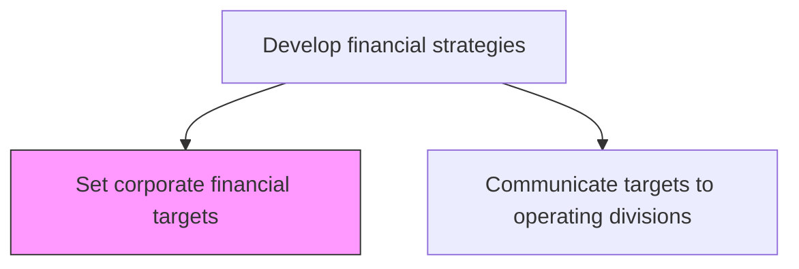
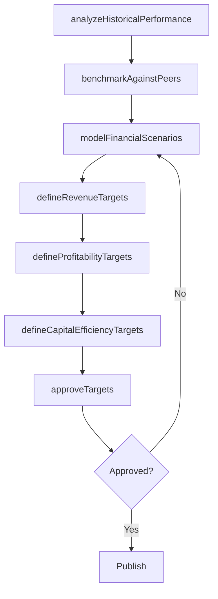

# Set corporate financial targets

> Business-as-Code definition for corporate financial target setting. Models the establishment of revenue, profitability, capital efficiency, and growth targets that translate organizational strategy into measurable financial objectives.

## Overview

Defining corporate-level financial targets based on strategic objectives, market conditions, and historical performance. Establish revenue growth, operating margin, return on invested capital, and free cash flow targets that guide capital allocation, budgeting, and performance management across the enterprise.

## Process Hierarchy



## GraphDL

```yaml
set:
  object: Corporate Financial Targets
  actor: CFO
  result: CorporateFinancialTargetSet
```

## Actions

| Action | Description |
|--------|-------------|
| analyzeHistoricalPerformance | Review multi-year financial performance trends and variances |
| benchmarkAgainstPeers | Compare financial metrics against industry peers and competitors |
| modelFinancialScenarios | Develop optimistic, base, and conservative financial scenarios |
| defineRevenueTargets | Set corporate revenue and growth rate targets |
| defineProfitabilityTargets | Establish operating margin, EBITDA, and net income targets |
| defineCapitalEfficiencyTargets | Set ROIC, ROE, and free cash flow targets |
| approveTargets | Secure executive and board approval for financial targets |

## Events

| Event | Description |
|-------|-------------|
| historicalPerformanceAnalyzed | Multi-year financial trend analysis completed |
| peerBenchmarkCompleted | Industry peer financial comparison finalized |
| financialScenariosModeled | Scenario analyses for revenue and profitability completed |
| revenueTargetsDefined | Corporate revenue and growth targets established |
| profitabilityTargetsDefined | Operating margin and net income targets set |
| capitalEfficiencyTargetsDefined | ROIC and cash flow targets established |
| targetsApproved | Financial targets approved by executive leadership and board |

## Searches

| Search | Description |
|--------|-------------|
| getFinancialTargets | Retrieve current corporate financial targets by category |
| getHistoricalPerformance | Access multi-year financial performance data |
| getPeerBenchmarks | Retrieve industry peer financial benchmarks |
| getScenarioAnalysis | Access financial scenario model results |

## Process Flow



## RACI Matrix

| Activity | Responsible | Accountable | Consulted | Informed |
|----------|-------------|-------------|-----------|----------|
| analyzeHistoricalPerformance | FinancialPlanningManager | CFO | Controller | VP Strategy |
| benchmarkAgainstPeers | FinancialAnalyst | CFO | InvestorRelations | CEO |
| modelFinancialScenarios | FinancialPlanningManager | CFO | VP Strategy | BusinessUnitLeads |
| defineRevenueTargets | CFO | CEO | VP Strategy | Sales |
| approveTargets | CFO | CEO | BoardOfDirectors | AllDivisions |

## Related Processes

| Process | Relationship |
|---------|-------------|
| 1.2.9.2 Communicate targets to operating divisions | Downstream - approved targets are cascaded to divisions |
| 1.1.3.5 Analyze financial health | Upstream - financial health analysis informs target setting |
| 1.2.5 Develop and set organizational goals | Parallel - financial targets align with organizational goals |

## Related Departments

| Department | Role |
|-----------|------|
| Finance | Leads financial target development and scenario modeling |
| Strategy | Ensures targets align with strategic objectives |
| Treasury | Provides capital structure and cost of capital inputs |
| Investor Relations | Ensures targets are consistent with market guidance |
| Controller | Validates targets against accounting standards and constraints |

## Related Occupations

| Occupation | Involvement |
|-----------|-------------|
| CFO | Leads target setting and seeks board approval |
| Financial Planning Manager | Develops financial models and scenario analyses |
| Financial Analyst | Conducts peer benchmarking and historical analysis |

## KPIs

| KPI | Description | Unit |
|-----|-------------|------|
| Target Setting Cycle Time | Time from analysis start to target approval | Weeks |
| Target Attainment Rate | Percentage of corporate targets achieved in prior period | % |
| Scenario Coverage | Number of financial scenarios modeled per target cycle | Count |
| Peer Benchmark Percentile | Ranking of financial targets against industry peer median | Percentile |

## Usage

```typescript
import { setCorporateFinancialTargets } from '@headlessly/set-corporate-financial-targets'

const targets = setCorporateFinancialTargets()

// Model financial scenarios
const scenarios = await targets.modelFinancialScenarios({
  period: 'fiscal-year-2027',
  cases: ['optimistic', 'base', 'conservative'],
  variables: ['revenue-growth', 'operating-margin', 'capex']
})

// Define revenue targets
const revenueTargets = await targets.defineRevenueTargets({
  scenarioId: scenarios.base.id,
  growthRate: 15,
  revenueFloor: 100000000
})

// Approve targets
await targets.approveTargets({
  targetIds: [revenueTargets.id],
  approver: 'board-of-directors',
  effectiveDate: '2027-01-01'
})
```
