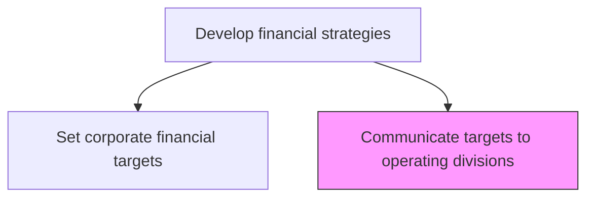
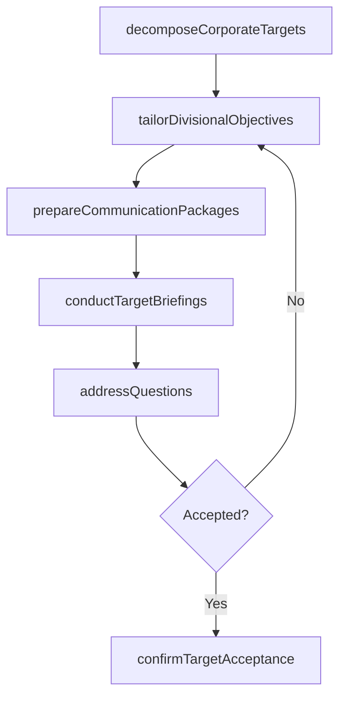

# Communicate targets to operating divisions

> Business-as-Code definition for cascading financial targets to divisions. Models the structured dissemination of corporate financial objectives to operating divisions, ensuring each division understands its contribution expectations and accountability.

## Overview

Cascading approved corporate financial targets to operating divisions and business units. Translate corporate-level revenue, profitability, and capital efficiency targets into division-specific objectives that account for each unit's market position, growth potential, and resource constraints.

## Process Hierarchy



## GraphDL

```yaml
communicate:
  object: Targets To Operating Divisions
  actor: CFO
  result: DivisionalTargetPackage
```

## Actions

| Action | Description |
|--------|-------------|
| decomposeCorporateTargets | Break corporate targets into division-level contributions |
| tailorDivisionalObjectives | Adjust targets to reflect each division's market context and capabilities |
| prepareCommunicationPackages | Create target briefing packages for each operating division |
| conductTargetBriefings | Present financial targets to division leadership in structured meetings |
| addressQuestions | Resolve questions and negotiate adjustments with division leaders |
| confirmTargetAcceptance | Secure formal acknowledgment and commitment from each division |

## Events

| Event | Description |
|-------|-------------|
| corporateTargetsDecomposed | Corporate targets allocated across operating divisions |
| divisionalObjectivesTailored | Division-specific targets adjusted for local context |
| communicationPackagesPrepared | Target briefing materials created for each division |
| targetBriefingsConducted | Financial target presentations delivered to divisions |
| questionsAddressed | Division feedback and concerns resolved |
| targetAcceptanceConfirmed | Divisions formally committed to their financial targets |

## Searches

| Search | Description |
|--------|-------------|
| getDivisionalTargets | Retrieve financial targets for a specific operating division |
| getTargetDecomposition | Access the corporate-to-division target allocation breakdown |
| getTargetAcceptanceStatus | Check which divisions have confirmed target acceptance |
| getCommunicationPackage | Retrieve the briefing materials for a specific division |

## Process Flow



## RACI Matrix

| Activity | Responsible | Accountable | Consulted | Informed |
|----------|-------------|-------------|-----------|----------|
| decomposeCorporateTargets | FinancialPlanningManager | CFO | VP Strategy | DivisionLeads |
| tailorDivisionalObjectives | FinancialPlanningManager | CFO | DivisionLeads | Controller |
| conductTargetBriefings | CFO | CEO | DivisionLeads | Finance |
| addressQuestions | CFO | CEO | DivisionLeads | FinancialPlanningManager |
| confirmTargetAcceptance | DivisionLeads | CFO | CEO | BoardOfDirectors |

## Related Processes

| Process | Relationship |
|---------|-------------|
| 1.2.9.1 Set corporate financial targets | Upstream - corporate targets provide the basis for division allocation |
| 1.2.6 Formulate business unit strategies | Parallel - unit strategies inform target tailoring |
| 8.0 Manage financial resources | Downstream - divisional targets drive budget and resource planning |

## Related Departments

| Department | Role |
|-----------|------|
| Finance | Leads target decomposition and communication |
| Operating Divisions | Receive, negotiate, and commit to financial targets |
| Strategy | Ensures target allocation aligns with strategic priorities |
| Controller | Validates target consistency with financial controls |
| Human Resources | Aligns incentive compensation with divisional targets |

## Related Occupations

| Occupation | Involvement |
|-----------|-------------|
| CFO | Leads target communication and secures division commitment |
| Financial Planning Manager | Decomposes targets and prepares communication packages |
| Division General Manager | Receives and commits to divisional financial targets |

## KPIs

| KPI | Description | Unit |
|-----|-------------|------|
| Target Communication Cycle Time | Time from target approval to full division communication | Days |
| Division Acceptance Rate | Percentage of divisions that accept targets without renegotiation | % |
| Target Clarity Score | Division leaders' rating of target clarity and actionability | Score (1-10) |
| Alignment Completeness | Percentage of corporate targets fully allocated to divisions | % |

## Usage

```typescript
import { communicateTargetsToOperatingDivisions } from '@headlessly/communicate-targets-to-operating-divisions'

const comms = communicateTargetsToOperatingDivisions()

// Decompose corporate targets to divisions
const allocation = await comms.decomposeCorporateTargets({
  corporateTargetId: 'fy2027-targets',
  divisions: ['north-america', 'emea', 'apac', 'latam'],
  allocationMethod: 'strategic-weighted'
})

// Conduct target briefings
await comms.conductTargetBriefings({
  allocationId: allocation.id,
  format: 'executive-presentation',
  schedule: 'Q4-planning-cycle'
})

// Confirm acceptance from all divisions
const status = await comms.confirmTargetAcceptance({
  allocationId: allocation.id,
  deadline: '2026-12-15'
})
```
