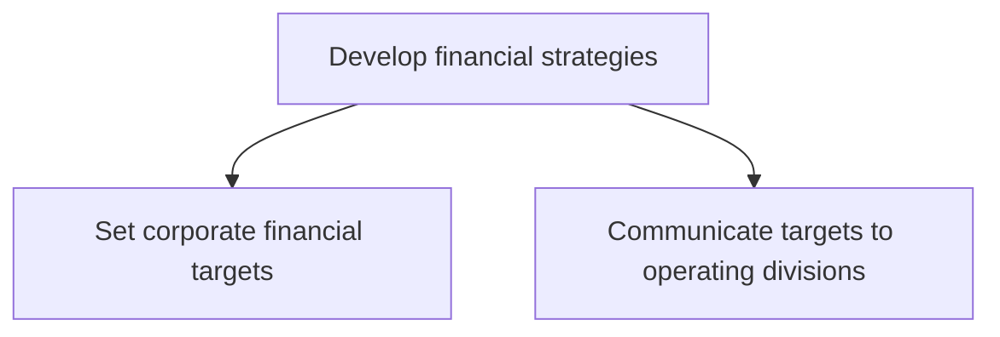
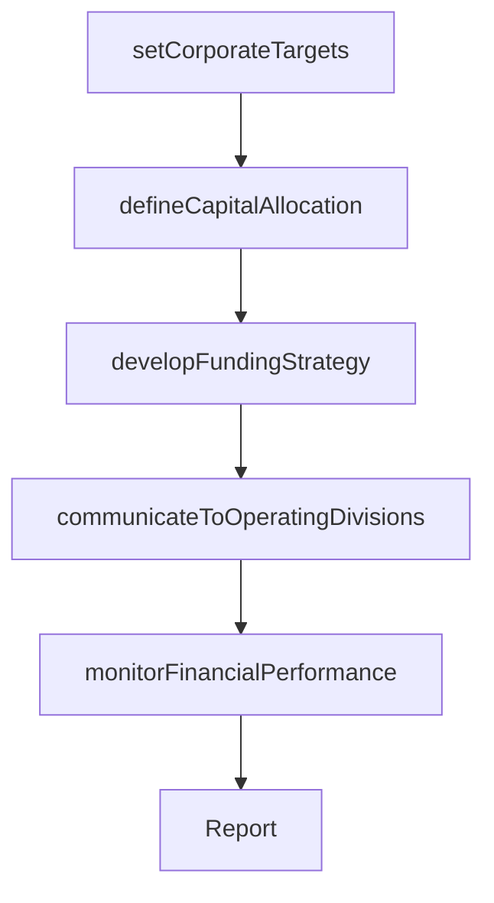

# Develop financial strategies

> Business-as-Code definition for financial strategy development. Models the establishment of corporate financial targets, capital allocation frameworks, and the communication of financial objectives to operating divisions.

## Overview

Developing strategic financial plans that align capital allocation, revenue targets, cost structures, and investment priorities with the organization's long-term business objectives. Set corporate financial targets based on strategic goals and communicate these targets to operating divisions for execution.

## Process Hierarchy



## GraphDL

```yaml
develop:
  object: Financial Strategies
  actor: CFO
  result: FinancialStrategyPlan
```

## Actions

| Action | Description |
|--------|-------------|
| setCorporateTargets | Define revenue, profitability, and capital efficiency targets at the corporate level |
| defineCapitalAllocation | Establish frameworks for allocating capital across business units and initiatives |
| developFundingStrategy | Determine the optimal mix of debt, equity, and internal funding sources |
| communicateToOperatingDivisions | Cascade financial targets and expectations to operating division leaders |
| monitorFinancialPerformance | Track actual financial performance against strategic targets |

## Events

| Event | Description |
|-------|-------------|
| corporateTargetsSet | Corporate financial targets defined and approved |
| capitalAllocationDefined | Capital allocation framework established |
| fundingStrategyDeveloped | Funding strategy and sources determined |
| targetsCommunicated | Financial targets cascaded to operating divisions |
| financialPerformanceMonitored | Financial performance tracked against targets |

## Searches

| Search | Description |
|--------|-------------|
| getFinancialTargets | Retrieve corporate financial targets by category and period |
| getCapitalAllocation | Access capital allocation by business unit and initiative |
| getFinancialPerformance | Compare actual financial results against strategic targets |

## Process Flow



## RACI Matrix

| Activity | Responsible | Accountable | Consulted | Informed |
|----------|-------------|-------------|-----------|----------|
| setCorporateTargets | CFO | CEO | VP Strategy | BoardOfDirectors |
| defineCapitalAllocation | CFO | CEO | BusinessUnitLeads | Finance |
| communicateToOperatingDivisions | CFO | CEO | DivisionLeads | Finance |
| monitorFinancialPerformance | FinancialPlanningManager | CFO | BusinessUnitLeads | InvestorRelations |

## Sub-Processes

| ID | Name | Description |
|----|------|-------------|
| 1.2.9.1 | Set corporate financial targets | Defining revenue, profitability, capital efficiency, and growth targets at the corporate level. Align |
| 1.2.9.2 | Communicate targets to operating divisions | Cascading approved corporate financial targets to operating divisions with context, expectations, and |

## Related Processes

| Process | Relationship |
|---------|-------------|
| 1.1.3.5 Analyze financial health | Upstream - financial health assessment informs target setting |
| 1.2.5 Develop and set organizational goals | Upstream - organizational goals drive financial targets |
| 8.0 Manage financial resources | Downstream - financial strategy guides resource management |

## Related Departments

| Department | Role |
|-----------|------|
| Finance | Leads financial strategy development and target setting |
| Treasury | Manages capital structure and funding strategy |
| Strategy | Ensures financial targets align with strategic objectives |
| Investor Relations | Communicates financial strategy to external stakeholders |

## Related Occupations

| Occupation | Involvement |
|-----------|-------------|
| CFO | Leads financial strategy development and approval |
| Financial Planning Manager | Develops financial targets and allocation frameworks |
| Treasury Manager | Executes funding and capital structure strategy |

## KPIs

| KPI | Description | Unit |
|-----|-------------|------|
| Revenue Target Attainment | Actual revenue vs corporate revenue target | % |
| Capital Efficiency | Return on invested capital relative to target | % |
| Budget Variance | Variance between actual and planned financial performance | % |

## Usage

```typescript
import { developFinancialStrategies } from '@headlessly/develop-financial-strategies'

const financial = developFinancialStrategies()

// Set corporate financial targets
const targets = await financial.setCorporateTargets({
  period: 'fiscal-year-2026',
  categories: ['revenue', 'operating-margin', 'ROIC', 'free-cash-flow']
})

// Communicate targets to divisions
const communication = await financial.communicateToOperatingDivisions({
  targetIds: targets.map(t => t.id),
  divisions: ['north-america', 'emea', 'apac']
})
```
