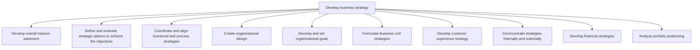
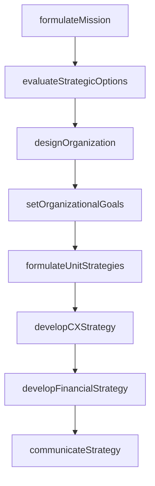

# Develop business strategy

> Business-as-Code definition for business strategy development. Models the formulation of mission statements, strategic options, organizational design, goal setting, business unit strategies, customer experience strategies, and financial strategies.

## Overview

Developing an organization's mission statement, strategy, and business design. Create a concise statement that clearly articulates the mission of the organization, outlining practicable targets to Establish a strategic vision [10020]. Delineate strategic options by matching these alternatives with the organization's internal capabilities. Create an organizational design, and identify goals by developing strategies at the functional and process levels.

## Process Hierarchy



## GraphDL

```yaml
develop:
  object: Business Strategy
  actor: VP Strategy
  result: BusinessStrategyPlan
```

## Actions

| Action | Description |
|--------|-------------|
| formulateMission | Draft and refine the organization's mission statement |
| evaluateStrategicOptions | Assess strategic alternatives against organizational objectives |
| designOrganization | Create the organizational structure to support the strategy |
| setOrganizationalGoals | Establish measurable goals aligned with strategic direction |
| formulateUnitStrategies | Develop strategies for individual business units |
| developCXStrategy | Design the customer experience strategy and roadmap |
| developFinancialStrategy | Define financial targets and capital allocation approach |
| communicateStrategy | Share the approved strategy with internal and external stakeholders |

## Events

| Event | Description |
|-------|-------------|
| missionFormulated | Mission statement drafted and approved |
| strategicOptionsEvaluated | Strategic alternatives assessed and ranked |
| organizationDesigned | Organizational structure defined and validated |
| organizationalGoalsSet | Measurable goals established for the planning period |
| unitStrategiesFormulated | Business unit strategies aligned with corporate strategy |
| cxStrategyDeveloped | Customer experience strategy and roadmap finalized |
| financialStrategyDeveloped | Financial targets and capital allocation plan approved |
| strategyCommunicated | Strategy shared with all stakeholder groups |

## Searches

| Search | Description |
|--------|-------------|
| getStrategyPlan | Retrieve the current business strategy plan and sub-strategies |
| listStrategicOptions | List evaluated strategic options by feasibility and impact |
| getOrganizationalGoals | Retrieve goals and their current attainment status |
| getUnitStrategies | Access business unit-level strategy documents |
| getFinancialTargets | Retrieve corporate financial targets and divisional allocations |

## Process Flow



## RACI Matrix

| Activity | Responsible | Accountable | Consulted | Informed |
|----------|-------------|-------------|-----------|----------|
| formulateMission | VP Strategy | CEO | BoardOfDirectors | AllEmployees |
| evaluateStrategicOptions | StrategyAnalyst | VP Strategy | Finance, Operations | Executive |
| designOrganization | VP Strategy | CEO | HR, Operations | BusinessUnits |
| setOrganizationalGoals | VP Strategy | CEO | BusinessUnitLeads | Finance |
| communicateStrategy | CorporateCommunications | CEO | VP Strategy | AllStakeholders |

## Sub-Processes

| ID | Name | Description |
|----|------|-------------|
| 1.2.1 | Develop overall mission statement | Establishing an overarching, compact statement that concisely underscores the mission of the organiz |
| 1.2.2 | Define and evaluate strategic options to achieve the objectives | Assessing sets of strategic decisions designed to drive the organization's long-term objectives. Ide |
| 1.2.3 | Coordinate and align functional and process strategies | Aligning the approach and method of individual units, departments, systems, and operations within th |
| 1.2.4 | Create organizational design | Formulating a design for the organization's resources that allow it to meet its objectives. Develop  |
| 1.2.5 | Develop and set organizational goals | Developing overall goals for the organization that help in accomplishing its mission. Formulate orga |
| 1.2.6 | Formulate business unit strategies | Charting a strategic course for business units in order to leverage opportunities, sidestep hurdles, |
| 1.2.7 | Develop customer experience strategy | Defining a roadmap to meet customer expectations while considering how it will affect the business. |
| 1.2.8 | Communicate strategies internally and externally | Conveying planned procedures and methods to both internal departments and external stakeholders like |
| 1.2.9 | Develop financial strategies | Establishing corporate financial targets, capital allocation frameworks, and cascading financial objectives to operating divisions |
| 1.2.10 | Analyze portfolio positioning | Evaluating the organization's business portfolio using growth-share matrices, market share analysis, and portfolio optimization |

## Related Processes

| Process | Relationship |
|---------|-------------|
| 1.1 Define the business concept and long-term vision | Upstream - vision drives strategy formulation |
| 1.3 Execute and measure strategic initiatives | Downstream - strategy defines which initiatives to pursue |
| 1.4 Develop and maintain business models | Parallel - business model and strategy co-evolve |
| 8.0 Manage Financial Resources | Supporting - financial planning supports strategy execution |

## Related Departments

| Department | Role |
|-----------|------|
| Strategy | Owns the strategy development process end to end |
| Finance | Models financial scenarios and sets capital allocation |
| Human Resources | Aligns organizational design with talent capabilities |
| Operations | Validates operational feasibility of strategic options |
| Corporate Communications | Manages internal and external strategy communication |

## Related Occupations

| Occupation | Involvement |
|-----------|-------------|
| VP Strategy | Leads the strategy development process |
| Strategy Analyst | Evaluates strategic options and prepares recommendations |
| Financial Analyst | Models financial impact of strategic alternatives |
| Organizational Development Specialist | Designs organizational structures and roles |

## KPIs

| KPI | Description | Unit |
|-----|-------------|------|
| Strategy Cycle Time | Time from vision approval to strategy finalization | Weeks |
| Goal Alignment Score | Percentage of business unit goals aligned with corporate strategy | % |
| Strategic Option Coverage | Number of viable strategic options evaluated per cycle | Count |
| Employee Strategy Awareness | Percentage of employees who can articulate the strategy | % |
| Financial Target Achievement | Percentage of financial targets met within the planning period | % |

## Usage

```typescript
import { developBusinessStrategy } from '@headlessly/develop-business-strategy'

const strategy = developBusinessStrategy()

// Formulate the mission statement
const mission = await strategy.formulateMission({
  purpose: 'Enable digital transformation for mid-market enterprises',
  values: ['innovation', 'customer-centricity', 'sustainability']
})

// Evaluate strategic options
const options = await strategy.evaluateStrategicOptions({
  horizon: '3-year',
  criteria: ['revenue-impact', 'feasibility', 'risk'],
  options: ['organic-growth', 'acquisition', 'partnership']
})

// Set organizational goals
await strategy.setOrganizationalGoals({
  strategyId: options.selectedOption.id,
  goals: [
    { metric: 'annualRevenue', target: 50000000, unit: 'USD' },
    { metric: 'customerRetention', target: 95, unit: 'percent' }
  ]
})
```
