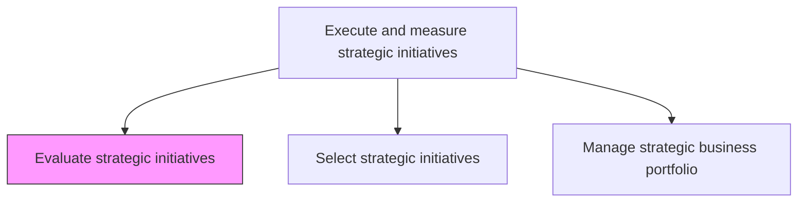
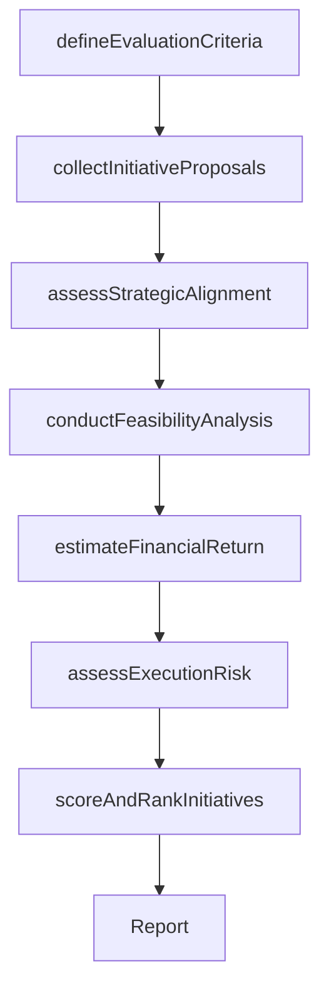

# Evaluate strategic initiatives

> Business-as-Code definition for strategic initiative evaluation. Models the systematic assessment of proposed strategic initiatives for feasibility, risk, resource requirements, and expected return to inform selection and prioritization decisions.

## Overview

Assessing proposed strategic initiatives against a consistent set of criteria to determine their viability and strategic fit. Evaluate each initiative's expected financial return, resource requirements, execution risk, timeline, and alignment with organizational strategy before advancing it to the selection stage.

## Process Hierarchy



## GraphDL

```yaml
evaluate:
  object: Strategic Initiatives
  actor: StrategyAnalyst
  result: InitiativeEvaluationReport
```

## Actions

| Action | Description |
|--------|-------------|
| defineEvaluationCriteria | Establish the scoring dimensions and weightings for initiative assessment |
| collectInitiativeProposals | Gather proposed initiatives from business units and strategy teams |
| assessStrategicAlignment | Evaluate how well each initiative supports organizational strategy |
| conductFeasibilityAnalysis | Analyze resource availability, technical feasibility, and timeline realism |
| estimateFinancialReturn | Calculate expected NPV, IRR, and payback period for each initiative |
| assessExecutionRisk | Identify and quantify risks that could impair initiative success |
| scoreAndRankInitiatives | Apply evaluation criteria to produce a ranked list of initiatives |

## Events

| Event | Description |
|-------|-------------|
| evaluationCriteriaDefined | Scoring dimensions and weightings established |
| initiativeProposalsCollected | All proposed initiatives gathered and documented |
| strategicAlignmentAssessed | Initiative alignment with strategy scored |
| feasibilityAnalysisConducted | Resource and technical feasibility assessed |
| financialReturnEstimated | Financial projections completed for each initiative |
| executionRiskAssessed | Risk profiles developed for each initiative |
| initiativesRanked | Initiatives scored and ranked for selection |

## Searches

| Search | Description |
|--------|-------------|
| listInitiativeProposals | Retrieve proposed initiatives filtered by status, sponsor, or domain |
| getInitiativeEvaluation | Access the full evaluation report for a specific initiative |
| getInitiativeRanking | Retrieve the ranked list of evaluated initiatives |
| getEvaluationCriteria | Access the current evaluation criteria and weightings |

## Process Flow



## RACI Matrix

| Activity | Responsible | Accountable | Consulted | Informed |
|----------|-------------|-------------|-----------|----------|
| defineEvaluationCriteria | VP Strategy | CEO | CFO | BusinessUnitLeads |
| collectInitiativeProposals | StrategyAnalyst | VP Strategy | BusinessUnitLeads | PMO |
| assessStrategicAlignment | StrategyAnalyst | VP Strategy | CEO | Executive |
| conductFeasibilityAnalysis | StrategyAnalyst | VP Strategy | Operations | IT |
| estimateFinancialReturn | FinancialAnalyst | CFO | VP Strategy | Treasury |
| scoreAndRankInitiatives | StrategyAnalyst | VP Strategy | CFO | BoardOfDirectors |

## Related Processes

| Process | Relationship |
|---------|-------------|
| 1.3.2 Select strategic initiatives | Downstream - evaluated initiatives are advanced for selection |
| 1.2.2 Define and evaluate strategic options | Upstream - strategic options generate initiative proposals |
| 1.3.4 Establish high-level measures | Parallel - evaluation criteria align with strategic measures |

## Related Departments

| Department | Role |
|-----------|------|
| Strategy | Leads initiative evaluation and scoring |
| Finance | Provides financial return analysis and risk quantification |
| Operations | Assesses operational feasibility |
| IT | Evaluates technology readiness and requirements |
| PMO | Supports evaluation process management |

## Related Occupations

| Occupation | Involvement |
|-----------|-------------|
| Strategy Analyst | Conducts initiative evaluation and scoring |
| Financial Analyst | Models financial returns and risk |
| Project Manager | Assesses execution feasibility and resource needs |

## KPIs

| KPI | Description | Unit |
|-----|-------------|------|
| Initiatives Evaluated | Number of initiatives formally evaluated per planning cycle | Count |
| Evaluation Cycle Time | Time from proposal submission to completed evaluation | Days |
| Evaluation Accuracy | Percentage of evaluated initiatives whose actual performance matched projections | % |
| Strategic Alignment Score | Average strategic alignment score across evaluated initiatives | Score (1-10) |

## Usage

```typescript
import { evaluateStrategicInitiatives } from '@headlessly/evaluate-strategic-initiatives'

const evaluation = evaluateStrategicInitiatives()

// Define evaluation criteria
const criteria = await evaluation.defineEvaluationCriteria({
  dimensions: ['strategic-alignment', 'financial-return', 'feasibility', 'risk'],
  weights: { strategicAlignment: 30, financialReturn: 30, feasibility: 20, risk: 20 }
})

// Evaluate a specific initiative
const result = await evaluation.scoreAndRankInitiatives({
  criteriaId: criteria.id,
  initiatives: ['digital-platform', 'market-expansion', 'cost-optimization'],
  scoringMethod: 'weighted-average'
})
```
