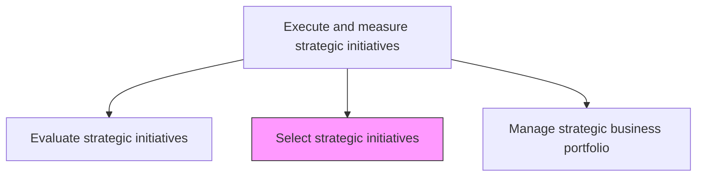
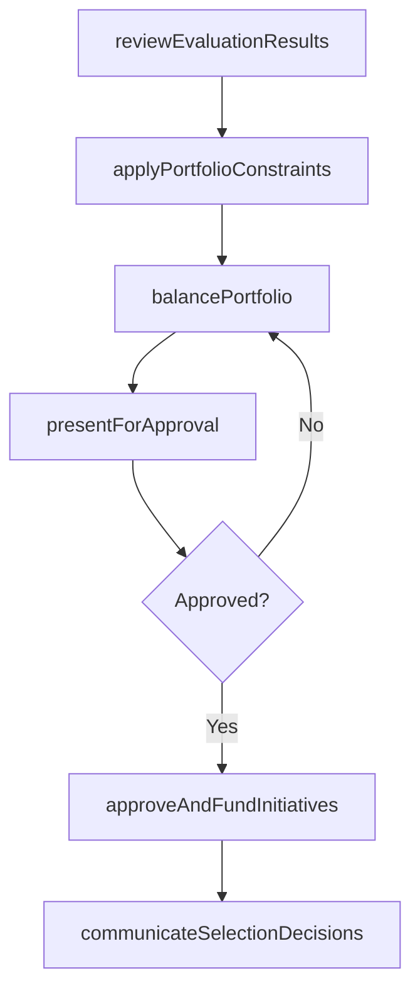

# Select strategic initiatives

> Business-as-Code definition for strategic initiative selection. Models the decision-making process of approving, prioritizing, and funding strategic initiatives based on evaluation results, resource constraints, and portfolio balance.

## Overview

Choosing which evaluated strategic initiatives to approve for funding and execution. Apply portfolio-level constraints such as capital budget, resource capacity, risk tolerance, and strategic balance to select the optimal set of initiatives that maximizes value creation while maintaining manageable risk.

## Process Hierarchy



## GraphDL

```yaml
select:
  object: Strategic Initiatives
  actor: VP Strategy
  result: ApprovedInitiativePortfolio
```

## Actions

| Action | Description |
|--------|-------------|
| reviewEvaluationResults | Review ranked initiative evaluations and scoring outcomes |
| applyPortfolioConstraints | Filter initiatives against budget, capacity, and risk constraints |
| balancePortfolio | Ensure the selected mix provides strategic diversity and risk balance |
| presentForApproval | Present the recommended initiative portfolio to executive leadership |
| approveAndFundInitiatives | Formally approve selected initiatives and allocate funding |
| communicateSelectionDecisions | Inform sponsors and stakeholders of selection outcomes |

## Events

| Event | Description |
|-------|-------------|
| evaluationResultsReviewed | Initiative rankings and evaluations reviewed by selection committee |
| portfolioConstraintsApplied | Budget and capacity filters applied to candidate initiatives |
| portfolioBalanced | Strategic diversity and risk balance validated |
| initiativesPresentedForApproval | Recommended portfolio presented to executive leadership |
| initiativesApprovedAndFunded | Selected initiatives formally approved with budget allocation |
| selectionDecisionsCommunicated | Sponsors and stakeholders notified of selection outcomes |

## Searches

| Search | Description |
|--------|-------------|
| getApprovedInitiatives | Retrieve the list of approved and funded initiatives |
| getSelectionDecisions | Access the rationale behind each selection or rejection decision |
| getPortfolioBalance | Retrieve the strategic balance metrics of the selected portfolio |
| getAvailableBudget | Access remaining budget capacity for additional initiative funding |

## Process Flow



## RACI Matrix

| Activity | Responsible | Accountable | Consulted | Informed |
|----------|-------------|-------------|-----------|----------|
| reviewEvaluationResults | VP Strategy | CEO | CFO | StrategyAnalyst |
| applyPortfolioConstraints | StrategyAnalyst | VP Strategy | CFO | PMO |
| balancePortfolio | VP Strategy | CEO | BusinessUnitLeads | Finance |
| presentForApproval | VP Strategy | CEO | BoardOfDirectors | Executive |
| approveAndFundInitiatives | CEO | BoardOfDirectors | CFO | AllDivisions |
| communicateSelectionDecisions | VP Strategy | CEO | CorporateCommunications | InitiativeSponsors |

## Related Processes

| Process | Relationship |
|---------|-------------|
| 1.3.1 Evaluate strategic initiatives | Upstream - evaluation provides ranked inputs for selection |
| 1.3.3 Manage strategic business portfolio | Downstream - selected initiatives enter the portfolio |
| 1.2.9 Develop financial strategies | Parallel - financial strategy determines the funding envelope |

## Related Departments

| Department | Role |
|-----------|------|
| Strategy | Facilitates selection process and portfolio balancing |
| Finance | Validates funding availability and budget allocation |
| Executive Office | Makes final approval decisions |
| PMO | Supports capacity planning and resource allocation |
| Corporate Communications | Manages selection outcome communications |

## Related Occupations

| Occupation | Involvement |
|-----------|-------------|
| VP Strategy | Leads selection process and presents recommendations |
| CFO | Validates financial feasibility and approves funding |
| CEO | Makes final selection and approval decisions |

## KPIs

| KPI | Description | Unit |
|-----|-------------|------|
| Selection Ratio | Percentage of evaluated initiatives selected for funding | % |
| Budget Utilization | Percentage of available initiative budget allocated | % |
| Portfolio Balance Score | Distribution of initiatives across strategic themes | Score (1-10) |
| Selection Cycle Time | Time from evaluation completion to selection decision | Days |

## Usage

```typescript
import { selectStrategicInitiatives } from '@headlessly/select-strategic-initiatives'

const selection = selectStrategicInitiatives()

// Review evaluation results and apply constraints
const candidates = await selection.applyPortfolioConstraints({
  evaluationBatchId: 'fy2027-planning',
  budgetCeiling: 10000000,
  maxConcurrentInitiatives: 8,
  riskTolerance: 'moderate'
})

// Balance portfolio across strategic themes
const balanced = await selection.balancePortfolio({
  candidates: candidates.eligible,
  themes: ['growth', 'efficiency', 'innovation', 'risk-mitigation'],
  targetDistribution: { growth: 40, efficiency: 25, innovation: 25, riskMitigation: 10 }
})

// Approve and fund selected initiatives
await selection.approveAndFundInitiatives({
  portfolioId: balanced.id,
  approver: 'ceo',
  effectiveDate: '2027-01-01'
})
```
