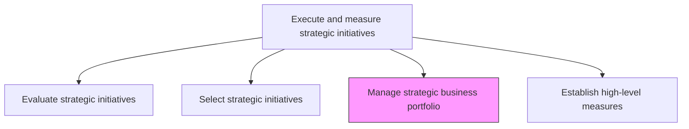
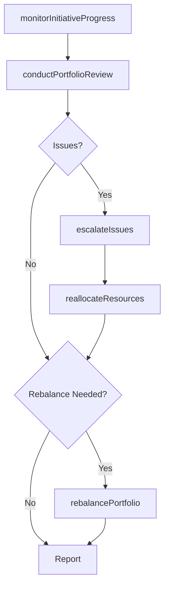

# Manage strategic business portfolio

> Business-as-Code definition for strategic portfolio management. Models the ongoing governance, monitoring, rebalancing, and optimization of the portfolio of active strategic initiatives to maximize value and manage enterprise risk.

## Overview

Governing the portfolio of active strategic initiatives on an ongoing basis. Monitor initiative progress, reallocate resources as conditions change, retire underperforming initiatives, and rebalance the portfolio to maintain strategic alignment and optimal resource utilization across the enterprise.

## Process Hierarchy



## GraphDL

```yaml
manage:
  object: Strategic Business Portfolio
  actor: StrategyProgramManager
  result: PortfolioStatusReport
```

## Actions

| Action | Description |
|--------|-------------|
| monitorInitiativeProgress | Track milestones, budgets, and deliverables for active initiatives |
| conductPortfolioReview | Hold periodic governance reviews to assess overall portfolio health |
| reallocateResources | Shift budget and headcount between initiatives based on performance |
| escalateIssues | Raise blockers and risks that require executive intervention |
| retireInitiatives | Formally close completed or cancelled initiatives and capture lessons |
| rebalancePortfolio | Adjust the initiative mix to respond to changing strategic priorities |

## Events

| Event | Description |
|-------|-------------|
| initiativeProgressMonitored | Milestone and budget status updated for active initiatives |
| portfolioReviewConducted | Periodic governance review completed |
| resourcesReallocated | Budget or headcount shifted between portfolio initiatives |
| issuesEscalated | Blockers or risks elevated to executive decision-makers |
| initiativeRetired | Initiative formally closed with lessons captured |
| portfolioRebalanced | Initiative mix adjusted for changing strategic priorities |

## Searches

| Search | Description |
|--------|-------------|
| getPortfolioSummary | Retrieve aggregate health, spend, and progress of the initiative portfolio |
| getInitiativeStatus | Access current status, milestones, and budget for a specific initiative |
| getResourceAllocation | Retrieve resource allocation across portfolio initiatives |
| getPortfolioRiskRegister | Access the consolidated risk register for all active initiatives |

## Process Flow



## RACI Matrix

| Activity | Responsible | Accountable | Consulted | Informed |
|----------|-------------|-------------|-----------|----------|
| monitorInitiativeProgress | StrategyProgramManager | VP Strategy | ProjectManagers | Finance |
| conductPortfolioReview | VP Strategy | CEO | CFO | BoardOfDirectors |
| reallocateResources | StrategyProgramManager | VP Strategy | CFO | InitiativeSponsors |
| retireInitiatives | StrategyProgramManager | VP Strategy | Finance | PMO |
| rebalancePortfolio | VP Strategy | CEO | CFO | Executive |

## Related Processes

| Process | Relationship |
|---------|-------------|
| 1.3.2 Select strategic initiatives | Upstream - selected initiatives enter the managed portfolio |
| 1.3.4 Establish high-level measures | Parallel - measures define how portfolio health is tracked |
| 1.3.1 Evaluate strategic initiatives | Upstream - new evaluations may trigger portfolio rebalancing |

## Related Departments

| Department | Role |
|-----------|------|
| Strategy | Leads portfolio governance and rebalancing decisions |
| PMO | Supports initiative tracking and progress reporting |
| Finance | Monitors budget utilization and financial performance |
| Executive Office | Provides governance oversight and escalation resolution |
| Business Intelligence | Delivers portfolio dashboards and analytics |

## Related Occupations

| Occupation | Involvement |
|-----------|-------------|
| Strategy Program Manager | Manages day-to-day portfolio operations and reporting |
| VP Strategy | Leads governance reviews and rebalancing decisions |
| Project Manager | Manages individual initiative execution within the portfolio |

## KPIs

| KPI | Description | Unit |
|-----|-------------|------|
| Portfolio Health Score | Composite score reflecting progress, budget, and risk across initiatives | Score (1-10) |
| Initiative On-Track Rate | Percentage of initiatives on schedule and within budget | % |
| Resource Utilization | Percentage of allocated resources actively deployed on initiatives | % |
| Portfolio ROI | Aggregate return on investment across the initiative portfolio | % |

## Usage

```typescript
import { manageStrategicBusinessPortfolio } from '@headlessly/manage-strategic-business-portfolio'

const portfolio = manageStrategicBusinessPortfolio()

// Get portfolio summary
const summary = await portfolio.getPortfolioSummary({
  period: 'Q1-2027',
  includeRisk: true,
  includeFinancials: true
})

// Conduct portfolio review
const review = await portfolio.conductPortfolioReview({
  portfolioId: 'active-initiatives-2027',
  reviewType: 'quarterly-governance',
  participants: ['ceo', 'cfo', 'vp-strategy']
})

// Rebalance portfolio based on review outcomes
await portfolio.rebalancePortfolio({
  reviewId: review.id,
  adjustments: [
    { initiativeId: 'digital-platform', action: 'increase-budget', amount: 500000 },
    { initiativeId: 'legacy-migration', action: 'retire', reason: 'superseded' }
  ]
})
```
