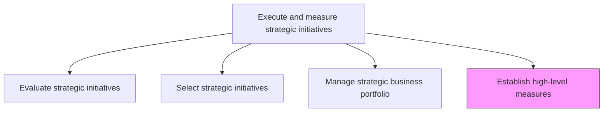
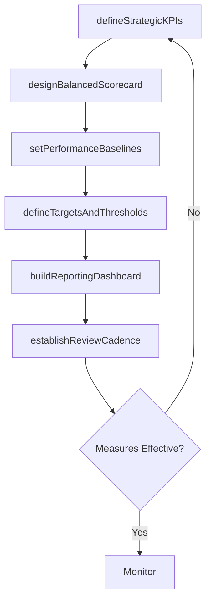

# Establish high-level measures

> Business-as-Code definition for strategic performance measurement. Models the creation of enterprise-level KPIs, balanced scorecards, and performance baselines that track strategic initiative outcomes against organizational objectives.

## Overview

Defining the high-level performance measures, KPIs, and balanced scorecard dimensions that enable the organization to track progress toward strategic objectives. Establish baselines, targets, and reporting cadences that provide executive leadership with clear visibility into strategic initiative performance and organizational health.

## Process Hierarchy



## GraphDL

```yaml
establish:
  object: High-level Measures
  actor: StrategyAnalyst
  result: StrategicMeasurementFramework
```

## Actions

| Action | Description |
|--------|-------------|
| defineStrategicKPIs | Identify the key performance indicators that measure strategic progress |
| designBalancedScorecard | Create a balanced scorecard covering financial, customer, process, and learning dimensions |
| setPerformanceBaselines | Establish current-state baselines for each strategic measure |
| defineTargetsAndThresholds | Set target values and alert thresholds for each KPI |
| buildReportingDashboard | Create executive dashboards for ongoing strategic performance visibility |
| establishReviewCadence | Define the frequency and format of strategic performance reviews |

## Events

| Event | Description |
|-------|-------------|
| strategicKPIsDefined | Key performance indicators for strategic objectives established |
| balancedScorecardDesigned | Balanced scorecard framework created and documented |
| performanceBaselinesSet | Current-state baselines measured for all strategic KPIs |
| targetsAndThresholdsDefined | Target values and alerting thresholds set for each measure |
| reportingDashboardBuilt | Executive performance dashboard deployed |
| reviewCadenceEstablished | Strategic performance review schedule defined |

## Searches

| Search | Description |
|--------|-------------|
| getStrategicKPIs | Retrieve the current set of strategic KPIs and their definitions |
| getBalancedScorecard | Access the balanced scorecard with current performance data |
| getPerformanceBaselines | Retrieve baseline values for each strategic measure |
| getPerformanceDashboard | Access the executive strategic performance dashboard |

## Process Flow



## RACI Matrix

| Activity | Responsible | Accountable | Consulted | Informed |
|----------|-------------|-------------|-----------|----------|
| defineStrategicKPIs | StrategyAnalyst | VP Strategy | CEO | BusinessUnitLeads |
| designBalancedScorecard | StrategyAnalyst | VP Strategy | CFO | Operations |
| setPerformanceBaselines | BusinessIntelligenceAnalyst | VP Strategy | Finance | IT |
| buildReportingDashboard | BusinessIntelligenceAnalyst | VP Strategy | IT | Executive |
| establishReviewCadence | VP Strategy | CEO | CFO | BoardOfDirectors |

## Related Processes

| Process | Relationship |
|---------|-------------|
| 1.3.3 Manage strategic business portfolio | Parallel - measures track portfolio performance |
| 1.3.1 Evaluate strategic initiatives | Upstream - evaluation criteria inform strategic measures |
| 1.2.5 Develop and set organizational goals | Upstream - organizational goals define what to measure |

## Related Departments

| Department | Role |
|-----------|------|
| Strategy | Defines strategic KPIs and balanced scorecard |
| Business Intelligence | Builds dashboards and automates reporting |
| Finance | Provides financial performance data for strategic measures |
| IT | Supports data infrastructure for measurement systems |
| Executive Office | Consumes strategic performance reports |

## Related Occupations

| Occupation | Involvement |
|-----------|-------------|
| Strategy Analyst | Defines KPIs and designs the measurement framework |
| Business Intelligence Analyst | Builds dashboards and automates performance reporting |
| VP Strategy | Leads strategic performance reviews |

## KPIs

| KPI | Description | Unit |
|-----|-------------|------|
| Measure Coverage | Percentage of strategic objectives with defined KPIs | % |
| Data Freshness | Average age of data in the strategic performance dashboard | Days |
| Review Adherence | Percentage of scheduled strategic reviews conducted on time | % |
| Target Achievement Rate | Percentage of strategic KPIs meeting or exceeding targets | % |

## Usage

```typescript
import { establishHighLevelMeasures } from '@headlessly/establish-high-level-measures'

const measures = establishHighLevelMeasures()

// Define strategic KPIs
const kpis = await measures.defineStrategicKPIs({
  objectives: ['revenue-growth', 'customer-retention', 'operational-efficiency', 'innovation'],
  kpisPerObjective: 3
})

// Design balanced scorecard
const scorecard = await measures.designBalancedScorecard({
  perspectives: ['financial', 'customer', 'internal-process', 'learning-and-growth'],
  kpis: kpis.map(k => k.id)
})

// Build executive dashboard
await measures.buildReportingDashboard({
  scorecardId: scorecard.id,
  refreshInterval: 'daily',
  audience: 'executive-leadership'
})
```
