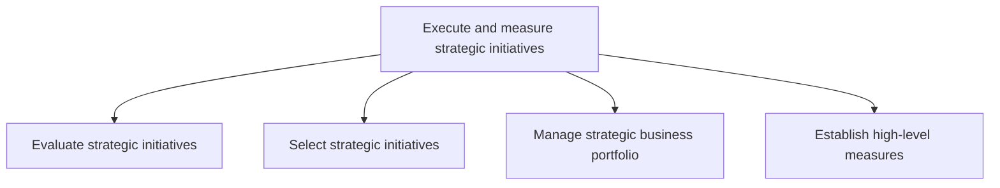
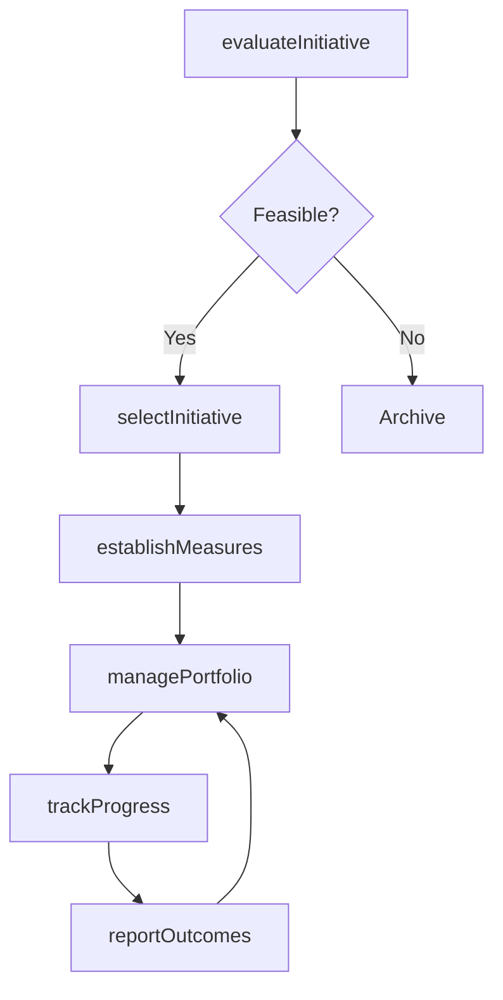

# Execute and measure strategic initiatives

> Business-as-Code definition for strategic initiative execution and measurement. Models the evaluation, selection, portfolio management, and performance measurement of strategic programs and projects.

## Overview

Managing strategic initiatives, from development through selection, execution, and evaluation. Conduct and oversee strategic projects supporting long-term objectives. Administer programs of strategic significance by developing such initiatives, select the most appropriate projects, and formulate measures to assess their impact.

## Process Hierarchy



## GraphDL

```yaml
execute:
  object: And Measure Strategic Initiatives
  actor: StrategyProgramManager
  result: InitiativePortfolioReport
```

## Actions

| Action | Description |
|--------|-------------|
| evaluateInitiative | Assess a strategic initiative for feasibility, risk, and expected impact |
| selectInitiative | Approve and prioritize initiatives for funding and execution |
| managePortfolio | Govern the portfolio of active strategic initiatives and resource allocation |
| establishMeasures | Define KPIs and performance baselines for initiative tracking |
| trackProgress | Monitor initiative milestones, budgets, and deliverables |
| reportOutcomes | Generate performance reports on initiative results versus targets |

## Events

| Event | Description |
|-------|-------------|
| initiativeEvaluated | Strategic initiative feasibility and impact assessment completed |
| initiativeSelected | Initiative approved for funding and execution |
| portfolioUpdated | Strategic portfolio rebalanced with new or retired initiatives |
| measuresEstablished | KPIs and performance baselines defined for an initiative |
| progressTracked | Initiative milestone or budget checkpoint recorded |
| outcomesReported | Performance report generated and distributed to stakeholders |

## Searches

| Search | Description |
|--------|-------------|
| listInitiatives | List strategic initiatives filtered by status, priority, or business unit |
| getInitiativeStatus | Retrieve current status, milestones, and budget for an initiative |
| getPortfolioSummary | Access an aggregate view of the strategic initiative portfolio |
| getPerformanceReport | Retrieve KPI performance data for a specific initiative or period |

## Process Flow



## RACI Matrix

| Activity | Responsible | Accountable | Consulted | Informed |
|----------|-------------|-------------|-----------|----------|
| evaluateInitiative | StrategyAnalyst | VP Strategy | Finance, Operations | Executive |
| selectInitiative | VP Strategy | CEO | BoardOfDirectors | BusinessUnits |
| managePortfolio | StrategyProgramManager | VP Strategy | Finance | Executive |
| establishMeasures | StrategyAnalyst | VP Strategy | BusinessIntelligence | Finance |
| reportOutcomes | StrategyProgramManager | VP Strategy | Finance | BoardOfDirectors |

## Sub-Processes

| ID | Name | Description |
|----|------|-------------|
| 1.3.1 | Evaluate strategic initiatives | Assess proposed strategic initiatives against criteria such as strategic fit, financial return, risk, and organizational readiness |
| 1.3.2 | Select strategic initiatives | Choose which evaluated initiatives to fund and execute, balancing portfolio diversification and resource constraints |
| 1.3.3 | Manage strategic business portfolio | Govern the active portfolio of strategic initiatives, monitoring performance and rebalancing resources |
| 1.3.4 | Establish high-level measures | Define enterprise-level KPIs, balanced scorecards, and performance baselines for strategic tracking |

## Related Processes

| Process | Relationship |
|---------|-------------|
| 1.2 Develop business strategy | Upstream - strategy defines which initiatives to pursue |
| 1.1 Define the business concept and long-term vision | Upstream - vision provides the context for initiative prioritization |
| 8.0 Manage Financial Resources | Supporting - budgets and capital allocation for initiatives |

## Related Departments

| Department | Role |
|-----------|------|
| Strategy | Owns initiative evaluation, selection, and portfolio governance |
| Project Management Office | Coordinates initiative execution and milestone tracking |
| Finance | Provides budget oversight and financial performance analysis |
| Business Intelligence | Supports KPI measurement and dashboard reporting |

## Related Occupations

| Occupation | Involvement |
|-----------|-------------|
| Strategy Program Manager | Manages the portfolio of strategic initiatives |
| Strategy Analyst | Evaluates initiative feasibility and tracks performance |
| Project Manager | Executes individual strategic initiatives |
| Business Intelligence Analyst | Builds dashboards and reports on initiative KPIs |

## KPIs

| KPI | Description | Unit |
|-----|-------------|------|
| Initiative Success Rate | Percentage of initiatives that achieve stated objectives | % |
| Portfolio ROI | Return on investment across the strategic initiative portfolio | % |
| On-Time Delivery Rate | Percentage of initiatives completed within scheduled timeline | % |
| Budget Variance | Deviation of actual spend from approved initiative budgets | % |
| Strategic Alignment Score | Degree to which active initiatives map to strategic priorities | Score (1-10) |

## Usage

```typescript
import { executeAndMeasureStrategicInitiatives } from '@headlessly/execute-and-measure-strategic-initiatives'

const initiatives = executeAndMeasureStrategicInitiatives()

// Evaluate a new strategic initiative
const evaluation = await initiatives.evaluateInitiative({
  name: 'Digital Commerce Platform',
  sponsor: 'VP Digital',
  investmentRequired: 2000000,
  expectedROI: 35
})

// Select and fund the initiative
await initiatives.selectInitiative({
  initiativeId: evaluation.id,
  budget: 2000000,
  timeline: { start: '2026-Q2', end: '2027-Q4' }
})

// Track progress against established measures
const report = await initiatives.reportOutcomes({
  initiativeId: evaluation.id,
  period: '2026-Q3'
})
```
