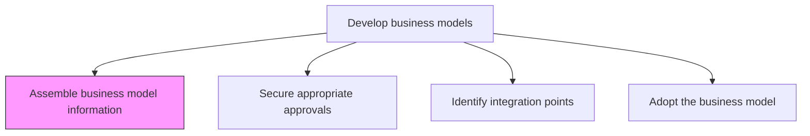
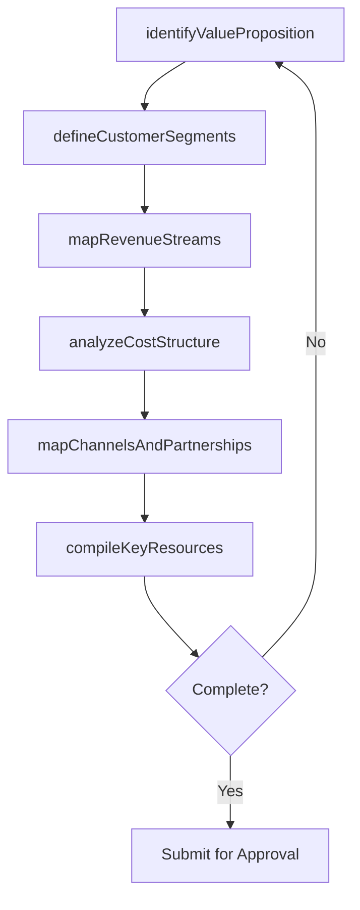

# Assemble business model information

> Business-as-Code definition for business model information gathering. Models the collection and organization of value proposition, revenue stream, cost structure, channel, and customer segment data needed to construct a viable business model.

## Overview

Collecting all relevant materials needed to develop the business model, so that it can adequately model its processes.

## Process Hierarchy



## GraphDL

```yaml
assemble:
  object: Business Model Information
  actor: BusinessModelArchitect
  result: BusinessModelCanvas
```

## Actions

| Action | Description |
|--------|-------------|
| identifyValueProposition | Document the core value the organization delivers to each customer segment |
| mapRevenueStreams | Catalog all current and planned sources of revenue |
| analyzeCostStructure | Document fixed and variable costs associated with delivering value |
| defineCustomerSegments | Identify and describe the target customer groups for the model |
| mapChannelsAndPartnerships | Document distribution channels and key partner relationships |
| compileKeyResources | Inventory the critical assets, capabilities, and resources required |

## Events

| Event | Description |
|-------|-------------|
| valuePropositionIdentified | Core value propositions documented for each customer segment |
| revenueStreamsMapped | All revenue sources cataloged and quantified |
| costStructureAnalyzed | Cost structure documented and validated |
| customerSegmentsDefined | Target customer segments described and validated |
| channelsAndPartnershipsMapped | Distribution channels and partnerships documented |
| keyResourcesCompiled | Critical resources and capabilities inventoried |

## Searches

| Search | Description |
|--------|-------------|
| getBusinessModelCanvas | Retrieve the assembled business model canvas |
| getRevenueStreams | Access revenue stream details and projections |
| getCostStructure | Retrieve cost structure breakdown by category |
| getCustomerSegments | Access customer segment definitions and sizing |

## Process Flow



## RACI Matrix

| Activity | Responsible | Accountable | Consulted | Informed |
|----------|-------------|-------------|-----------|----------|
| identifyValueProposition | BusinessModelArchitect | VP Strategy | Product | Marketing |
| mapRevenueStreams | FinancialAnalyst | CFO | Sales | VP Strategy |
| analyzeCostStructure | FinancialAnalyst | CFO | Operations | Procurement |
| defineCustomerSegments | MarketResearcher | VP Strategy | Marketing | Sales |
| compileKeyResources | BusinessModelArchitect | VP Strategy | HR | IT |

## Related Processes

| Process | Relationship |
|---------|-------------|
| 1.4.1.2 Secure appropriate approvals | Downstream - assembled information proceeds to approval |
| 1.1.1 Assess the external environment | Upstream - external analysis informs business model assumptions |
| 1.1.2 Survey market and determine customer needs | Upstream - market data informs customer segments and value proposition |

## Related Departments

| Department | Role |
|-----------|------|
| Strategy | Leads business model information gathering and synthesis |
| Finance | Provides revenue and cost structure data |
| Marketing | Contributes customer segment and channel insights |
| Product | Defines value proposition and key activities |
| Operations | Provides resource and capability data |

## Related Occupations

| Occupation | Involvement |
|-----------|-------------|
| Business Model Architect | Primary assembler of business model components |
| Financial Analyst | Models revenue streams and cost structures |
| Market Researcher | Provides customer segment and market data |

## KPIs

| KPI | Description | Unit |
|-----|-------------|------|
| Information Completeness | Percentage of business model canvas components populated | % |
| Assembly Cycle Time | Time from initiation to completed business model draft | Weeks |
| Data Source Coverage | Number of validated data sources used to populate the model | Count |
| Stakeholder Input Rate | Percentage of key stakeholders who contributed to the model | % |

## Usage

```typescript
import { assembleBusinessModelInformation } from '@headlessly/assemble-business-model-information'

const assembly = assembleBusinessModelInformation()

// Identify value proposition
const valueProp = await assembly.identifyValueProposition({
  customerSegments: ['enterprise', 'mid-market', 'startup'],
  differentiators: ['speed-to-value', 'customization', 'support']
})

// Map revenue streams
const revenue = await assembly.mapRevenueStreams({
  types: ['subscription', 'usage-based', 'professional-services'],
  projectionHorizon: '3-years'
})

// Compile key resources
const resources = await assembly.compileKeyResources({
  categories: ['technology', 'talent', 'intellectual-property', 'partnerships']
})
```
