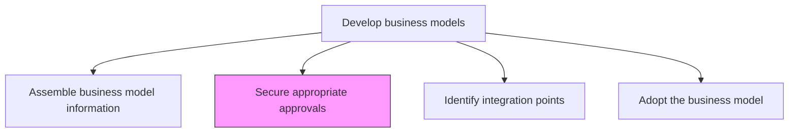
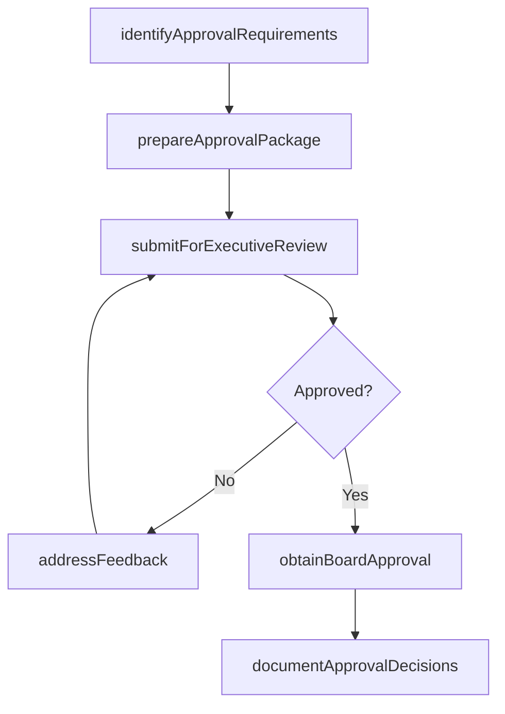

# Secure appropriate approvals

> Business-as-Code definition for business model approval management. Models the process of obtaining executive, board, regulatory, and legal approvals required to legitimize and operationalize a new or revised business model.

## Overview

Obtaining required permissions, licenses and authorizations that legitimize the business, help to mitigate associated risks and safeguard the operations.

## Process Hierarchy



## GraphDL

```yaml
secure:
  object: Appropriate Approvals
  actor: VP Strategy
  result: ApprovalRecord
```

## Actions

| Action | Description |
|--------|-------------|
| identifyApprovalRequirements | Determine which approvals are needed based on business model scope and risk |
| prepareApprovalPackage | Compile business case, risk assessment, and financial projections for reviewers |
| submitForExecutiveReview | Present the business model to executive leadership for review and feedback |
| addressFeedback | Incorporate reviewer feedback and resolve concerns |
| obtainBoardApproval | Secure formal board of directors approval for significant business model changes |
| documentApprovalDecisions | Record all approval decisions, conditions, and signatories |

## Events

| Event | Description |
|-------|-------------|
| approvalRequirementsIdentified | Required approvals determined based on model scope |
| approvalPackagePrepared | Business case and supporting materials compiled |
| executiveReviewSubmitted | Business model presented to executive leadership |
| feedbackAddressed | Reviewer concerns resolved and model updated |
| boardApprovalObtained | Board of directors formally approved the business model |
| approvalDecisionsDocumented | All approval records filed and archived |

## Searches

| Search | Description |
|--------|-------------|
| getApprovalStatus | Retrieve the current approval status for a business model |
| getApprovalRequirements | Access the list of required approvals and their status |
| getApprovalHistory | Retrieve historical approval decisions for past models |
| getApprovalPackage | Access the business case and materials submitted for approval |

## Process Flow



## RACI Matrix

| Activity | Responsible | Accountable | Consulted | Informed |
|----------|-------------|-------------|-----------|----------|
| identifyApprovalRequirements | VP Strategy | CEO | Legal | Compliance |
| prepareApprovalPackage | BusinessModelArchitect | VP Strategy | Finance | Marketing |
| submitForExecutiveReview | VP Strategy | CEO | CFO | ExecutiveTeam |
| obtainBoardApproval | CEO | BoardOfDirectors | GeneralCounsel | InvestorRelations |
| documentApprovalDecisions | VP Strategy | GeneralCounsel | Compliance | Finance |

## Related Processes

| Process | Relationship |
|---------|-------------|
| 1.4.1.1 Assemble business model information | Upstream - assembled information forms the approval package |
| 1.4.1.3 Identify integration points with existing models | Downstream - approved model proceeds to integration analysis |
| 1.4.3 Establish business model governance | Parallel - governance framework defines approval requirements |

## Related Departments

| Department | Role |
|-----------|------|
| Strategy | Prepares and presents the business model for approval |
| Legal | Reviews legal and regulatory compliance of the model |
| Finance | Validates financial projections and risk assessments |
| Compliance | Ensures the model meets regulatory requirements |
| Executive Office | Provides final approval authority |

## Related Occupations

| Occupation | Involvement |
|-----------|-------------|
| VP Strategy | Leads the approval process and presents to leadership |
| General Counsel | Reviews legal implications and regulatory compliance |
| CFO | Validates financial assumptions and risk tolerance |

## KPIs

| KPI | Description | Unit |
|-----|-------------|------|
| Approval Cycle Time | Time from package submission to final approval | Days |
| First-Pass Approval Rate | Percentage of models approved without revision requests | % |
| Approval Completeness | Percentage of required approvals obtained before model launch | % |
| Feedback Resolution Time | Average time to address and resolve reviewer feedback | Days |

## Usage

```typescript
import { secureAppropriateApprovals } from '@headlessly/secure-appropriate-approvals'

const approvals = secureAppropriateApprovals()

// Identify required approvals
const requirements = await approvals.identifyApprovalRequirements({
  modelId: 'platform-subscription-model',
  scope: 'new-revenue-stream',
  riskLevel: 'moderate'
})

// Prepare and submit approval package
const package_ = await approvals.prepareApprovalPackage({
  modelId: 'platform-subscription-model',
  documents: ['business-case', 'financial-projections', 'risk-assessment'],
  reviewers: ['cfo', 'general-counsel', 'ceo']
})

// Track approval status
const status = await approvals.getApprovalStatus({
  packageId: package_.id
})
```
