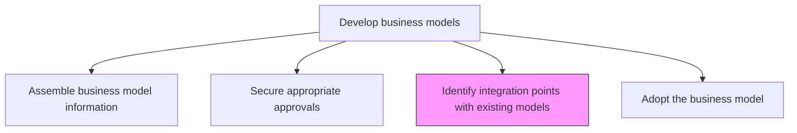
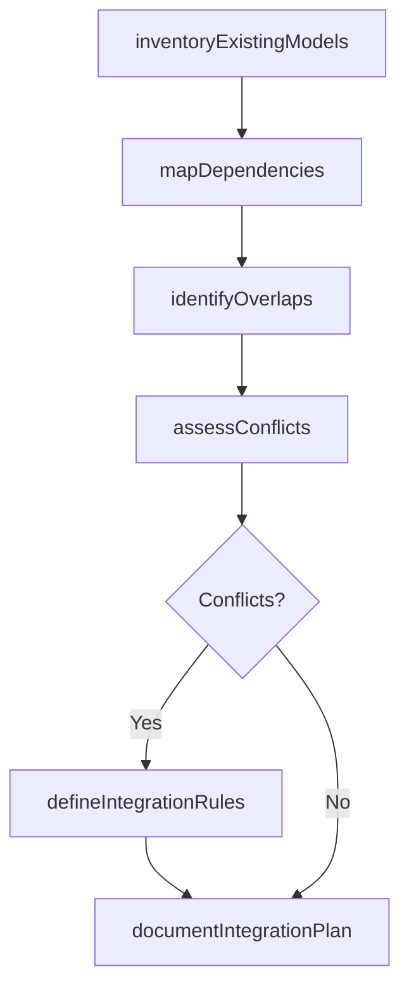

# Identify integration points with existing models

> Business-as-Code definition for business model integration analysis. Models the process of mapping dependencies, overlaps, and potential conflicts between a new business model and the organization's existing models to ensure strategic coherence.

## Overview

Ensuring coherence with pre-exsiting models to avoid contradictions between models. Make sure that all models represent the same long-term vision.

## Process Hierarchy



## GraphDL

```yaml
identify:
  object: Integration Points With Existing Models
  actor: BusinessModelArchitect
  result: IntegrationPointMap
```

## Actions

| Action | Description |
|--------|-------------|
| inventoryExistingModels | Catalog all active business models currently in operation |
| mapDependencies | Document how the new model depends on or interacts with existing models |
| identifyOverlaps | Detect areas where the new model overlaps with existing revenue streams or segments |
| assessConflicts | Evaluate potential contradictions or cannibalization risks between models |
| defineIntegrationRules | Establish guidelines for how models coexist and share resources |
| documentIntegrationPlan | Create a formal integration plan with timelines and responsibilities |

## Events

| Event | Description |
|-------|-------------|
| existingModelsInventoried | All active business models cataloged |
| dependenciesMapped | Inter-model dependencies documented |
| overlapsIdentified | Revenue stream and segment overlaps detected |
| conflictsAssessed | Model contradictions and cannibalization risks evaluated |
| integrationRulesDefined | Coexistence guidelines established |
| integrationPlanDocumented | Formal integration plan created |

## Searches

| Search | Description |
|--------|-------------|
| getExistingModels | Retrieve the catalog of active business models |
| getIntegrationPointMap | Access the dependency and overlap map between models |
| getConflictAssessment | Retrieve the conflict and cannibalization risk analysis |
| getIntegrationPlan | Access the formal integration plan and timeline |

## Process Flow



## RACI Matrix

| Activity | Responsible | Accountable | Consulted | Informed |
|----------|-------------|-------------|-----------|----------|
| inventoryExistingModels | BusinessModelArchitect | VP Strategy | BusinessUnitLeads | Finance |
| mapDependencies | BusinessModelArchitect | VP Strategy | Operations | IT |
| identifyOverlaps | BusinessModelArchitect | VP Strategy | Sales | Marketing |
| assessConflicts | VP Strategy | CEO | CFO | BusinessUnitLeads |
| defineIntegrationRules | BusinessModelArchitect | VP Strategy | Legal | Operations |

## Related Processes

| Process | Relationship |
|---------|-------------|
| 1.4.1.2 Secure appropriate approvals | Upstream - approved model proceeds to integration analysis |
| 1.4.1.4 Adopt the business model | Downstream - integration plan is prerequisite for adoption |
| 1.4.2 Maintain business models | Parallel - existing models may need maintenance due to integration |

## Related Departments

| Department | Role |
|-----------|------|
| Strategy | Leads integration analysis and conflict resolution |
| Finance | Assesses financial implications of model interactions |
| Operations | Evaluates operational dependencies between models |
| Sales | Identifies customer segment and channel overlaps |
| IT | Assesses technology infrastructure dependencies |

## Related Occupations

| Occupation | Involvement |
|-----------|-------------|
| Business Model Architect | Conducts integration mapping and conflict analysis |
| Strategy Analyst | Supports dependency and overlap analysis |
| Operations Manager | Validates operational integration feasibility |

## KPIs

| KPI | Description | Unit |
|-----|-------------|------|
| Integration Points Identified | Number of dependencies and overlaps documented between models | Count |
| Conflict Resolution Rate | Percentage of identified conflicts resolved before adoption | % |
| Integration Analysis Cycle Time | Time from analysis start to completed integration plan | Days |
| Model Coherence Score | Degree of alignment between all active business models | Score (1-10) |

## Usage

```typescript
import { identifyIntegrationPointsWithExistingModels } from '@headlessly/identify-integration-points-with-existing-models'

const integration = identifyIntegrationPointsWithExistingModels()

// Inventory existing models
const models = await integration.inventoryExistingModels({
  status: 'active',
  includeMetadata: true
})

// Map dependencies with the new model
const dependencies = await integration.mapDependencies({
  newModelId: 'platform-subscription-model',
  existingModelIds: models.map(m => m.id),
  dimensions: ['revenue', 'cost', 'channel', 'customer-segment']
})

// Assess conflicts
const conflicts = await integration.assessConflicts({
  dependencyMapId: dependencies.id,
  riskThreshold: 'medium'
})
```
