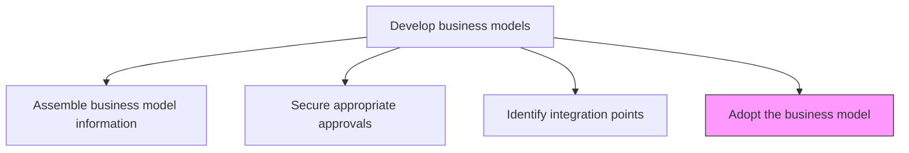
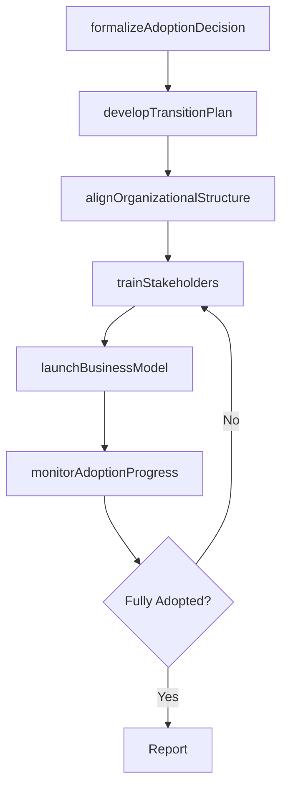

# Adopt the business model

> Business-as-Code definition for business model adoption. Models the formal operationalization of an approved business model, including organizational alignment, change management, and the transition from current to new operating principles.

## Overview

Consenting to a particular business model and formally accepting it to serve as the set of guiding principles in operating the company.

## Process Hierarchy



## GraphDL

```yaml
adopt:
  object: Business Model
  actor: CEO
  result: AdoptedBusinessModel
```

## Actions

| Action | Description |
|--------|-------------|
| formalizeAdoptionDecision | Record the executive decision to adopt the business model as operational guidance |
| developTransitionPlan | Create a phased plan for transitioning from current to new business model |
| alignOrganizationalStructure | Adjust roles, teams, and reporting lines to support the new model |
| trainStakeholders | Educate employees and partners on the new business model and their roles within it |
| launchBusinessModel | Activate the new business model across designated business units |
| monitorAdoptionProgress | Track the rollout and adherence to the new business model |

## Events

| Event | Description |
|-------|-------------|
| adoptionDecisionFormalized | Executive adoption decision recorded and communicated |
| transitionPlanDeveloped | Phased transition plan created and approved |
| organizationalStructureAligned | Roles and teams adjusted for the new model |
| stakeholdersTrained | Employees and partners educated on the new model |
| businessModelLaunched | New business model activated in designated units |
| adoptionProgressMonitored | Rollout adherence tracked and reported |

## Searches

| Search | Description |
|--------|-------------|
| getAdoptionStatus | Retrieve the current adoption status for a business model |
| getTransitionPlan | Access the phased transition plan and timeline |
| getTrainingCompletion | Check training completion rates by department or role |
| getAdoptionMetrics | Access adoption progress and adherence metrics |

## Process Flow



## RACI Matrix

| Activity | Responsible | Accountable | Consulted | Informed |
|----------|-------------|-------------|-----------|----------|
| formalizeAdoptionDecision | CEO | BoardOfDirectors | VP Strategy | AllDivisions |
| developTransitionPlan | VP Strategy | CEO | Operations | HR |
| alignOrganizationalStructure | CHRO | CEO | BusinessUnitLeads | AllEmployees |
| trainStakeholders | ChangeManagementLead | VP Strategy | HR | AllEmployees |
| launchBusinessModel | BusinessUnitLeads | CEO | VP Strategy | Finance |
| monitorAdoptionProgress | VP Strategy | CEO | BusinessIntelligence | Executive |

## Related Processes

| Process | Relationship |
|---------|-------------|
| 1.4.1.3 Identify integration points with existing models | Upstream - integration plan informs transition approach |
| 1.4.2 Maintain business models | Downstream - adopted model enters maintenance lifecycle |
| 1.4.3 Establish business model governance | Parallel - governance framework applies to adopted model |

## Related Departments

| Department | Role |
|-----------|------|
| Executive Office | Formalizes the adoption decision |
| Strategy | Plans and oversees the transition to the new model |
| Human Resources | Manages organizational realignment and training |
| Operations | Implements operational changes required by the model |
| Change Management | Drives employee readiness and adoption |

## Related Occupations

| Occupation | Involvement |
|-----------|-------------|
| CEO | Formalizes the adoption decision and sponsors the transition |
| Change Management Lead | Plans and executes adoption and training activities |
| Business Unit General Manager | Implements the model within their division |

## KPIs

| KPI | Description | Unit |
|-----|-------------|------|
| Adoption Completion Rate | Percentage of business units operating under the new model | % |
| Training Completion Rate | Percentage of affected employees who completed model training | % |
| Time to Full Adoption | Elapsed time from adoption decision to full operationalization | Months |
| Model Adherence Score | Degree to which operations conform to the adopted model | Score (1-10) |

## Usage

```typescript
import { adoptBusinessModel } from '@headlessly/adopt-business-model'

const adoption = adoptBusinessModel()

// Formalize adoption decision
const decision = await adoption.formalizeAdoptionDecision({
  modelId: 'platform-subscription-model',
  approver: 'ceo',
  effectiveDate: '2027-01-01'
})

// Develop transition plan
const plan = await adoption.developTransitionPlan({
  modelId: decision.modelId,
  phases: ['pilot', 'regional-rollout', 'full-adoption'],
  timeline: '6-months'
})

// Monitor adoption progress
const progress = await adoption.monitorAdoptionProgress({
  planId: plan.id,
  metrics: ['training-completion', 'unit-adoption', 'adherence']
})
```
