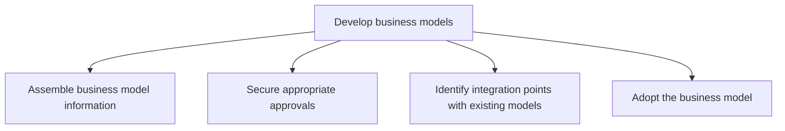
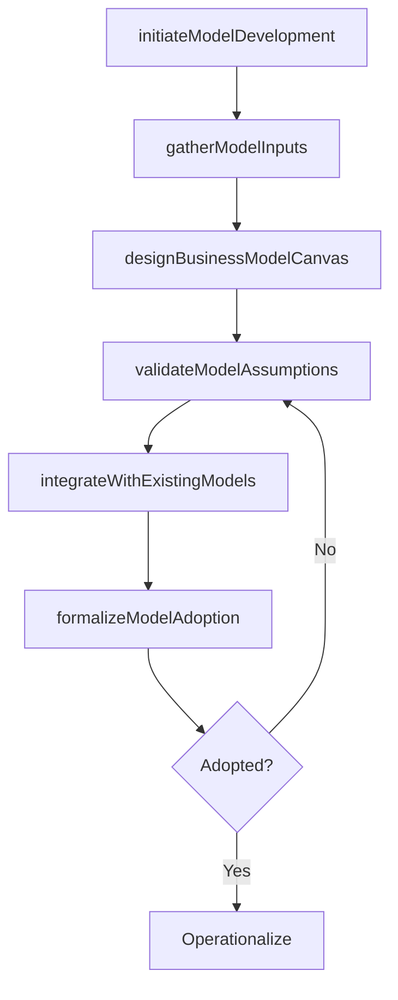

# Develop business models

> Business-as-Code definition for business model development. Models the end-to-end process of creating viable business models, from assembling market and financial information through securing approvals, integrating with existing models, and formal organizational adoption.

## Overview

Creating an economic model that describes the goals of an organization and the business processes needed to achieve those goals. This involves information gathering, securing necessary approvals and authorizations, integrating with preexisting models, including the general business concept [10002] and business strategy [10015], and formally accepting the model as the basis for organization's day-to-day operations.

## Process Hierarchy



## GraphDL

```yaml
develop:
  object: Business Models
  actor: BusinessModelArchitect
  result: AdoptedBusinessModel
```

## Actions

| Action | Description |
|--------|-------------|
| initiateModelDevelopment | Kick off a new business model development effort with defined scope and objectives |
| gatherModelInputs | Collect market, financial, operational, and customer data to inform model design |
| designBusinessModelCanvas | Structure value proposition, revenue, cost, channel, and resource components on a business model canvas |
| validateModelAssumptions | Test key model assumptions against market data, financial projections, and operational feasibility |
| integrateWithExistingModels | Ensure coherence between the new model and pre-existing organizational models |
| formalizeModelAdoption | Secure approvals and formally adopt the business model as an organizational operating guide |

## Events

| Event | Description |
|-------|-------------|
| modelDevelopmentInitiated | New business model development effort launched |
| modelInputsGathered | Market, financial, and operational data collected for model design |
| businessModelCanvasDesigned | Business model canvas components structured and documented |
| modelAssumptionsValidated | Key assumptions tested and confirmed against data |
| modelIntegrated | New model validated for coherence with existing organizational models |
| modelAdoptionFormalized | Business model approved and adopted as operating guide |

## Searches

| Search | Description |
|--------|-------------|
| getBusinessModels | Retrieve developed business models by status or type |
| getModelCanvas | Access the business model canvas for a specific model |
| getModelAssumptions | Retrieve the key assumptions and their validation status |
| getModelDevelopmentStatus | Access the current development stage and progress of a model |

## Process Flow



## RACI Matrix

| Activity | Responsible | Accountable | Consulted | Informed |
|----------|-------------|-------------|-----------|----------|
| initiateModelDevelopment | BusinessModelArchitect | VP Strategy | CEO | CFO |
| designBusinessModelCanvas | BusinessModelArchitect | VP Strategy | Product | Finance |
| validateModelAssumptions | FinancialAnalyst | CFO | VP Strategy | Operations |
| formalizeModelAdoption | VP Strategy | CEO | Board | AllDepartments |

## Sub-Processes

| ID | Name | Description |
|----|------|-------------|
| 1.4.1.1 | Assemble business model information | Collecting all relevant materials needed to develop the business model, so that it can adequately mo |
| 1.4.1.2 | Secure appropriate approvals | Obtaining required permissions, licenses and authorizations that legitimize the business, help to mi |
| 1.4.1.3 | Identify integration points with existing models | Ensuring coherence with pre-exsiting models to avoid contradictions between models. Make sure that a |
| 1.4.1.4 | Adopt the business model | Consenting to a particular business model and formally accepting it to serve as the set of guiding p |

## Related Processes

| Process | Relationship |
|---------|-------------|
| 1.4.2 Maintain business models | Downstream - developed models enter the maintenance lifecycle |
| 1.4.3 Establish business model governance | Related - governance defines rules for model development |
| 1.1.1 Assess the external environment | Upstream - external analysis informs business model assumptions |
| 1.2.2 Define and evaluate strategic options | Upstream - strategic options shape business model direction |

## Related Departments

| Department | Role |
|-----------|------|
| Strategy | Leads business model design and development |
| Finance | Provides financial modeling and validates economic assumptions |
| Product | Defines value proposition and key activities |
| Marketing | Contributes customer segment and channel insights |
| Operations | Provides resource and capability feasibility input |

## Related Occupations

| Occupation | Involvement |
|-----------|-------------|
| Business Model Architect | Primary designer and developer of the business model |
| Financial Analyst | Models revenue streams, cost structure, and financial projections |
| VP Strategy | Sponsors the development effort and drives adoption |

## KPIs

| KPI | Description | Unit |
|-----|-------------|------|
| Model Development Cycle Time | Average time from initiation to formal adoption | Weeks |
| Assumption Validation Rate | Percentage of key assumptions validated against data before adoption | % |
| Stakeholder Sign-Off Rate | Percentage of required approvals obtained for the model | % |
| Model Completeness Score | Percentage of business model canvas components fully populated | % |

## Usage

```typescript
import { developBusinessModels } from '@headlessly/develop-business-models'

const models = developBusinessModels()

// Initiate model development
const initiative = await models.initiateModelDevelopment({
  name: 'platform-business-model-v3',
  scope: 'full-canvas',
  objectives: ['expand-TAM', 'improve-unit-economics', 'enable-partner-ecosystem']
})

// Design the business model canvas
const canvas = await models.designBusinessModelCanvas({
  initiativeId: initiative.id,
  components: ['value-proposition', 'customer-segments', 'revenue-streams', 'cost-structure', 'channels', 'key-resources', 'key-activities', 'key-partnerships']
})

// Validate model assumptions
const validation = await models.validateModelAssumptions({
  canvasId: canvas.id,
  assumptions: ['tam-growth-15pct', 'cac-payback-12mo', 'partner-attach-rate-30pct'],
  dataSources: ['market-research', 'financial-projections', 'customer-interviews']
})
```
