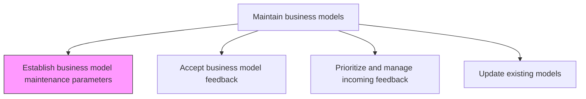
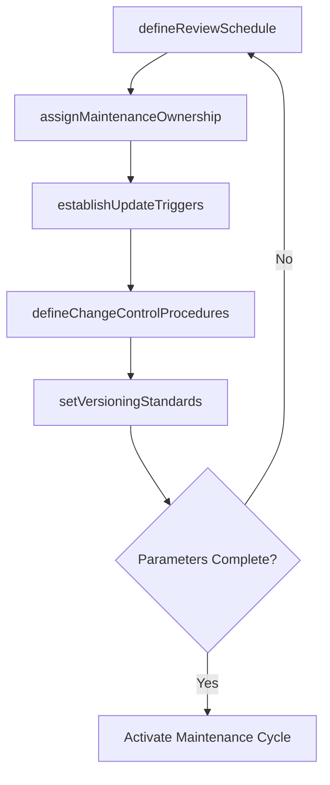

# Establish business model maintenance parameters

> Business-as-Code definition for business model maintenance parameter setting. Models the establishment of review schedules, update triggers, ownership assignments, and change control procedures that keep the business model current and relevant.

## Overview

Determining the timeline, procedures and responsibilities for reviewing the business model and for updating it to best serve the organization.

## Process Hierarchy



## GraphDL

```yaml
establish:
  object: Business Model Maintenance Parameters
  actor: BusinessModelArchitect
  result: MaintenanceParameterSet
```

## Actions

| Action | Description |
|--------|-------------|
| defineReviewSchedule | Set the cadence and timing for periodic business model reviews |
| assignMaintenanceOwnership | Designate accountable owners for each component of the business model |
| establishUpdateTriggers | Define the market, financial, or operational events that mandate an out-of-cycle review |
| defineChangeControlProcedures | Create procedures for proposing, evaluating, and approving model changes |
| setVersioningStandards | Establish version numbering, documentation, and archival standards for model changes |

## Events

| Event | Description |
|-------|-------------|
| reviewScheduleDefined | Periodic review cadence established and calendared |
| maintenanceOwnershipAssigned | Component-level ownership designated for the business model |
| updateTriggersEstablished | Market and operational trigger events defined for out-of-cycle reviews |
| changeControlProceduresDefined | Change proposal, evaluation, and approval procedures documented |
| versioningStandardsSet | Version control and archival standards established |

## Searches

| Search | Description |
|--------|-------------|
| getMaintenanceParameters | Retrieve the current maintenance parameters and review schedule |
| getOwnershipMap | Access the ownership assignments for business model components |
| getUpdateTriggers | Retrieve defined trigger events that mandate model reviews |

## Process Flow



## RACI Matrix

| Activity | Responsible | Accountable | Consulted | Informed |
|----------|-------------|-------------|-----------|----------|
| defineReviewSchedule | BusinessModelArchitect | VP Strategy | CFO | Operations |
| assignMaintenanceOwnership | VP Strategy | CEO | BusinessUnitLeads | AllDepartments |
| defineChangeControlProcedures | BusinessModelArchitect | VP Strategy | Legal | Compliance |

## Related Processes

| Process | Relationship |
|---------|-------------|
| 1.4.2.2 Accept business model feedback | Downstream - maintenance parameters define how feedback is received |
| 1.4.1 Develop business models | Upstream - developed model becomes the subject of maintenance |
| 1.4.3 Establish business model governance | Related - governance framework shapes maintenance parameters |

## Related Departments

| Department | Role |
|-----------|------|
| Strategy | Leads definition of maintenance parameters and review schedules |
| Finance | Defines financial trigger events for model review |
| Operations | Provides operational change triggers and resource inputs |
| Legal | Reviews change control procedures for compliance |

## Related Occupations

| Occupation | Involvement |
|-----------|-------------|
| Business Model Architect | Designs the maintenance parameter framework |
| VP Strategy | Approves and sponsors the maintenance approach |
| Process Improvement Specialist | Establishes change control procedures |

## KPIs

| KPI | Description | Unit |
|-----|-------------|------|
| Review Schedule Adherence | Percentage of scheduled model reviews conducted on time | % |
| Trigger Response Time | Average time from trigger event to initiated review | Days |
| Ownership Coverage | Percentage of business model components with assigned owners | % |
| Change Control Compliance | Percentage of model changes following the defined procedures | % |

## Usage

```typescript
import { establishBusinessModelMaintenanceParameters } from '@headlessly/establish-business-model-maintenance-parameters'

const maintenance = establishBusinessModelMaintenanceParameters()

// Define review schedule
const schedule = await maintenance.defineReviewSchedule({
  modelId: 'platform-business-model-v2',
  cadence: 'quarterly',
  reviewType: 'comprehensive',
  participants: ['strategy', 'finance', 'operations', 'product']
})

// Establish update triggers
const triggers = await maintenance.establishUpdateTriggers({
  modelId: 'platform-business-model-v2',
  triggerEvents: ['revenue-decline-10pct', 'market-disruption', 'regulatory-change', 'competitor-model-shift'],
  escalationPath: ['model-owner', 'vp-strategy', 'ceo']
})
```
