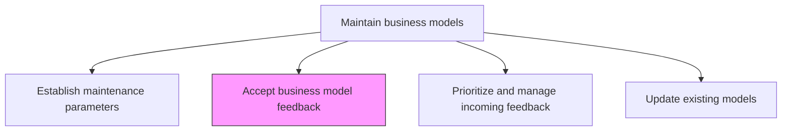
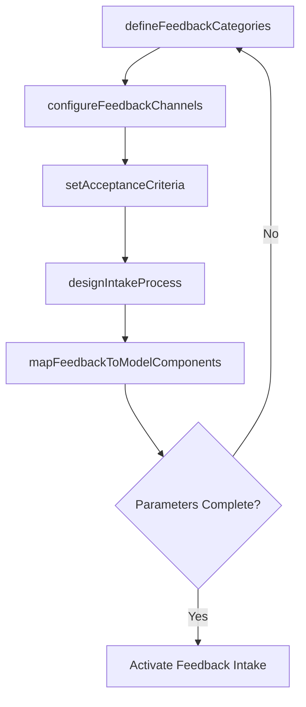

# Accept business model feedback parameters

> Business-as-Code definition for business model feedback acceptance. Models the definition and configuration of feedback channels, acceptance criteria, and intake processes that capture stakeholder insights relevant to business model maintenance.

## Overview

Deciding the type of responses, reactions, sentiments and insights that are crucial to be taken into consideration with business model maintenance.

## Process Hierarchy



## GraphDL

```yaml
accept:
  object: Business Model Feedback Parameters
  actor: BusinessModelArchitect
  result: FeedbackAcceptanceCriteria
```

## Actions

| Action | Description |
|--------|-------------|
| defineFeedbackCategories | Classify the types of feedback relevant to business model maintenance (market, financial, operational, customer) |
| configureFeedbackChannels | Establish the channels through which stakeholders can submit business model feedback |
| setAcceptanceCriteria | Define minimum quality and relevance thresholds for feedback to be formally accepted |
| designIntakeProcess | Create a structured workflow for receiving, logging, and acknowledging feedback submissions |
| mapFeedbackToModelComponents | Link feedback categories to specific business model components they affect |

## Events

| Event | Description |
|-------|-------------|
| feedbackCategoriesDefined | Relevant feedback types classified and documented |
| feedbackChannelsConfigured | Submission channels established and published to stakeholders |
| acceptanceCriteriaSet | Quality and relevance thresholds defined for feedback intake |
| intakeProcessDesigned | Feedback receiving and logging workflow created |
| feedbackMappedToComponents | Feedback categories linked to business model components |

## Searches

| Search | Description |
|--------|-------------|
| getFeedbackCategories | Retrieve the defined feedback category taxonomy |
| getFeedbackChannels | Access configured feedback submission channels |
| getAcceptanceCriteria | Retrieve the quality and relevance criteria for feedback acceptance |
| getPendingFeedback | Access submitted feedback awaiting acceptance review |

## Process Flow



## RACI Matrix

| Activity | Responsible | Accountable | Consulted | Informed |
|----------|-------------|-------------|-----------|----------|
| defineFeedbackCategories | BusinessModelArchitect | VP Strategy | BusinessUnitLeads | Operations |
| configureFeedbackChannels | BusinessModelArchitect | VP Strategy | IT | AllStakeholders |
| setAcceptanceCriteria | VP Strategy | CEO | CFO | Legal |

## Related Processes

| Process | Relationship |
|---------|-------------|
| 1.4.2.1 Establish business model maintenance parameters | Upstream - maintenance parameters define the feedback framework |
| 1.4.2.3 Prioritize and manage incoming feedback | Downstream - accepted feedback flows to prioritization |
| 1.4.3 Establish business model governance | Related - governance defines feedback authority levels |

## Related Departments

| Department | Role |
|-----------|------|
| Strategy | Defines feedback categories and acceptance criteria |
| Operations | Provides operational performance feedback on the business model |
| Sales | Submits market and customer feedback relevant to model validity |
| Finance | Contributes financial performance feedback against model assumptions |

## Related Occupations

| Occupation | Involvement |
|-----------|-------------|
| Business Model Architect | Designs the feedback acceptance framework |
| Strategy Analyst | Manages the feedback intake process |
| Business Intelligence Analyst | Configures feedback channels and reporting |

## KPIs

| KPI | Description | Unit |
|-----|-------------|------|
| Feedback Channel Coverage | Number of active channels configured for feedback collection | Count |
| Feedback Acceptance Rate | Percentage of submitted feedback meeting acceptance criteria | % |
| Intake Processing Time | Average time from feedback submission to formal acceptance or rejection | Days |
| Stakeholder Participation Rate | Percentage of key stakeholder groups submitting feedback | % |

## Usage

```typescript
import { acceptBusinessModelFeedbackParameters } from '@headlessly/accept-business-model-feedback-parameters'

const feedback = acceptBusinessModelFeedbackParameters()

// Define feedback categories
const categories = await feedback.defineFeedbackCategories({
  modelId: 'platform-business-model-v2',
  categories: ['market-shift', 'financial-variance', 'operational-constraint', 'customer-behavior-change', 'competitive-threat']
})

// Set acceptance criteria
const criteria = await feedback.setAcceptanceCriteria({
  modelId: 'platform-business-model-v2',
  minimumEvidence: 'quantitative-or-multi-source',
  relevanceThreshold: 'directly-impacts-model-assumption',
  timelinessWindow: '90-days'
})
```
