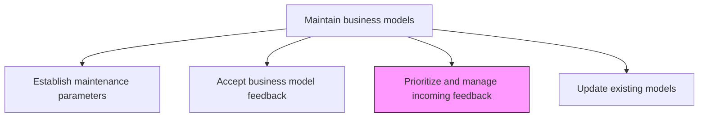
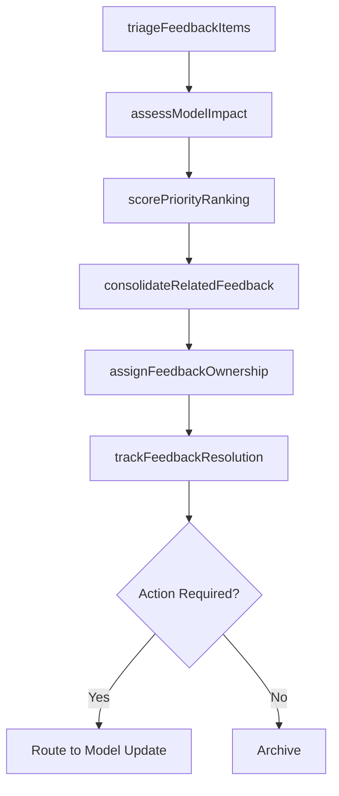

# Prioritize and manage incoming feedback

> Business-as-Code definition for business model feedback prioritization. Models the triage, impact assessment, and management of incoming feedback to determine which items warrant changes to the current business model.

## Overview

Evaluating the feedback regarding products, services, processes or resources. Determine which judgments are critical and mandate changes to the current business model to better deliver the desired value

## Process Hierarchy



## GraphDL

```yaml
prioritize:
  object: And Manage Incoming Feedback
  actor: StrategyAnalyst
  result: PrioritizedFeedbackBacklog
```

## Actions

| Action | Description |
|--------|-------------|
| triageFeedbackItems | Classify incoming feedback by urgency, source credibility, and potential business model impact |
| assessModelImpact | Evaluate how each feedback item affects specific business model components and assumptions |
| scorePriorityRanking | Apply weighted scoring criteria to rank feedback items by strategic importance |
| consolidateRelatedFeedback | Group overlapping or thematically related feedback items to reduce duplication |
| assignFeedbackOwnership | Designate responsible owners for each prioritized feedback item |
| trackFeedbackResolution | Monitor the disposition and resolution status of each feedback item |

## Events

| Event | Description |
|-------|-------------|
| feedbackItemsTriaged | Incoming feedback classified by urgency and impact |
| modelImpactAssessed | Feedback impact on business model components evaluated |
| priorityRankingScored | Feedback items ranked by weighted strategic importance |
| relatedFeedbackConsolidated | Overlapping feedback items grouped and deduplicated |
| feedbackOwnershipAssigned | Responsible owners designated for prioritized items |
| feedbackResolutionTracked | Feedback disposition and resolution status updated |

## Searches

| Search | Description |
|--------|-------------|
| getPrioritizedFeedback | Retrieve the ranked backlog of business model feedback items |
| getFeedbackByImpact | Access feedback items filtered by business model component impact |
| getFeedbackResolutionStatus | Retrieve resolution status and disposition of feedback items |

## Process Flow



## RACI Matrix

| Activity | Responsible | Accountable | Consulted | Informed |
|----------|-------------|-------------|-----------|----------|
| triageFeedbackItems | StrategyAnalyst | VP Strategy | BusinessUnitLeads | Operations |
| assessModelImpact | BusinessModelArchitect | VP Strategy | CFO | Product |
| scorePriorityRanking | StrategyAnalyst | VP Strategy | CEO | AllStakeholders |

## Related Processes

| Process | Relationship |
|---------|-------------|
| 1.4.2.2 Accept business model feedback | Upstream - accepted feedback flows into prioritization |
| 1.4.2.4 Update existing models | Downstream - prioritized feedback drives model updates |
| 1.4.3 Establish business model governance | Related - governance defines prioritization authority |

## Related Departments

| Department | Role |
|-----------|------|
| Strategy | Leads feedback triage, impact assessment, and prioritization |
| Finance | Assesses financial impact of feedback on model assumptions |
| Operations | Evaluates operational feasibility of model changes |
| Product | Provides product-market feedback context |

## Related Occupations

| Occupation | Involvement |
|-----------|-------------|
| Strategy Analyst | Triages, scores, and manages the feedback backlog |
| Business Model Architect | Assesses feedback impact on model components |
| VP Strategy | Approves priority rankings and resource allocation |

## KPIs

| KPI | Description | Unit |
|-----|-------------|------|
| Feedback Triage Time | Average time from feedback receipt to initial triage classification | Hours |
| Backlog Velocity | Number of feedback items resolved or dispositioned per month | Count |
| High-Impact Identification Rate | Percentage of feedback items with material model impact identified within 48 hours | % |
| Feedback-to-Action Conversion | Percentage of prioritized feedback items resulting in model updates | % |

## Usage

```typescript
import { prioritizeAndManageIncomingFeedback } from '@headlessly/prioritize-and-manage-incoming-feedback'

const feedbackMgmt = prioritizeAndManageIncomingFeedback()

// Triage incoming feedback
const triaged = await feedbackMgmt.triageFeedbackItems({
  feedbackIds: ['fb-001', 'fb-002', 'fb-003'],
  urgencyLevels: ['critical', 'high', 'medium', 'low'],
  impactCategories: ['revenue-model', 'cost-structure', 'value-proposition', 'channel-strategy']
})

// Score priority ranking
const ranked = await feedbackMgmt.scorePriorityRanking({
  triagedItems: triaged.items,
  weights: { 'strategic-impact': 0.40, 'urgency': 0.30, 'source-credibility': 0.15, 'frequency': 0.15 }
})
```
