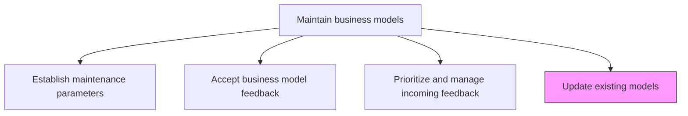
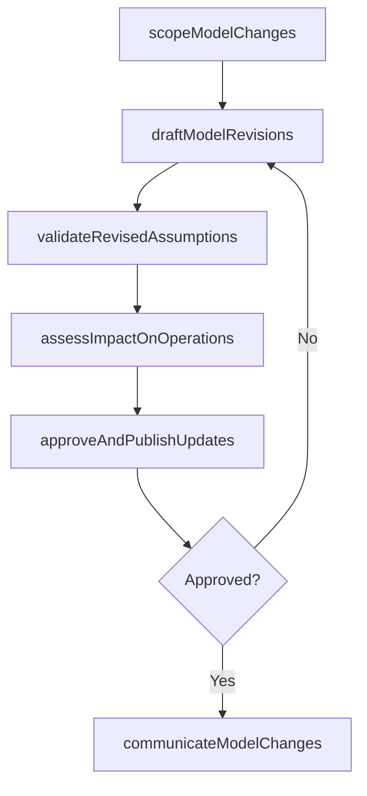

# Update existing models

> Business-as-Code definition for business model update execution. Models the process of modifying, validating, and publishing changes to existing business models in response to prioritized feedback, market shifts, or strategic pivots.

## Overview

Modifying the business models that are presently in use in response to incoming feedback or changing markets to achieve the enterprise business goals.

## Process Hierarchy



## GraphDL

```yaml
update:
  object: Existing Models
  actor: BusinessModelArchitect
  result: UpdatedBusinessModel
```

## Actions

| Action | Description |
|--------|-------------|
| scopeModelChanges | Define the specific business model components and assumptions to be modified |
| draftModelRevisions | Create proposed revisions to the affected business model elements |
| validateRevisedAssumptions | Test revised model assumptions against current market data and financial projections |
| assessImpactOnOperations | Evaluate how model changes affect existing operational processes and resource allocation |
| approveAndPublishUpdates | Secure change approval and publish the updated business model as the new baseline |
| communicateModelChanges | Inform all stakeholders of business model updates and their operational implications |

## Events

| Event | Description |
|-------|-------------|
| modelChangesScoped | Specific components and assumptions targeted for modification documented |
| modelRevisionsDrafted | Proposed business model revisions created and reviewed |
| revisedAssumptionsValidated | Updated model assumptions tested and confirmed against data |
| operationalImpactAssessed | Effects of model changes on operations evaluated |
| updatesApprovedAndPublished | Revised model approved and published as new baseline |
| modelChangesCommunicated | Stakeholders notified of business model updates |

## Searches

| Search | Description |
|--------|-------------|
| getModelUpdateHistory | Retrieve the change log for a specific business model |
| getPendingUpdates | Access model revisions awaiting approval or validation |
| getModelVersionComparison | Compare current and previous versions of the business model |

## Process Flow



## RACI Matrix

| Activity | Responsible | Accountable | Consulted | Informed |
|----------|-------------|-------------|-----------|----------|
| scopeModelChanges | BusinessModelArchitect | VP Strategy | CFO | Operations |
| draftModelRevisions | BusinessModelArchitect | VP Strategy | Product | Finance |
| validateRevisedAssumptions | FinancialAnalyst | CFO | VP Strategy | BusinessUnitLeads |
| approveAndPublishUpdates | VP Strategy | CEO | Board | AllDepartments |

## Related Processes

| Process | Relationship |
|---------|-------------|
| 1.4.2.3 Prioritize and manage incoming feedback | Upstream - prioritized feedback drives model update scope |
| 1.4.1.3 Identify integration points with existing models | Related - updates must maintain coherence with related models |
| 1.4.3 Establish business model governance | Related - governance defines approval authority for updates |

## Related Departments

| Department | Role |
|-----------|------|
| Strategy | Leads model revision drafting and approval coordination |
| Finance | Validates financial assumptions in revised models |
| Operations | Assesses operational impact of model changes |
| Product | Ensures product strategy alignment with updated model |
| Corporate Communications | Supports stakeholder notification of model changes |

## Related Occupations

| Occupation | Involvement |
|-----------|-------------|
| Business Model Architect | Drafts and validates business model revisions |
| Financial Analyst | Tests revised financial assumptions and projections |
| VP Strategy | Approves and sponsors model updates |

## KPIs

| KPI | Description | Unit |
|-----|-------------|------|
| Update Cycle Time | Average time from change scope to published update | Weeks |
| Assumption Validation Rate | Percentage of revised assumptions confirmed by market data | % |
| Update Approval Rate | Percentage of proposed revisions approved on first submission | % |
| Model Currency | Time since last substantive business model update | Months |

## Usage

```typescript
import { updateExistingModels } from '@headlessly/update-existing-models'

const modelUpdate = updateExistingModels()

// Scope model changes based on prioritized feedback
const scope = await modelUpdate.scopeModelChanges({
  modelId: 'platform-business-model-v2',
  feedbackItemIds: ['fb-001', 'fb-003'],
  affectedComponents: ['revenue-streams', 'cost-structure', 'channel-strategy']
})

// Draft and validate revisions
const revisions = await modelUpdate.draftModelRevisions({
  scopeId: scope.id,
  proposedChanges: [
    { component: 'revenue-streams', change: 'add-usage-based-tier' },
    { component: 'cost-structure', change: 'reduce-cac-via-self-serve' }
  ]
})
```
