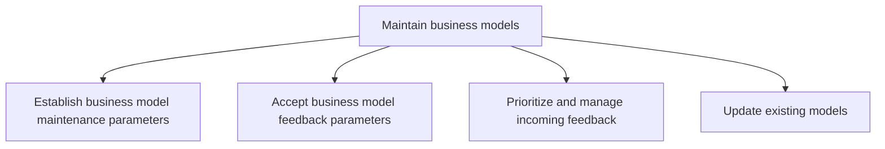
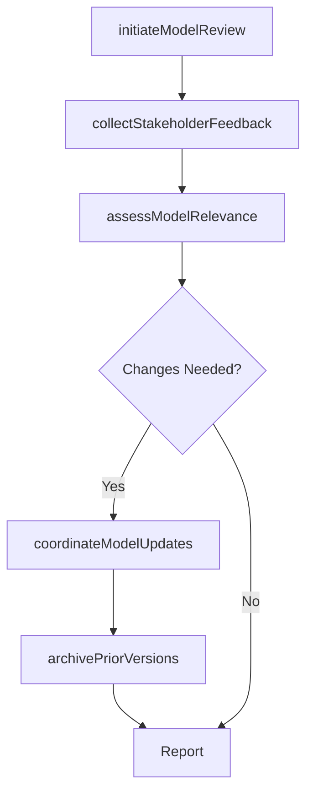

# Maintain business models

> Business-as-Code definition for business model maintenance. Models the ongoing process of reviewing, updating, and evolving business models in response to market changes, stakeholder feedback, and strategic shifts to ensure continued relevance and value creation.

## Overview

Revising and updating business models to reflect the changes in the marketed services, product inventory, market behavior, available resources or accrued expenses. Determine how and when to modify the accepted business model in response to incoming feedback.

## Process Hierarchy



## GraphDL

```yaml
maintain:
  object: Business Models
  actor: BusinessModelArchitect
  result: MaintainedBusinessModelPortfolio
```

## Actions

| Action | Description |
|--------|-------------|
| initiateModelReview | Trigger a scheduled or event-driven review of the current business model |
| collectStakeholderFeedback | Gather feedback from internal and external stakeholders on model validity |
| assessModelRelevance | Evaluate whether the business model still reflects market conditions and strategic goals |
| coordinateModelUpdates | Orchestrate the revision, validation, and publication of business model changes |
| archivePriorVersions | Maintain a versioned history of business model iterations for audit and reference |

## Events

| Event | Description |
|-------|-------------|
| modelReviewInitiated | Scheduled or event-driven business model review triggered |
| stakeholderFeedbackCollected | Feedback gathered from stakeholders on model validity |
| modelRelevanceAssessed | Current model evaluated against market conditions and strategic goals |
| modelUpdatesCoordinated | Business model revisions orchestrated through approval and publication |
| priorVersionsArchived | Previous model versions documented and stored |

## Searches

| Search | Description |
|--------|-------------|
| getModelMaintenanceStatus | Retrieve the current maintenance status and next review date |
| getModelVersionHistory | Access the versioned history of business model iterations |
| getMaintenanceMetrics | Retrieve metrics on model review frequency and update velocity |

## Process Flow



## RACI Matrix

| Activity | Responsible | Accountable | Consulted | Informed |
|----------|-------------|-------------|-----------|----------|
| initiateModelReview | BusinessModelArchitect | VP Strategy | CFO | CEO |
| assessModelRelevance | StrategyAnalyst | VP Strategy | BusinessUnitLeads | Operations |
| coordinateModelUpdates | BusinessModelArchitect | VP Strategy | Finance | AllDepartments |

## Sub-Processes

| ID | Name | Description |
|----|------|-------------|
| 1.4.2.1 | Establish business model maintenance parameters | Determining the timeline, procedures and responsibilities for reviewing the business model and for u |
| 1.4.2.2 | Accept business model feedback parameters | Deciding the type of responses, reactions, sentiments and insights that are crucial to be taken into |
| 1.4.2.3 | Prioritize and manage incoming feedback | Evaluating the feedback regarding products, services, processes or resources. Determine which judgme |
| 1.4.2.4 | Update existing models | Modifying the business models that are presently in use in response to incoming feedback or changing |

## Related Processes

| Process | Relationship |
|---------|-------------|
| 1.4.1 Develop business models | Upstream - developed models become the subjects of ongoing maintenance |
| 1.4.3 Establish business model governance | Related - governance defines the authority and rules for model maintenance |
| 1.2.2 Define and evaluate strategic options | Related - strategic shifts trigger model maintenance reviews |

## Related Departments

| Department | Role |
|-----------|------|
| Strategy | Leads business model maintenance and review cycles |
| Finance | Validates financial assumptions during model updates |
| Operations | Provides operational performance data for model assessment |
| Product | Contributes product-market feedback for model relevance checks |

## Related Occupations

| Occupation | Involvement |
|-----------|-------------|
| Business Model Architect | Leads model maintenance activities and coordinates updates |
| Strategy Analyst | Manages feedback triage and impact assessment |
| VP Strategy | Sponsors the maintenance program and approves major changes |

## KPIs

| KPI | Description | Unit |
|-----|-------------|------|
| Model Review Cadence Adherence | Percentage of scheduled reviews conducted on time | % |
| Feedback-to-Update Cycle Time | Average time from feedback acceptance to published model update | Weeks |
| Model Currency Score | Recency of the last substantive model update | Months |
| Stakeholder Feedback Volume | Number of feedback items received per review cycle | Count |

## Usage

```typescript
import { maintainBusinessModels } from '@headlessly/maintain-business-models'

const maintenance = maintainBusinessModels()

// Initiate a model review
const review = await maintenance.initiateModelReview({
  modelId: 'platform-business-model-v2',
  trigger: 'quarterly-scheduled',
  reviewScope: ['revenue-streams', 'cost-structure', 'value-proposition']
})

// Assess model relevance
const assessment = await maintenance.assessModelRelevance({
  reviewId: review.id,
  marketDataSources: ['industry-reports', 'competitor-analysis', 'customer-feedback'],
  relevanceThreshold: 0.80
})
```
