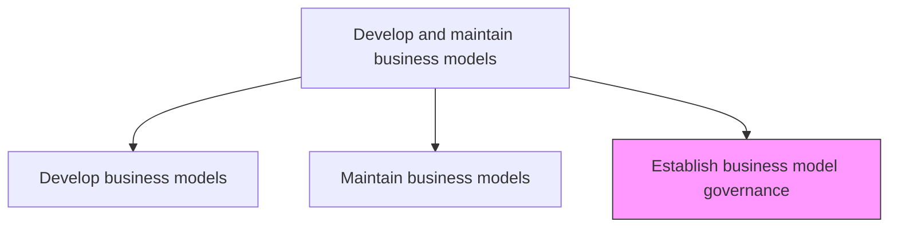
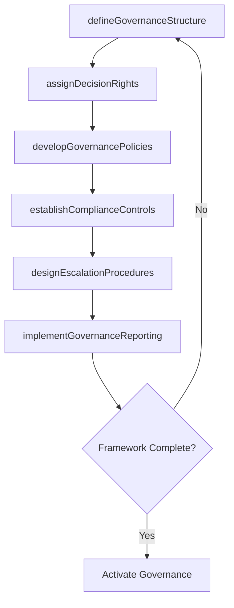

# Establish business model governance

> Business-as-Code definition for business model governance establishment. Models the creation of oversight structures, decision rights, policies, and control mechanisms that ensure business models are managed with consistency, accountability, and strategic alignment.

## Overview

Creating and implementing a strategy, responsibilities and control mechanisms for managing business models that are timely, efficient and cost-effective.

## Process Hierarchy



## GraphDL

```yaml
establish:
  object: Business Model Governance
  actor: VP Strategy
  result: BusinessModelGovernanceFramework
```

## Actions

| Action | Description |
|--------|-------------|
| defineGovernanceStructure | Design the committee structure, roles, and reporting lines for business model oversight |
| assignDecisionRights | Specify who can propose, approve, and veto business model changes at each level |
| developGovernancePolicies | Create policies governing model creation, modification, retirement, and conflict resolution |
| establishComplianceControls | Define audit trails, documentation requirements, and compliance checkpoints for model changes |
| designEscalationProcedures | Create procedures for escalating governance disputes or deadlocked decisions |
| implementGovernanceReporting | Set up regular governance reporting on model health, change activity, and compliance |

## Events

| Event | Description |
|-------|-------------|
| governanceStructureDefined | Committee structure and oversight roles established |
| decisionRightsAssigned | Change proposal, approval, and veto authorities designated |
| governancePoliciesDeveloped | Model lifecycle and conflict resolution policies created |
| complianceControlsEstablished | Audit trails and compliance checkpoints configured |
| escalationProceduresDesigned | Dispute resolution and escalation paths documented |
| governanceReportingImplemented | Regular governance reporting cadence activated |

## Searches

| Search | Description |
|--------|-------------|
| getGovernanceFramework | Retrieve the current business model governance structure and policies |
| getDecisionRights | Access the decision rights matrix for business model changes |
| getGovernanceComplianceReport | Retrieve compliance audit results for business model governance |
| getEscalationHistory | Access the history of governance escalations and resolutions |

## Process Flow



## RACI Matrix

| Activity | Responsible | Accountable | Consulted | Informed |
|----------|-------------|-------------|-----------|----------|
| defineGovernanceStructure | VP Strategy | CEO | Board | AllExecutives |
| assignDecisionRights | VP Strategy | CEO | CFO | BusinessUnitLeads |
| developGovernancePolicies | BusinessModelArchitect | VP Strategy | Legal | Compliance |
| establishComplianceControls | InternalAudit | VP Strategy | Legal | CFO |

## Related Processes

| Process | Relationship |
|---------|-------------|
| 1.4.1 Develop business models | Related - governance defines the rules for model development |
| 1.4.2 Maintain business models | Related - governance provides the authority framework for model maintenance |
| 1.2.3 Coordinate and align functional and process strategies | Related - governance ensures model alignment with cross-functional strategies |

## Related Departments

| Department | Role |
|-----------|------|
| Strategy | Designs and administers the governance framework |
| Legal | Reviews governance policies for regulatory compliance |
| Internal Audit | Validates governance controls and compliance |
| Finance | Ensures financial governance over model assumptions and projections |
| Executive Leadership | Sponsors and enforces governance authority |

## Related Occupations

| Occupation | Involvement |
|-----------|-------------|
| VP Strategy | Designs and sponsors the governance framework |
| Internal Auditor | Validates governance compliance and control effectiveness |
| General Counsel | Reviews governance policies for legal and regulatory adherence |

## KPIs

| KPI | Description | Unit |
|-----|-------------|------|
| Governance Compliance Rate | Percentage of model changes following governance procedures | % |
| Decision Rights Coverage | Percentage of model components with clearly assigned decision authority | % |
| Governance Audit Score | Internal audit rating of governance control effectiveness | Score (1-5) |
| Escalation Resolution Time | Average time to resolve governance disputes | Days |

## Usage

```typescript
import { establishBusinessModelGovernance } from '@headlessly/establish-business-model-governance'

const governance = establishBusinessModelGovernance()

// Define governance structure
const structure = await governance.defineGovernanceStructure({
  committees: ['business-model-review-board', 'model-change-committee'],
  meetingCadence: 'monthly',
  reportingLine: 'ceo'
})

// Assign decision rights
const rights = await governance.assignDecisionRights({
  structureId: structure.id,
  rights: [
    { role: 'model-owner', actions: ['propose', 'draft'] },
    { role: 'vp-strategy', actions: ['approve-minor'] },
    { role: 'ceo', actions: ['approve-major', 'veto'] },
    { role: 'board', actions: ['approve-fundamental'] }
  ]
})
```
