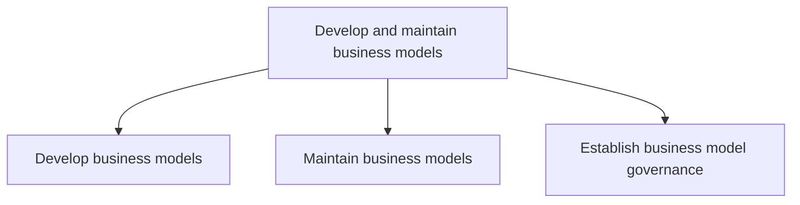
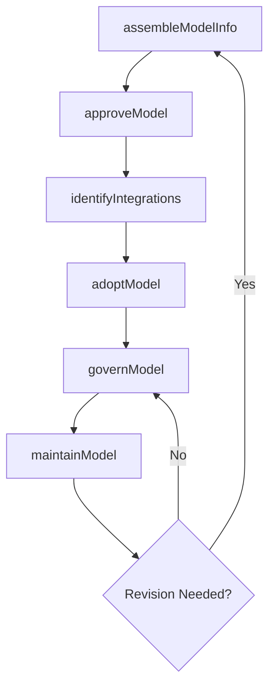

# Develop and maintain business models

> Business-as-Code definition for business model development and maintenance. Models the creation, approval, integration, revision, and governance of how an organization creates, delivers, and captures value.

## Overview

Establishing how an organization creates, delivers and captures value or makes profit. Identify the products or services that a business will sell, its target market, anticipated expenses, and other core aspects of its modus operandi. Revise the plan as required to reflect changing circumstances.

## Process Hierarchy



## GraphDL

```yaml
develop:
  object: And Maintain Business Models
  actor: BusinessModelArchitect
  result: BusinessModelCanvas
```

## Actions

| Action | Description |
|--------|-------------|
| assembleModelInfo | Gather revenue streams, cost structures, value propositions, and channel data |
| approveModel | Secure executive and board approval for new or revised business models |
| identifyIntegrations | Map integration points between new and existing business models |
| adoptModel | Operationalize the approved business model across the organization |
| maintainModel | Update models based on market feedback and performance data |
| governModel | Establish ownership, review cadence, and change control for business models |

## Events

| Event | Description |
|-------|-------------|
| modelInfoAssembled | Business model components gathered and documented |
| modelApproved | Business model approved by executive leadership |
| integrationsIdentified | Integration points with existing models mapped |
| modelAdopted | Business model operationalized across the organization |
| modelMaintained | Business model updated with latest feedback and data |
| governanceEstablished | Model governance framework and review cadence set |

## Searches

| Search | Description |
|--------|-------------|
| getBusinessModel | Retrieve a specific business model by ID or name |
| listBusinessModels | List all business models filtered by status, type, or business unit |
| getModelPerformance | Retrieve revenue, cost, and margin data for a business model |
| getGovernanceStatus | Access governance review schedule and compliance status |

## Process Flow



## RACI Matrix

| Activity | Responsible | Accountable | Consulted | Informed |
|----------|-------------|-------------|-----------|----------|
| assembleModelInfo | BusinessModelArchitect | VP Strategy | Finance, Product | Operations |
| approveModel | VP Strategy | CEO | BoardOfDirectors | BusinessUnits |
| identifyIntegrations | BusinessModelArchitect | VP Strategy | IT, Operations | Finance |
| adoptModel | BusinessUnitLeads | VP Strategy | Operations, HR | AllEmployees |
| governModel | BusinessModelArchitect | VP Strategy | Legal, Compliance | Executive |

## Sub-Processes

| ID | Name | Description |
|----|------|-------------|
| 1.4.1 | Develop business models | Creating an economic model that describes the goals of an organization and the business processes ne |
| 1.4.2 | Maintain business models | Revising and updating business models to reflect the changes in the marketed services, product inven |
| 1.4.3 | Establish business model governance | Creating and implementing a strategy, responsibilities and control mechanisms for managing business  |

## Related Processes

| Process | Relationship |
|---------|-------------|
| 1.1 Define the business concept and long-term vision | Upstream - vision shapes the business model framework |
| 1.2 Develop business strategy | Parallel - strategy and business model co-evolve |
| 2.0 Design and Develop Products and Services | Downstream - business model defines product monetization approach |
| 8.0 Manage Financial Resources | Supporting - financial modeling validates business model viability |

## Related Departments

| Department | Role |
|-----------|------|
| Strategy | Designs and governs business models |
| Finance | Validates revenue and cost assumptions |
| Product | Aligns product offerings with value propositions |
| Operations | Ensures operational feasibility of the model |
| Legal | Reviews contractual and compliance aspects of the model |

## Related Occupations

| Occupation | Involvement |
|-----------|-------------|
| Business Model Architect | Designs and maintains business model canvases |
| Financial Analyst | Models revenue streams and cost structures |
| Product Manager | Aligns value propositions with market needs |

## KPIs

| KPI | Description | Unit |
|-----|-------------|------|
| Model Viability Score | Assessment of business model sustainability and profitability | Score (1-10) |
| Revenue per Model | Revenue generated by each active business model | USD |
| Model Review Cadence | Frequency of scheduled business model governance reviews | Per Year |
| Time to Model Adoption | Elapsed time from model approval to full operationalization | Months |

## Usage

```typescript
import { developAndMaintainBusinessModels } from '@headlessly/develop-and-maintain-business-models'

const models = developAndMaintainBusinessModels()

// Assemble business model information
const modelDraft = await models.assembleModelInfo({
  name: 'Platform Subscription Model',
  valueProposition: 'Self-service analytics for mid-market',
  revenueStreams: ['subscription', 'usage-based'],
  costStructure: ['cloud-infrastructure', 'engineering', 'support']
})

// Secure approval and adopt the model
await models.approveModel({ modelId: modelDraft.id })
await models.adoptModel({
  modelId: modelDraft.id,
  businessUnits: ['North America', 'EMEA']
})
```
