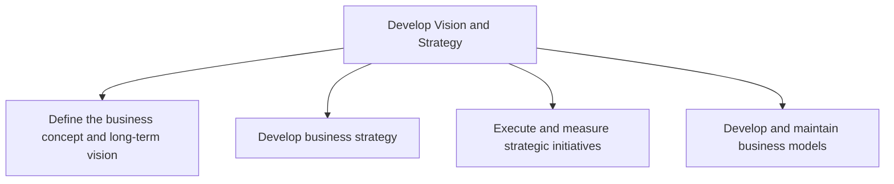
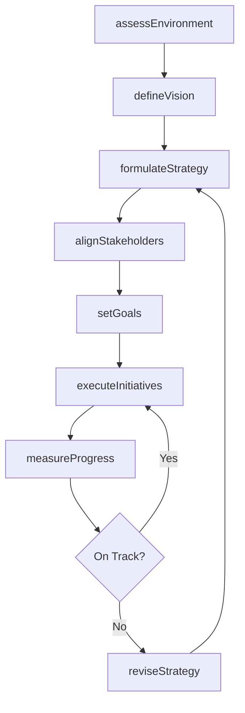

# Develop Vision and Strategy

> Business-as-Code definition for organizational vision and strategy development. Models the end-to-end process of defining business direction, formulating strategy, executing initiatives, and governing business models.

## Overview

Establishing a direction and vision for an organization. This involves defining the business concept and long-term vision, as well as developing the business strategy and managing strategic initiatives. Processes in this category focus on creating a vision, a mission, and strategic objectives, and culminate in creating measures to ensure that the organization is moving in the desired direction.

## Process Hierarchy



## GraphDL

```yaml
develop:
  object: Vision And Strategy
  actor: ChiefStrategyOfficer
  result: StrategicPlan
```

## Actions

| Action | Description |
|--------|-------------|
| defineVision | Articulate the long-term strategic vision for the organization |
| assessEnvironment | Evaluate external and internal factors shaping strategic direction |
| formulateStrategy | Develop the overarching business strategy and objectives |
| alignStakeholders | Engage leadership and stakeholders around the strategic plan |
| setGoals | Establish measurable organizational goals and targets |
| executeInitiatives | Launch and manage strategic initiatives to realize the vision |
| measureProgress | Track strategic KPIs and initiative outcomes against targets |
| reviseStrategy | Update the strategic plan based on performance data and market shifts |

## Events

| Event | Description |
|-------|-------------|
| visionDefined | Long-term strategic vision articulated and documented |
| environmentAssessed | External and internal environment analysis completed |
| strategyFormulated | Business strategy developed and approved |
| stakeholdersAligned | Leadership consensus on strategic direction achieved |
| goalsSet | Organizational goals and targets established |
| initiativesExecuted | Strategic initiatives launched and under management |
| progressMeasured | Strategic KPIs reviewed and reported |
| strategyRevised | Strategic plan updated based on new insights |

## Searches

| Search | Description |
|--------|-------------|
| getStrategicPlan | Retrieve the current strategic plan and vision documents |
| listInitiatives | List strategic initiatives filtered by status, priority, or owner |
| getGoalProgress | Retrieve goal attainment metrics for a given period |
| findStrategyGaps | Identify areas where strategy execution deviates from targets |

## Process Flow



## RACI Matrix

| Activity | Responsible | Accountable | Consulted | Informed |
|----------|-------------|-------------|-----------|----------|
| assessEnvironment | StrategyAnalyst | ChiefStrategyOfficer | MarketResearch | Executive |
| defineVision | ChiefStrategyOfficer | CEO | BoardOfDirectors | AllEmployees |
| formulateStrategy | VP Strategy | CEO | Finance, Operations | BusinessUnits |
| setGoals | VP Strategy | ChiefStrategyOfficer | BusinessUnitLeads | HR |
| measureProgress | StrategyAnalyst | ChiefStrategyOfficer | Finance | BoardOfDirectors |

## Sub-Processes

| ID | Name | Description |
|----|------|-------------|
| 1.1 | Define the business concept and long-term vision | Creating a conceptual framework of the organization's business activity and strategic vision with lo |
| 1.2 | Develop business strategy | Developing an organization's mission statement, strategy, and business design. Create a concise stat |
| 1.3 | Execute and measure strategic initiatives | Managing strategic initiatives, from development through selection, execution, and evaluation. Condu |
| 1.4 | Develop and maintain business models | Establishing how an organization creates, delivers and captures value or makes profit. Identify the  |

## Related Processes

| Process | Relationship |
|---------|-------------|
| 2.0 Design and Develop Products and Services | Downstream - strategy informs product development priorities |
| 8.0 Manage Financial Resources | Downstream - financial strategies feed budget and capital planning |
| 7.0 Manage Human Capital | Supporting - workforce planning aligned to strategic goals |
| 11.0 Manage Business Risk | Parallel - risk analysis informs strategic option evaluation |

## Related Departments

| Department | Role |
|-----------|------|
| Strategy | Primary owner of vision and strategy development |
| Executive Leadership | Approves and champions strategic direction |
| Finance | Provides financial modeling and resource allocation |
| Operations | Ensures strategic feasibility and operational alignment |
| Human Resources | Aligns talent strategy with organizational goals |

## Related Occupations

| Occupation | Involvement |
|-----------|-------------|
| Chief Strategy Officer | Executive owner of strategic planning |
| Strategy Analyst | Conducts environmental analysis and strategic research |
| Business Development Manager | Identifies growth opportunities and partnerships |
| Management Consultant | Provides external strategic advisory |

## KPIs

| KPI | Description | Unit |
|-----|-------------|------|
| Strategic Goal Attainment | Percentage of strategic goals met within target period | % |
| Initiative Completion Rate | Proportion of strategic initiatives completed on time | % |
| Strategy Review Cycle Time | Time between strategy formulation and scheduled review | Months |
| Stakeholder Alignment Score | Survey-based measure of leadership alignment on strategy | Score (1-10) |
| Revenue Growth vs. Target | Actual revenue growth compared to strategic plan targets | % Variance |

## Usage

```typescript
import { developVisionAndStrategy } from '@headlessly/develop-vision-and-strategy'

const strategy = developVisionAndStrategy()

// Assess the external and internal environment
const assessment = await strategy.assessEnvironment({
  scope: 'full',
  includeCompetitorAnalysis: true,
  includeMarketTrends: true
})

// Formulate strategy based on assessment
const plan = await strategy.formulateStrategy({
  assessmentId: assessment.id,
  horizon: '5-year',
  focusAreas: ['growth', 'digital-transformation', 'sustainability']
})

// Set measurable organizational goals
await strategy.setGoals({
  strategyId: plan.id,
  goals: [
    { metric: 'revenueGrowth', target: 15, unit: 'percent' },
    { metric: 'marketShare', target: 25, unit: 'percent' }
  ]
})
```
