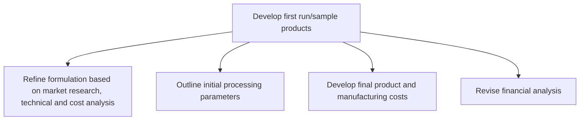

# Develop first run/sample products

> TODO: Business-as-Code definition for develop first run/sample products (consumer-products)

## Overview

TODO: Add process overview

## Process Hierarchy



## GraphDL

```yaml
develop:
  object: First Run/sample Products
  actor: TODO
  result: TODO
```

## Actions

| Action | Description |
|--------|-------------|
| TODO | TODO |

## Events

| Event | Description |
|-------|-------------|
| TODO | TODO |

## Searches

| Search | Description |
|--------|-------------|
| TODO | TODO |

## Process Flow


## RACI Matrix

| Activity | Responsible | Accountable | Consulted | Informed |
|----------|-------------|-------------|-----------|----------|
| TODO | TODO | TODO | TODO | TODO |

## Sub-Processes

| ID | Name | Description |
|----|------|-------------|
| 2.3.1.13.1 | Refine formulation based on market research, technical and cost analysis | TODO |
| 2.3.1.13.2 | Outline initial processing parameters | TODO |
| 2.3.1.13.3 | Develop final product and manufacturing costs | TODO |
| 2.3.1.13.4 | Revise financial analysis | TODO |

## Related Processes

| Process | Relationship |
|---------|-------------|
| TODO | TODO |

## Related Departments

| Department | Role |
|-----------|------|
| TODO | TODO |

## Related Occupations

| Occupation | Involvement |
|-----------|-------------|
| TODO | TODO |

## KPIs

| KPI | Description | Unit |
|-----|-------------|------|
| TODO | TODO | TODO |

## Usage

```typescript
import { TODO } from '@headlessly/develop-first-run/sample-products'

const client = TODO()

// TODO: Example action calls
```
