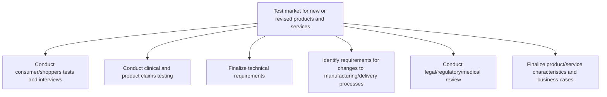

# Test market for new or revised products and services

> TODO: Business-as-Code definition for test market for new or revised products and services (consumer-products)

## Overview

Vetting the market before producing new products/services. Contextualize these products/services with the objective of refining them in order to create a product-market fit that takes stock of market realities and customer expectations but does not compromise profitability.

## Process Hierarchy



## GraphDL

```yaml
test:
  object: Market For New Or Revised Products And Services
  actor: TODO
  result: TODO
```

## Actions

| Action | Description |
|--------|-------------|
| TODO | TODO |

## Events

| Event | Description |
|-------|-------------|
| TODO | TODO |

## Searches

| Search | Description |
|--------|-------------|
| TODO | TODO |

## Process Flow


## RACI Matrix

| Activity | Responsible | Accountable | Consulted | Informed |
|----------|-------------|-------------|-----------|----------|
| TODO | TODO | TODO | TODO | TODO |

## Sub-Processes

| ID | Name | Description |
|----|------|-------------|
| 2.3.2.1 | Conduct consumer/shoppers tests and interviews | TODO |
| 2.3.2.2 | Conduct clinical and product claims testing | TODO |
| 2.3.2.3 | Finalize technical requirements | Reassessing the technical requirements in light of the final product/service attributes. Revisit the |
| 2.3.2.4 | Identify requirements for changes to manufacturing/delivery processes | Identifying any changes that need to be effectuated in the organization's internal processes for man |
| 2.3.2.5 | Conduct legal/regulatory/medical review | TODO |
| 2.3.2.6 | Finalize product/service characteristics and business cases | Finalizing the characteristics of new products/services by appropriately weighing feedback from pros |

## Related Processes

| Process | Relationship |
|---------|-------------|
| TODO | TODO |

## Related Departments

| Department | Role |
|-----------|------|
| TODO | TODO |

## Related Occupations

| Occupation | Involvement |
|-----------|-------------|
| TODO | TODO |

## KPIs

| KPI | Description | Unit |
|-----|-------------|------|
| TODO | TODO | TODO |

## Usage

```typescript
import { TODO } from '@headlessly/test-market-for-new-or-revised-products-and-services'

const client = TODO()

// TODO: Example action calls
```
