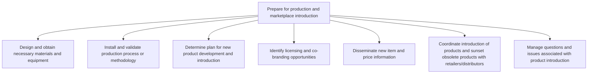

# Prepare for production and marketplace introduction

> TODO: Business-as-Code definition for prepare for production and marketplace introduction (consumer-products)

## Overview

TODO: Add process overview

## Process Hierarchy



## GraphDL

```yaml
prepare:
  object: For Production And Marketplace Introduction
  actor: TODO
  result: TODO
```

## Actions

| Action | Description |
|--------|-------------|
| TODO | TODO |

## Events

| Event | Description |
|-------|-------------|
| TODO | TODO |

## Searches

| Search | Description |
|--------|-------------|
| TODO | TODO |

## Process Flow


## RACI Matrix

| Activity | Responsible | Accountable | Consulted | Informed |
|----------|-------------|-------------|-----------|----------|
| TODO | TODO | TODO | TODO | TODO |

## Sub-Processes

| ID | Name | Description |
|----|------|-------------|
| 2.3.3.1 | Design and obtain necessary materials and equipment | Developing and/or sourcing the essential machinery needed for creating purpose-built processes, as w |
| 2.3.3.2 | Install and validate production process or methodology | Finalizing production process or methodology. Install and initiate the production process to manufac |
| 2.3.3.3 | Determine plan for new product development and introduction | TODO |
| 2.3.3.4 | Identify licensing and co-branding opportunities | TODO |
| 2.3.3.5 | Disseminate new item and price information | TODO |
| 2.3.3.6 | Coordinate introduction of products and sunset obsolete products with retailers/distributors | TODO |
| 2.3.3.7 | Manage questions and issues associated with product introduction | TODO |

## Related Processes

| Process | Relationship |
|---------|-------------|
| TODO | TODO |

## Related Departments

| Department | Role |
|-----------|------|
| TODO | TODO |

## Related Occupations

| Occupation | Involvement |
|-----------|-------------|
| TODO | TODO |

## KPIs

| KPI | Description | Unit |
|-----|-------------|------|
| TODO | TODO | TODO |

## Usage

```typescript
import { TODO } from '@headlessly/prepare-for-production-and-marketplace-introduction'

const client = TODO()

// TODO: Example action calls
```
