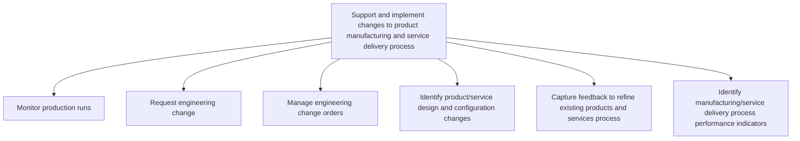

# Support and implement changes to product manufacturing and service delivery process

> TODO: Business-as-Code definition for support and implement changes to product manufacturing and service delivery process (consumer-products)

## Overview

TODO: Add process overview

## Process Hierarchy



## GraphDL

```yaml
support:
  object: And Implement Changes To Product Manufacturing And Service Delivery Process
  actor: TODO
  result: TODO
```

## Actions

| Action | Description |
|--------|-------------|
| TODO | TODO |

## Events

| Event | Description |
|-------|-------------|
| TODO | TODO |

## Searches

| Search | Description |
|--------|-------------|
| TODO | TODO |

## Process Flow


## RACI Matrix

| Activity | Responsible | Accountable | Consulted | Informed |
|----------|-------------|-------------|-----------|----------|
| TODO | TODO | TODO | TODO | TODO |

## Sub-Processes

| ID | Name | Description |
|----|------|-------------|
| 2.3.4.1 | Monitor production runs | Regularly monitoring production runs of the production and/or delivery operations. |
| 2.3.4.2 | Request engineering change | Requesting changes in the production and/or delivery operations for processing the new or revised pr |
| 2.3.4.3 | Manage engineering change orders | Coordinating the implementation of requests for component changes, equipment repairs, and the optimi |
| 2.3.4.4 | Identify product/service design and configuration changes | TODO |
| 2.3.4.5 | Capture feedback to refine existing products and services process | TODO |
| 2.3.4.6 | Identify manufacturing/service delivery process performance indicators | TODO |

## Related Processes

| Process | Relationship |
|---------|-------------|
| TODO | TODO |

## Related Departments

| Department | Role |
|-----------|------|
| TODO | TODO |

## Related Occupations

| Occupation | Involvement |
|-----------|-------------|
| TODO | TODO |

## KPIs

| KPI | Description | Unit |
|-----|-------------|------|
| TODO | TODO | TODO |

## Usage

```typescript
import { TODO } from '@headlessly/support-and-implement-changes-to-product-manufacturing-and-service-delivery-process'

const client = TODO()

// TODO: Example action calls
```
