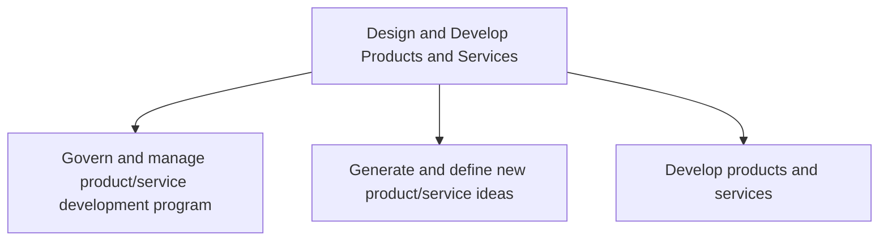

# Design and Develop Products and Services

> TODO: Business-as-Code definition for design and develop products and services (consumer-products)

## Overview

TODO: Add process overview

## Process Hierarchy



## GraphDL

```yaml
design:
  object: And Develop Products And Services
  actor: TODO
  result: TODO
```

## Actions

| Action | Description |
|--------|-------------|
| TODO | TODO |

## Events

| Event | Description |
|-------|-------------|
| TODO | TODO |

## Searches

| Search | Description |
|--------|-------------|
| TODO | TODO |

## Process Flow


## RACI Matrix

| Activity | Responsible | Accountable | Consulted | Informed |
|----------|-------------|-------------|-----------|----------|
| TODO | TODO | TODO | TODO | TODO |

## Sub-Processes

| ID | Name | Description |
|----|------|-------------|
| 2.1 | Govern and manage product/service development program | Supervising the complete product/service program from innovation until its commercial success. Meeti |
| 2.2 | Generate and define new product/service ideas | Identifying and describing new product or service thoughts based on organizational objectives/target |
| 2.3 | Develop products and services | Developing new products/services from scratch, including all activities associated with the design,  |

## Related Processes

| Process | Relationship |
|---------|-------------|
| TODO | TODO |

## Related Departments

| Department | Role |
|-----------|------|
| TODO | TODO |

## Related Occupations

| Occupation | Involvement |
|-----------|-------------|
| TODO | TODO |

## KPIs

| KPI | Description | Unit |
|-----|-------------|------|
| TODO | TODO | TODO |

## Usage

```typescript
import { TODO } from '@headlessly/design-and-develop-products-and-services'

const client = TODO()

// TODO: Example action calls
```
