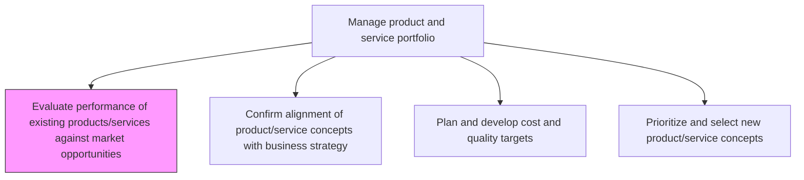
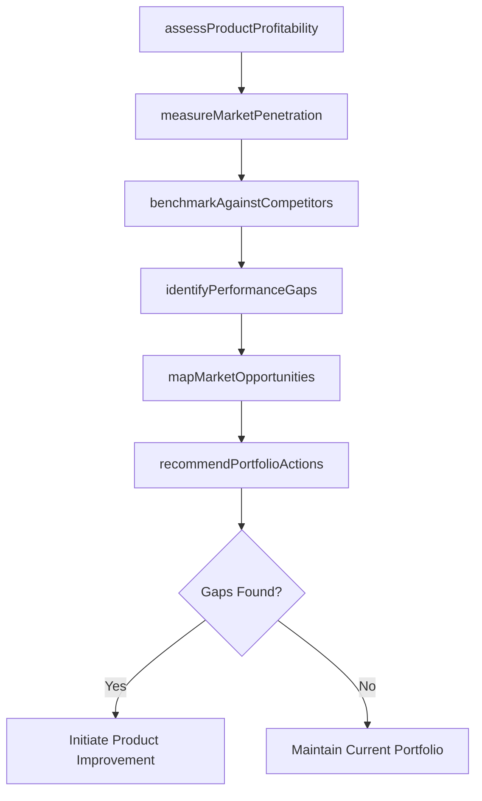

# Evaluate performance of existing products/services against market opportunities

> Business-as-Code definition for evaluating existing product and service performance against market opportunities. Models profitability assessment, market gap analysis, and portfolio optimization.

## Overview

Assessing the capabilities and performance of existing products/services, in light of market opportunities. Examine performance of the existing line of products/services, including measures of profitability, penetration, and value delivered. Identify gaps between existing solutions' portfolio or their performance levels, on the one hand, and the current market demand, available technologies, and/or customer expectations, on the other. Consider opportunities in the present market environment and any relation with the performance. Consider input from professional services providers.

## Process Hierarchy



## GraphDL

```yaml
evaluate:
  object: Performance Of Existing Products/services Against Market Opportunities
  actor: ProductPortfolioManager
  result: PerformanceGapReport
```

## Actions

| Action | Description |
|--------|-------------|
| assessProductProfitability | Analyze revenue, margin, and ROI for each product in the portfolio |
| measureMarketPenetration | Calculate current market share and adoption rates per segment |
| identifyPerformanceGaps | Compare portfolio capabilities against market demand and expectations |
| benchmarkAgainstCompetitors | Evaluate product positioning relative to competitive offerings |
| mapMarketOpportunities | Chart emerging market needs and whitespace opportunities |
| recommendPortfolioActions | Propose invest, maintain, sunset, or pivot decisions per product |

## Events

| Event | Description |
|-------|-------------|
| profitabilityAssessed | Product profitability analysis completed for all portfolio items |
| marketPenetrationMeasured | Market share and adoption data compiled and reported |
| performanceGapsIdentified | Gap analysis between portfolio and market demands finalized |
| competitorsBenchmarked | Competitive positioning assessment completed |
| marketOpportunitiesMapped | Emerging opportunities and whitespace analysis documented |
| portfolioActionsRecommended | Investment and sunset recommendations issued |

## Searches

| Search | Description |
|--------|-------------|
| getProductPerformance | Retrieve profitability and market share metrics by product |
| findPerformanceGaps | List gaps between current portfolio and market demand |
| getMarketOpportunities | Access mapped market opportunities with estimated potential |
| getCompetitiveBenchmarks | Retrieve product benchmarks against competitors |

## Process Flow



## RACI Matrix

| Activity | Responsible | Accountable | Consulted | Informed |
|----------|-------------|-------------|-----------|----------|
| assessProductProfitability | ProductAnalyst | VP Product | Finance | Executive |
| measureMarketPenetration | MarketResearcher | VP Marketing | Sales | Product |
| identifyPerformanceGaps | ProductPortfolioManager | VP Product | Engineering, Sales | Executive |
| benchmarkAgainstCompetitors | StrategyAnalyst | VP Strategy | Marketing | Product |
| recommendPortfolioActions | ProductPortfolioManager | CPO | Finance, Engineering | Board |

## Related Processes

| Process | Relationship |
|---------|-------------|
| 2.1.1.2 Confirm alignment of product/service concepts with business strategy | Downstream - performance data informs strategic alignment |
| 2.1.1.4 Prioritize and select new product/service concepts | Consumer - gap analysis feeds concept prioritization |
| 2.1.2.1 Introduce new products/services | Downstream - identified opportunities drive new introductions |
| 1.1.1.1 Identify competitors | Upstream - competitive intelligence supports benchmarking |

## Related Departments

| Department | Role |
|-----------|------|
| Product Management | Primary owner of portfolio performance evaluation |
| Marketing | Provides market share and customer perception data |
| Finance | Contributes profitability and ROI analysis |
| Strategy | Supports competitive benchmarking and opportunity mapping |
| Sales | Delivers front-line customer feedback and win/loss data |

## Related Occupations

| Occupation | Involvement |
|-----------|-------------|
| Product Portfolio Manager | Primary executor of performance evaluation |
| Market Research Analyst | Collects market penetration and opportunity data |
| Financial Analyst | Conducts profitability and ROI calculations |

## KPIs

| KPI | Description | Unit |
|-----|-------------|------|
| Portfolio Revenue Growth | Year-over-year revenue growth across the portfolio | % |
| Product Margin Spread | Average margin differential across product lines | % |
| Market Share Coverage | Percentage of addressable market captured by portfolio | % |
| Gap Closure Rate | Percentage of identified gaps addressed within review cycle | % |
| Opportunity Conversion | Rate of mapped opportunities converted to active projects | % |

## Usage

```typescript
import { evaluatePerformanceOfExistingProductsServicesAgainstMarketOpportunities } from '@headlessly/evaluate-performance-of-existing-products-services-against-market-opportunities'

const evaluator = evaluatePerformanceOfExistingProductsServicesAgainstMarketOpportunities()

// Assess profitability across the portfolio
const profitability = await evaluator.assessProductProfitability({
  portfolioId: 'portfolio-2024',
  period: 'Q4-2024',
  metrics: ['revenue', 'margin', 'roi']
})

// Identify gaps between portfolio and market demand
const gaps = await evaluator.identifyPerformanceGaps({
  portfolioId: 'portfolio-2024',
  marketSegments: ['enterprise', 'mid-market'],
  threshold: 0.15
})
```
