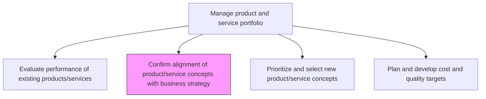
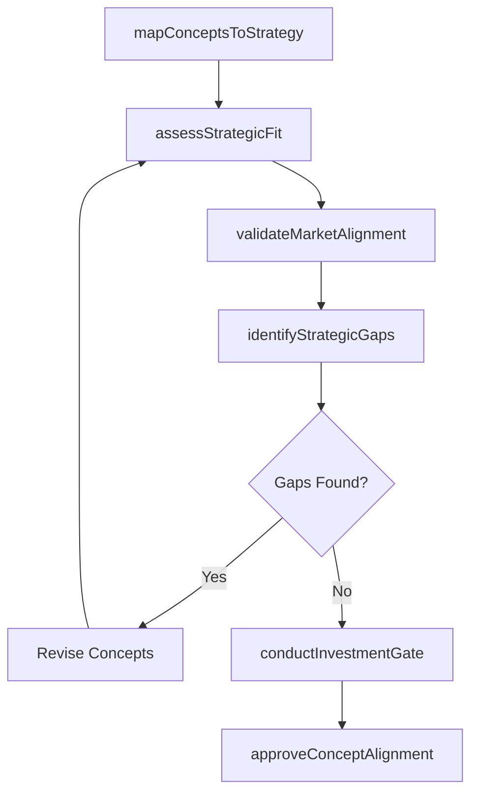

# Confirm alignment of product/service concepts with business strategy

> Business-as-Code definition for confirming product and service concept alignment with business strategy. Models strategic validation, investment gate reviews, and portfolio-strategy coherence checks.

## Overview

Checking the alignment of product/service portfolio, and its individual offerings, with the organization's overall strategy and planning for the development of new or revised solutions. Conduct reality checks on new product/service concepts prior to committing significant investment to ensure that the revamped solutions' portfolio is in line with the overall business strategy, aligns organizational processes for their development, and creates a plan for assimilating these changes in the organization's offerings. Enlist senior management executives.

## Process Hierarchy



## GraphDL

```yaml
confirm:
  object: Alignment Of Product/service Concepts With Business Strategy
  actor: StrategyDirector
  result: AlignmentAssessment
```

## Actions

| Action | Description |
|--------|-------------|
| mapConceptsToStrategy | Link each product/service concept to specific strategic objectives |
| assessStrategicFit | Score concepts against strategic pillars such as growth, differentiation, and efficiency |
| conductInvestmentGate | Review financial commitment readiness against strategic priorities |
| validateMarketAlignment | Confirm that concepts address validated market needs within strategic scope |
| identifyStrategicGaps | Detect areas where concepts fail to support stated business goals |
| approveConceptAlignment | Formally authorize concepts that pass strategic alignment criteria |

## Events

| Event | Description |
|-------|-------------|
| conceptsMappedToStrategy | Product concepts linked to strategic objectives |
| strategicFitAssessed | Alignment scoring completed for all candidate concepts |
| investmentGateConducted | Investment readiness review finalized |
| marketAlignmentValidated | Market-strategy coherence confirmed |
| strategicGapsIdentified | Misalignments between concepts and strategy documented |
| conceptAlignmentApproved | Senior leadership approved concept-strategy alignment |

## Searches

| Search | Description |
|--------|-------------|
| getAlignmentScores | Retrieve strategic fit scores for product concepts |
| findMisalignedConcepts | List concepts that do not meet alignment thresholds |
| getStrategicObjectives | Access current strategic objectives for mapping |
| getGateDecisions | Retrieve investment gate review decisions by concept |

## Process Flow



## RACI Matrix

| Activity | Responsible | Accountable | Consulted | Informed |
|----------|-------------|-------------|-----------|----------|
| mapConceptsToStrategy | ProductManager | VP Product | Strategy | Engineering |
| assessStrategicFit | StrategyDirector | CEO | Finance, Marketing | Board |
| conductInvestmentGate | FinanceDirector | CFO | Product, Strategy | Operations |
| approveConceptAlignment | StrategyDirector | CEO | Product, Finance | AllDepartments |

## Related Processes

| Process | Relationship |
|---------|-------------|
| 2.1.1.1 Evaluate performance of existing products/services against market opportunities | Upstream - performance gaps inform alignment review |
| 2.1.1.3 Prioritize and select new product/service concepts | Downstream - aligned concepts proceed to prioritization |
| 1.2.2 Define and evaluate strategic options | Upstream - strategic options define alignment criteria |

## Related Departments

| Department | Role |
|-----------|------|
| Strategy | Primary owner of alignment validation |
| Product Management | Presents concepts for strategic review |
| Finance | Evaluates investment readiness and financial alignment |
| Executive Leadership | Provides strategic direction and final approval |

## Related Occupations

| Occupation | Involvement |
|-----------|-------------|
| Strategy Director | Leads alignment assessment |
| Product Manager | Prepares concept-strategy mappings |
| Chief Executive Officer | Final alignment authority |

## KPIs

| KPI | Description | Unit |
|-----|-------------|------|
| Strategic Alignment Score | Average alignment rating across concept portfolio | Score (1-10) |
| Concept Approval Rate | Percentage of concepts passing alignment review | % |
| Gate Cycle Time | Average time from concept submission to alignment decision | Days |
| Strategy Coverage | Percentage of strategic objectives addressed by approved concepts | % |

## Usage

```typescript
import { confirmAlignmentOfProductServiceConceptsWithBusinessStrategy } from '@headlessly/confirm-alignment-of-product-service-concepts-with-business-strategy'

const alignment = confirmAlignmentOfProductServiceConceptsWithBusinessStrategy()

// Map product concepts to strategic objectives
const mapping = await alignment.mapConceptsToStrategy({
  conceptIds: ['concept-a', 'concept-b', 'concept-c'],
  strategyVersion: '2024-annual'
})

// Assess strategic fit for each concept
const scores = await alignment.assessStrategicFit({
  conceptId: 'concept-a',
  pillars: ['growth', 'differentiation', 'costLeadership']
})
```
