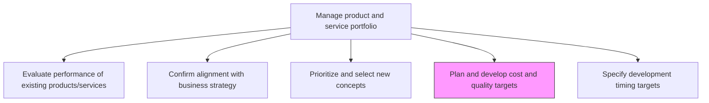
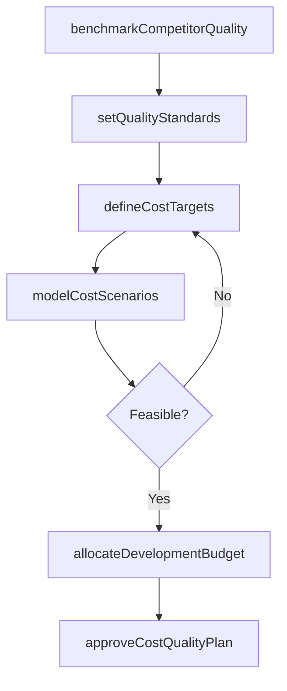

# Plan and develop cost and quality targets

> Business-as-Code definition for planning and developing cost and quality targets for product development. Models budget allocation, quality standard setting, and target-based development governance.

## Overview

Setting prerequisites for the cost of development and quality standards for the new solutions' portfolio and/or its individual offerings. Set targets for the budget and quality standards for the revamped portfolio of solution offerings. Prepare a plan for the outlay required for revising and adding new product/services. Identify intended levels of quality for these, bearing in mind the existing standards of solutions offered by the organization and its competitors. Enlist senior management executives, particularly those responsible for finance and budgeting, product/service design, manufacturing/processing, delivery, and quality control.

## Process Hierarchy



## GraphDL

```yaml
plan:
  object: And Develop Cost And Quality Targets
  actor: ProductDevelopmentDirector
  result: CostAndQualityTargetPlan
```

## Actions

| Action | Description |
|--------|-------------|
| defineCostTargets | Establish development budget ceilings and unit cost targets per product |
| setQualityStandards | Define quality benchmarks based on industry norms and competitive positioning |
| allocateDevelopmentBudget | Distribute financial resources across product development initiatives |
| benchmarkCompetitorQuality | Compare intended quality levels against competitor offerings |
| modelCostScenarios | Run cost scenarios to validate target feasibility under varying conditions |
| approveCostQualityPlan | Formally sign off on finalized cost and quality target framework |

## Events

| Event | Description |
|-------|-------------|
| costTargetsDefined | Development cost ceilings established for each product concept |
| qualityStandardsSet | Quality benchmarks defined and documented |
| budgetAllocated | Financial resources distributed to development initiatives |
| competitorQualityBenchmarked | Competitive quality comparison completed |
| costScenariosModeled | Cost feasibility scenarios analyzed and documented |
| costQualityPlanApproved | Cost and quality target plan authorized by leadership |

## Searches

| Search | Description |
|--------|-------------|
| getCostTargets | Retrieve cost targets by product concept or portfolio segment |
| getQualityBenchmarks | Access defined quality standards and competitive benchmarks |
| getBudgetAllocations | List budget allocations across development initiatives |
| getCostScenarios | Retrieve cost scenario analyses and feasibility results |

## Process Flow



## RACI Matrix

| Activity | Responsible | Accountable | Consulted | Informed |
|----------|-------------|-------------|-----------|----------|
| defineCostTargets | FinanceManager | CFO | Product, Engineering | Operations |
| setQualityStandards | QualityDirector | VP Product | Manufacturing, Engineering | Sales |
| allocateDevelopmentBudget | FinanceManager | CFO | Product, Strategy | Board |
| approveCostQualityPlan | ProductDevelopmentDirector | CPO | Finance, Quality | Executive |

## Related Processes

| Process | Relationship |
|---------|-------------|
| 2.1.1.3 Prioritize and select new product/service concepts | Upstream - selected concepts need cost and quality targets |
| 2.1.1.5 Specify development timing targets | Parallel - timing targets coordinate with cost constraints |
| 2.3.1.2 Prepare high-level business case and technical assessment | Downstream - cost targets feed business case preparation |

## Related Departments

| Department | Role |
|-----------|------|
| Finance | Sets cost ceilings and manages budget allocation |
| Quality Assurance | Defines quality standards and benchmarks |
| Product Management | Balances cost and quality against market requirements |
| Engineering | Provides technical cost estimates and feasibility input |

## Related Occupations

| Occupation | Involvement |
|-----------|-------------|
| Financial Analyst | Models cost scenarios and budget allocations |
| Quality Director | Establishes quality benchmarks |
| Product Development Director | Coordinates cost-quality tradeoff decisions |

## KPIs

| KPI | Description | Unit |
|-----|-------------|------|
| Target Cost Variance | Deviation between targeted and actual development costs | % |
| Quality Standard Attainment | Percentage of products meeting defined quality benchmarks | % |
| Budget Utilization | Ratio of spent to allocated development budget | % |
| Cost-to-Quality Ratio | Development cost per unit of quality improvement achieved | Currency/Point |

## Usage

```typescript
import { planAndDevelopCostAndQualityTargets } from '@headlessly/plan-and-develop-cost-and-quality-targets'

const planner = planAndDevelopCostAndQualityTargets()

// Define cost targets for a product concept
const targets = await planner.defineCostTargets({
  conceptId: 'concept-a',
  developmentBudgetCeiling: 500000,
  unitCostTarget: 45.00,
  currency: 'USD'
})

// Set quality standards based on competitive benchmarks
const standards = await planner.setQualityStandards({
  conceptId: 'concept-a',
  benchmarkSource: 'industry-top-quartile',
  metrics: ['defectRate', 'durability', 'customerSatisfaction']
})
```
