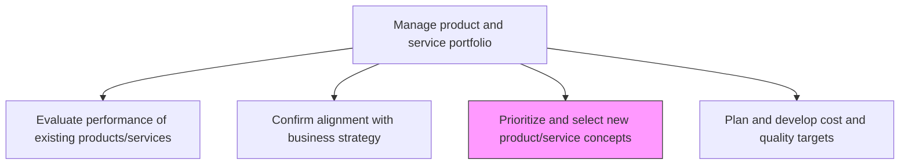
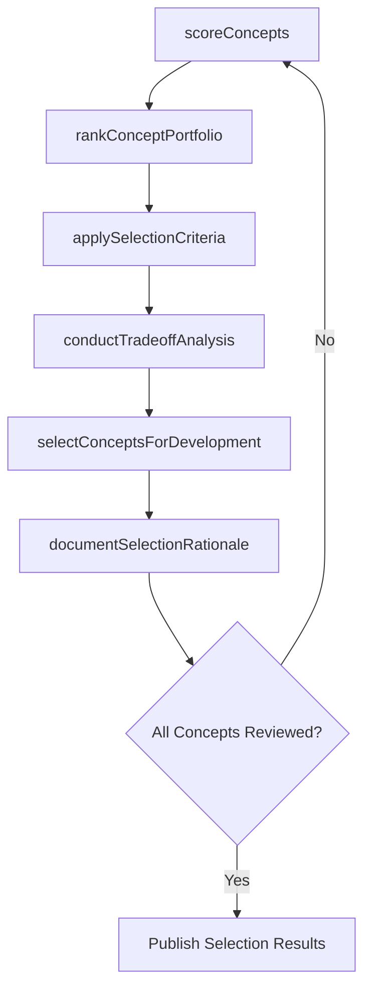

# Prioritize and select new product/service concepts

> Business-as-Code definition for prioritizing and selecting new product and service concepts. Models scoring frameworks, selection criteria application, and concept portfolio optimization.

## Overview

Selecting from among the potential new/revised solutions and capitalizing on market opportunities so that they meet the cost and quality prerequisites. Create an index of product/service concepts, and arrange them in order of preference. Base prioritization on adherence to Plan and develop cost and quality targets [10073], and choose options that would comprise the revised solution portfolio.

## Process Hierarchy



## GraphDL

```yaml
prioritize:
  object: And Select New Product/service Concepts
  actor: ProductPortfolioManager
  result: PrioritizedConceptList
```

## Actions

| Action | Description |
|--------|-------------|
| scoreConcepts | Rate each product/service concept against weighted selection criteria |
| rankConceptPortfolio | Order scored concepts by strategic value, feasibility, and market potential |
| applySelectionCriteria | Filter concepts using cost, quality, and time-to-market thresholds |
| conductTradeoffAnalysis | Evaluate resource and capability tradeoffs among competing concepts |
| selectConceptsForDevelopment | Choose the final set of concepts to advance into development |
| documentSelectionRationale | Record justification for concept acceptance or rejection decisions |

## Events

| Event | Description |
|-------|-------------|
| conceptsScored | All candidate concepts rated against selection criteria |
| portfolioRanked | Concepts ordered by priority ranking |
| selectionCriteriaApplied | Threshold filters applied to narrow concept list |
| tradeoffAnalysisCompleted | Resource and capability tradeoff evaluation finished |
| conceptsSelected | Final concept set chosen for development |
| selectionRationaleDocumented | Decision rationale recorded for audit and communication |

## Searches

| Search | Description |
|--------|-------------|
| getConceptScores | Retrieve scoring results for product/service concepts |
| getRankedConcepts | List concepts ordered by priority ranking |
| getSelectionCriteria | Access current selection criteria and thresholds |
| getSelectionDecisions | Retrieve accept/reject decisions with rationale |

## Process Flow



## RACI Matrix

| Activity | Responsible | Accountable | Consulted | Informed |
|----------|-------------|-------------|-----------|----------|
| scoreConcepts | ProductAnalyst | VP Product | Marketing, Engineering | Finance |
| rankConceptPortfolio | ProductPortfolioManager | CPO | Strategy | Executive |
| conductTradeoffAnalysis | ProductPortfolioManager | CPO | Finance, Operations | Engineering |
| selectConceptsForDevelopment | ProductPortfolioManager | CEO | Strategy, Finance | AllDepartments |

## Related Processes

| Process | Relationship |
|---------|-------------|
| 2.1.1.2 Confirm alignment of product/service concepts with business strategy | Upstream - only aligned concepts enter prioritization |
| 2.1.1.4 Plan and develop cost and quality targets | Parallel - cost/quality targets inform selection criteria |
| 2.1.1.5 Specify development timing targets | Downstream - selected concepts receive timing targets |
| 2.2.2 Generate new product/service concepts | Upstream - generated concepts feed into prioritization |

## Related Departments

| Department | Role |
|-----------|------|
| Product Management | Leads concept scoring and selection |
| Strategy | Provides strategic criteria and market intelligence |
| Finance | Validates financial feasibility of selected concepts |
| Engineering | Assesses technical feasibility and resource requirements |

## Related Occupations

| Occupation | Involvement |
|-----------|-------------|
| Product Portfolio Manager | Leads prioritization and selection process |
| Business Analyst | Prepares scoring models and tradeoff analyses |
| Strategic Planner | Ensures selections align with long-term strategy |

## KPIs

| KPI | Description | Unit |
|-----|-------------|------|
| Concept Selection Rate | Percentage of candidate concepts selected for development | % |
| Selection Cycle Time | Time from concept submission to selection decision | Days |
| Scoring Consistency | Variance in scores across reviewers for the same concept | Standard Deviation |
| Selected Concept Success Rate | Percentage of selected concepts that reach market launch | % |

## Usage

```typescript
import { prioritizeAndSelectNewProductServiceConcepts } from '@headlessly/prioritize-and-select-new-product-service-concepts'

const selector = prioritizeAndSelectNewProductServiceConcepts()

// Score concepts against weighted criteria
const scores = await selector.scoreConcepts({
  conceptIds: ['concept-a', 'concept-b', 'concept-c'],
  criteria: {
    strategicFit: 0.3,
    marketPotential: 0.25,
    technicalFeasibility: 0.2,
    costEfficiency: 0.15,
    timeToMarket: 0.1
  }
})

// Select top concepts for development
const selected = await selector.selectConceptsForDevelopment({
  maxConcepts: 5,
  minimumScore: 7.0,
  budgetConstraint: 2000000
})
```
