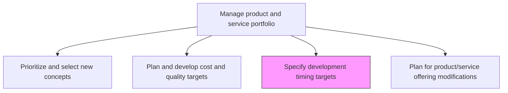
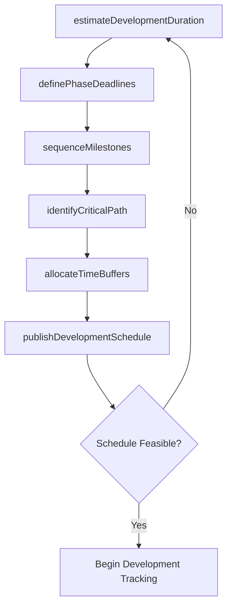

# Specify development timing targets

> Business-as-Code definition for specifying development timing targets. Models milestone scheduling, deadline assignment, and development timeline governance for product portfolios.

## Overview

Determining the individual and collective timeframe for realizing new/revised solutions. Create a schedule that clearly demarcates the timeframes designated for the development of every new solution and/or revising each of the existing ones. Create a timetable by setting deadlines for each step in overhauling the product/service portfolio.

## Process Hierarchy



## GraphDL

```yaml
specify:
  object: Development Timing Targets
  actor: ProgramManager
  result: DevelopmentTimeline
```

## Actions

| Action | Description |
|--------|-------------|
| definePhaseDeadlines | Set target dates for each development phase per product concept |
| estimateDevelopmentDuration | Calculate expected duration based on scope, complexity, and resources |
| sequenceMilestones | Order key milestones across the portfolio development calendar |
| identifyCriticalPath | Determine the longest dependency chain that constrains delivery |
| allocateTimeBuffers | Add contingency buffers to high-risk development phases |
| publishDevelopmentSchedule | Release the finalized timeline to all stakeholders |

## Events

| Event | Description |
|-------|-------------|
| phaseDeadlinesDefined | Target dates established for all development phases |
| durationEstimated | Development duration calculated for each concept |
| milestonesSequenced | Portfolio milestones ordered on the master calendar |
| criticalPathIdentified | Longest dependency chain documented |
| timeBuffersAllocated | Contingency time assigned to high-risk phases |
| schedulePublished | Finalized development schedule distributed to stakeholders |

## Searches

| Search | Description |
|--------|-------------|
| getDevelopmentTimeline | Retrieve the master development schedule for the portfolio |
| getMilestonesByProduct | List milestones and deadlines for a specific product concept |
| getCriticalPathItems | Access tasks and dependencies on the critical path |
| getScheduleVariance | Retrieve actual versus planned timing data |

## Process Flow



## RACI Matrix

| Activity | Responsible | Accountable | Consulted | Informed |
|----------|-------------|-------------|-----------|----------|
| definePhaseDeadlines | ProgramManager | VP Product | Engineering, Marketing | Finance |
| estimateDevelopmentDuration | ProjectLead | ProgramManager | Engineering, QA | Product |
| identifyCriticalPath | ProgramManager | VP Product | Engineering, Operations | Executive |
| publishDevelopmentSchedule | ProgramManager | CPO | AllDepartments | Board |

## Related Processes

| Process | Relationship |
|---------|-------------|
| 2.1.1.4 Plan and develop cost and quality targets | Parallel - cost constraints shape timing feasibility |
| 2.1.1.6 Plan for product/service offering modifications | Downstream - timing targets inform modification planning |
| 2.3.1 Design and prototype products and services | Downstream - development phases follow published schedule |

## Related Departments

| Department | Role |
|-----------|------|
| Program Management | Primary owner of timing target specification |
| Engineering | Provides effort estimates and dependency input |
| Product Management | Defines market-driven launch windows |
| Operations | Assesses manufacturing and delivery timeline constraints |

## Related Occupations

| Occupation | Involvement |
|-----------|-------------|
| Program Manager | Leads timeline development and milestone scheduling |
| Project Lead | Estimates task durations and identifies dependencies |
| Engineering Manager | Validates technical feasibility of timing targets |

## KPIs

| KPI | Description | Unit |
|-----|-------------|------|
| On-Time Milestone Rate | Percentage of milestones met on or before target date | % |
| Schedule Variance | Average deviation between planned and actual completion dates | Days |
| Critical Path Length | Duration of the longest dependency chain in the portfolio | Weeks |
| Buffer Utilization | Percentage of allocated contingency time consumed | % |

## Usage

```typescript
import { specifyDevelopmentTimingTargets } from '@headlessly/specify-development-timing-targets'

const scheduler = specifyDevelopmentTimingTargets()

// Estimate development duration for a concept
const estimate = await scheduler.estimateDevelopmentDuration({
  conceptId: 'concept-a',
  complexity: 'high',
  teamSize: 12,
  phases: ['design', 'prototype', 'testing', 'launch']
})

// Define phase deadlines based on estimates
const deadlines = await scheduler.definePhaseDeadlines({
  conceptId: 'concept-a',
  startDate: '2025-01-15',
  phases: estimate.phases,
  bufferPercentage: 15
})
```
