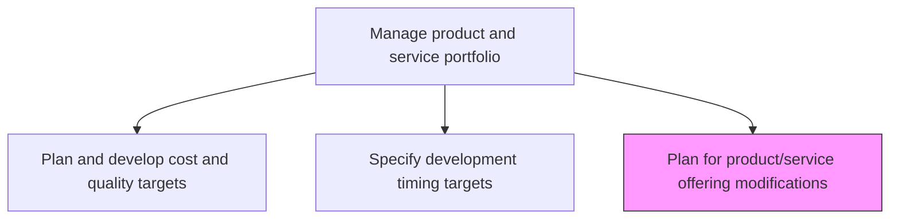
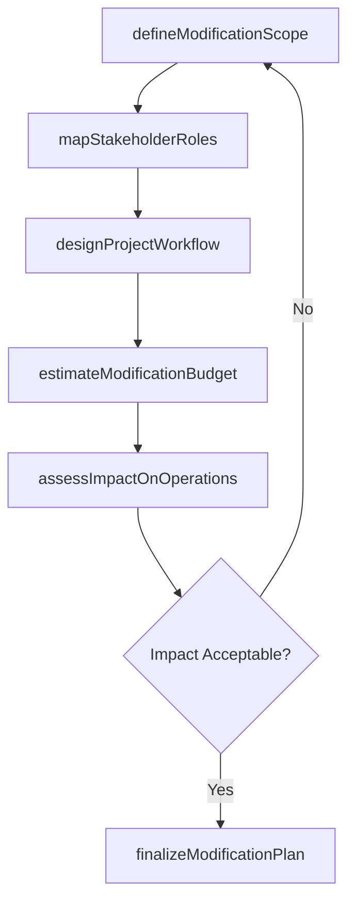

# Plan for product/service offering modifications

> Business-as-Code definition for planning product and service offering modifications. Models change program design, stakeholder coordination, and systematic modification planning.

## Overview

Developing a programmatic procedure for changing products/services while paying heed to all stakeholders involved and the prerequisites identified. Create a plan for changing the existing portfolio of solution offerings. Develop a systematic program for the design, processing, and delivery of the new product/service concepts. Construct project-flow diagrams. Identify the stakeholders involved and personnel responsible for each stage, as well as the necessary decisions. Earmark the budgetary outlay, and conduct any strategic planning required.

## Process Hierarchy



## GraphDL

```yaml
plan:
  object: For Product/service Offering Modifications
  actor: ProductPlanningManager
  result: ModificationPlan
```

## Actions

| Action | Description |
|--------|-------------|
| defineModificationScope | Outline the boundaries and objectives of each product/service change |
| mapStakeholderRoles | Identify all stakeholders and assign responsibilities for each phase |
| designProjectWorkflow | Construct project-flow diagrams with decision gates and deliverables |
| estimateModificationBudget | Calculate the financial outlay required for planned modifications |
| assessImpactOnOperations | Evaluate how modifications will affect manufacturing, delivery, and support |
| finalizeModificationPlan | Compile and approve the complete modification program document |

## Events

| Event | Description |
|-------|-------------|
| modificationScopeDefined | Boundaries and objectives of product changes documented |
| stakeholderRolesMapped | Stakeholder responsibility assignments completed |
| projectWorkflowDesigned | Project-flow diagrams and decision gates constructed |
| modificationBudgetEstimated | Financial outlay for modifications calculated |
| operationalImpactAssessed | Impact analysis on operations completed |
| modificationPlanFinalized | Complete modification plan approved and distributed |

## Searches

| Search | Description |
|--------|-------------|
| getModificationPlans | Retrieve modification plans by product or portfolio segment |
| getStakeholderAssignments | List stakeholder roles and responsibilities for a modification |
| getModificationBudget | Access budget estimates and allocations for planned changes |
| getImpactAssessments | Retrieve operational impact analysis results |

## Process Flow



## RACI Matrix

| Activity | Responsible | Accountable | Consulted | Informed |
|----------|-------------|-------------|-----------|----------|
| defineModificationScope | ProductPlanningManager | VP Product | Engineering, Marketing | Operations |
| mapStakeholderRoles | ProjectManager | VP Product | HR, Legal | AllDepartments |
| estimateModificationBudget | FinanceAnalyst | CFO | Product, Engineering | Board |
| finalizeModificationPlan | ProductPlanningManager | CPO | Strategy, Finance | Executive |

## Related Processes

| Process | Relationship |
|---------|-------------|
| 2.1.1.5 Specify development timing targets | Upstream - timing targets constrain modification scheduling |
| 2.3.4 Support and implement changes to product manufacturing and service delivery process | Downstream - modification plans drive manufacturing changes |
| 2.1.2.1 Introduce new products/services | Downstream - modifications may include new product introductions |

## Related Departments

| Department | Role |
|-----------|------|
| Product Management | Leads modification planning and scoping |
| Engineering | Provides technical feasibility and effort estimates |
| Finance | Validates budget requirements and allocations |
| Operations | Assesses manufacturing and delivery impact |
| Marketing | Evaluates market positioning implications of modifications |

## Related Occupations

| Occupation | Involvement |
|-----------|-------------|
| Product Planning Manager | Leads modification plan development |
| Project Manager | Designs workflows and coordinates stakeholders |
| Financial Analyst | Estimates and validates modification budgets |

## KPIs

| KPI | Description | Unit |
|-----|-------------|------|
| Plan Completion Rate | Percentage of modifications with finalized plans before development starts | % |
| Budget Accuracy | Variance between estimated and actual modification costs | % |
| Stakeholder Coverage | Percentage of affected stakeholders included in planning | % |
| Modification Cycle Time | Average time from scope definition to plan finalization | Days |

## Usage

```typescript
import { planForProductServiceOfferingModifications } from '@headlessly/plan-for-product-service-offering-modifications'

const planner = planForProductServiceOfferingModifications()

// Define the scope of a product modification
const scope = await planner.defineModificationScope({
  productId: 'prod-2024-a',
  modificationTypes: ['featureAddition', 'qualityImprovement'],
  targetLaunchDate: '2025-06-01'
})

// Map stakeholder roles for the modification
const stakeholders = await planner.mapStakeholderRoles({
  modificationId: scope.id,
  departments: ['Engineering', 'Marketing', 'Operations', 'QA']
})
```
