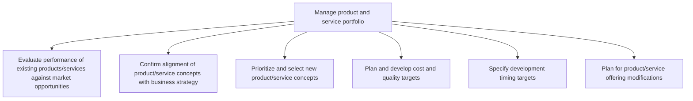
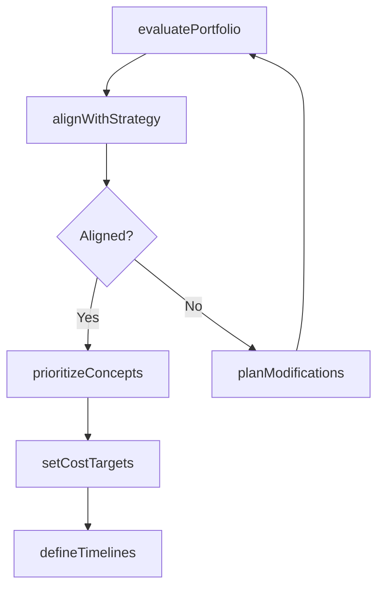

# Manage product and service portfolio

> Business-as-Code definition for product and service portfolio management. Models the evaluation, alignment, prioritization, and planning of product and service offerings to maximize market value and strategic fit.

## Overview

Managing a portfolio of product/service offerings to take advantage of shifts in the market expectations, all the while coordinating with the overall business strategy. Revisit the product/service portfolio in light of market opportunities, and overhaul it to capture value created by these opportunities. Identify gaps between current offerings and the market expectations to direct the organization's R&D activity. Create new solutions, and revise or retire existing ones so that the revamped portfolio aligns with Develop a business strategy [10015].

## Process Hierarchy



## GraphDL

```yaml
manage:
  object: Product And Service Portfolio
  actor: PortfolioManager
  result: PortfolioStrategy
```

## Actions

| Action | Description |
|--------|-------------|
| evaluatePortfolio | Assess current product and service offerings against market opportunities |
| alignWithStrategy | Verify portfolio alignment with corporate business strategy |
| prioritizeConcepts | Rank and select new product or service concepts for development |
| setCostTargets | Establish cost and quality targets for portfolio items |
| defineTimelines | Specify development timing and milestone targets |
| planModifications | Develop plans for product and service offering changes |

## Events

| Event | Description |
|-------|-------------|
| portfolioEvaluated | Portfolio performance assessment completed against market data |
| strategyAligned | Product concepts confirmed as aligned with business strategy |
| conceptsPrioritized | New product and service concepts ranked and selected |
| costTargetsSet | Cost and quality targets established for selected concepts |
| timelinesSpecified | Development timing and milestone targets defined |
| modificationsPlanned | Product and service modification plans approved |

## Searches

| Search | Description |
|--------|-------------|
| getPortfolioItems | List all products and services with current performance metrics |
| findGaps | Identify gaps between current offerings and market expectations |
| getConcepts | Retrieve prioritized product and service concepts by status |
| getTimelines | Access development schedules and milestone targets |

## Process Flow



## RACI Matrix

| Activity | Responsible | Accountable | Consulted | Informed |
|----------|-------------|-------------|-----------|----------|
| evaluatePortfolio | PortfolioManager | VP Product | MarketResearch, Sales | Executive |
| alignWithStrategy | PortfolioManager | VP Strategy | ProductManagement | Finance |
| prioritizeConcepts | ProductManager | VP Product | Engineering, Marketing | Operations |
| setCostTargets | FinanceAnalyst | VP Finance | Engineering, Procurement | ProductManager |

## Sub-Processes

| ID | Name | Description |
|----|------|-------------|
| 2.1.1.1 | Evaluate performance of existing products/services against market opportunities | Assessing the capabilities and performance of existing products/services, in light of market opportu |
| 2.1.1.2 | Confirm alignment of product/service concepts with business strategy | Checking the alignment of product/service portfolio, and its individual offerings, with the organiza |
| 2.1.1.3 | Prioritize and select new product/service concepts | Selecting from among the potential new/revised solutions and capitalizing on market opportunities so |
| 2.1.1.4 | Plan and develop cost and quality targets | Setting prerequisites for the cost of development and quality standards for the new solutions' portf |
| 2.1.1.5 | Specify development timing targets | Determining the individual and collective timeframe for realizing new/revised solutions. Create a sc |
| 2.1.1.6 | Plan for product/service offering modifications | Developing a programmatic procedure for changing products/services while paying heed to all stakehol |

## Related Processes

| Process | Relationship |
|---------|-------------|
| 2.1.2 Manage product and service life cycle | Downstream - portfolio decisions feed lifecycle management |
| 2.2 Generate and define new product/service ideas | Upstream - new ideas feed portfolio evaluation |
| 1.2 Develop and manage business strategy | Governance - strategy directs portfolio priorities |

## Related Departments

| Department | Role |
|-----------|------|
| Product Management | Primary owner of portfolio evaluation and prioritization |
| Strategy | Provides business strategy alignment and direction |
| Finance | Develops cost targets and financial feasibility analysis |
| Marketing | Contributes market opportunity data and competitive insights |
| Engineering | Assesses technical feasibility of new concepts |

## Related Occupations

| Occupation | Involvement |
|-----------|-------------|
| Portfolio Manager | Leads portfolio evaluation and prioritization |
| Product Manager | Defines product concepts and requirements |
| Business Analyst | Conducts market opportunity and gap analysis |
| Financial Analyst | Develops cost and ROI projections |

## KPIs

| KPI | Description | Unit |
|-----|-------------|------|
| Portfolio Vitality Index | Percentage of revenue from products launched in the last 3 years | % |
| Concept-to-Market Hit Rate | Percentage of prioritized concepts that reach market | % |
| Strategic Alignment Score | Portfolio alignment with business strategy objectives | Score (1-10) |
| Time-to-Target | Average time to achieve cost and quality targets | Months |

## Usage

```typescript
import { manageProductAndServicePortfolio } from '@headlessly/manage-product-and-service-portfolio'

const portfolio = manageProductAndServicePortfolio()

// Evaluate current portfolio against market opportunities
const evaluation = await portfolio.evaluatePortfolio({
  marketSegment: 'enterprise-software',
  benchmarkPeriod: 'last-4-quarters',
  includeCompetitorData: true
})

// Prioritize new product concepts for development
const prioritized = await portfolio.prioritizeConcepts({
  concepts: evaluation.gapAnalysis.opportunities,
  criteria: ['strategic-fit', 'market-size', 'technical-feasibility'],
  maxSelections: 5
})

// Set cost and quality targets for selected concepts
await portfolio.setCostTargets({
  conceptIds: prioritized.map(c => c.id),
  marginTarget: 0.35,
  qualityStandard: 'ISO-9001'
})
```
