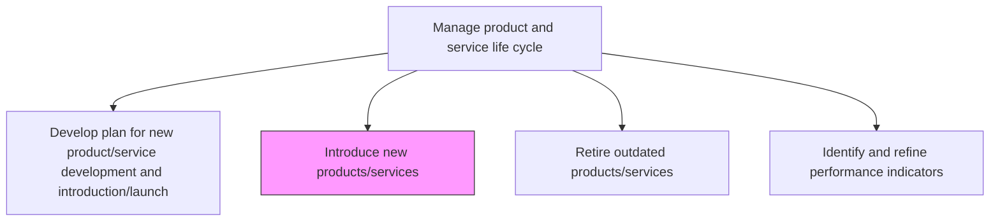
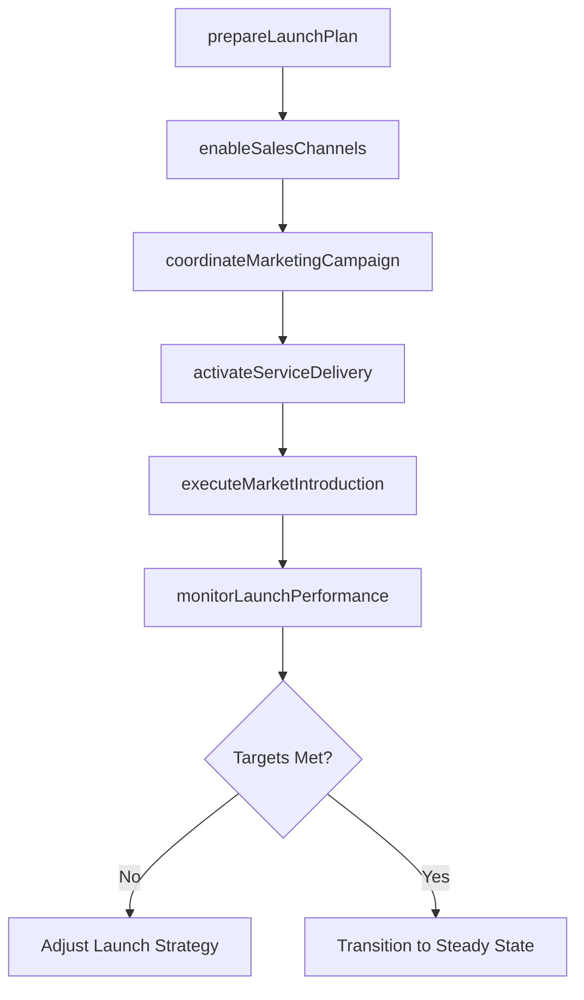

# Introduce new products/services

> Business-as-Code definition for introducing new products and services to market. Models cross-functional launch coordination, channel deployment, and go-to-market execution.

## Overview

Launching revamped product/service portfolio in to the market. Introduction in to the marketplace is done by deploying effective channels for marketing, sales, delivery, and after-sales servicing. Introduce new/revised solution offerings in a concerted effort. Coordinate a cross-functional effort.

## Process Hierarchy



## GraphDL

```yaml
introduce:
  object: New Products/services
  actor: LaunchManager
  result: ProductLaunchRecord
```

## Actions

| Action | Description |
|--------|-------------|
| prepareLaunchPlan | Assemble the detailed go-to-market plan with timelines and responsibilities |
| enableSalesChannels | Equip sales teams and distribution channels with product information and materials |
| coordinateMarketingCampaign | Synchronize marketing campaigns across channels for launch day |
| activateServiceDelivery | Ensure manufacturing, fulfillment, and delivery operations are ready |
| executeMarketIntroduction | Formally release the product/service into designated markets |
| monitorLaunchPerformance | Track early adoption, sales velocity, and customer feedback post-launch |

## Events

| Event | Description |
|-------|-------------|
| launchPlanPrepared | Go-to-market plan finalized and distributed to stakeholders |
| salesChannelsEnabled | Sales teams and partners equipped with launch materials |
| marketingCampaignCoordinated | Marketing campaigns synchronized and activated |
| serviceDeliveryActivated | Operations confirmed ready for production delivery |
| marketIntroductionExecuted | Product/service formally released to market |
| launchPerformanceMonitored | Post-launch performance data collected and reported |

## Searches

| Search | Description |
|--------|-------------|
| getLaunchStatus | Retrieve launch readiness status by product and market |
| getChannelReadiness | Access sales channel enablement progress |
| getLaunchMetrics | Retrieve early adoption and sales performance data |
| getCustomerFeedback | Access initial customer feedback and sentiment data |

## Process Flow



## RACI Matrix

| Activity | Responsible | Accountable | Consulted | Informed |
|----------|-------------|-------------|-----------|----------|
| prepareLaunchPlan | LaunchManager | VP Product | Marketing, Sales, Operations | Executive |
| enableSalesChannels | SalesEnablement | VP Sales | Product, Marketing | Finance |
| coordinateMarketingCampaign | MarketingManager | CMO | Product, Sales | Operations |
| executeMarketIntroduction | LaunchManager | CPO | AllDepartments | Board |

## Related Processes

| Process | Relationship |
|---------|-------------|
| 2.1.2.1 Develop plan for new product/service development and introduction/launch | Upstream - launch plan provides the introduction blueprint |
| 2.1.2.5 Conduct post launch review | Downstream - launched products enter post-launch evaluation |
| 2.3.3 Prepare for production and marketplace introduction | Upstream - production readiness enables market introduction |

## Related Departments

| Department | Role |
|-----------|------|
| Product Management | Owns the launch plan and coordination |
| Marketing | Drives demand generation and campaign execution |
| Sales | Executes customer acquisition through enabled channels |
| Operations | Ensures fulfillment and delivery readiness |
| Customer Support | Prepares for post-launch service inquiries |

## Related Occupations

| Occupation | Involvement |
|-----------|-------------|
| Launch Manager | Coordinates cross-functional launch activities |
| Marketing Manager | Executes go-to-market campaigns |
| Sales Enablement Specialist | Equips sales teams with launch materials |

## KPIs

| KPI | Description | Unit |
|-----|-------------|------|
| Time to Market | Duration from development completion to market availability | Days |
| Launch Revenue | Revenue generated in the first 90 days post-launch | Currency |
| Channel Readiness Score | Percentage of sales channels fully enabled before launch | % |
| Initial Adoption Rate | Customer adoption within the first quarter of launch | % |

## Usage

```typescript
import { introduceNewProductsServices } from '@headlessly/introduce-new-products-services'

const launcher = introduceNewProductsServices()

// Prepare the go-to-market launch plan
const plan = await launcher.prepareLaunchPlan({
  productId: 'prod-2025-a',
  targetMarkets: ['north-america', 'europe'],
  launchDate: '2025-03-15'
})

// Monitor early launch performance
const metrics = await launcher.monitorLaunchPerformance({
  productId: 'prod-2025-a',
  period: 'first-30-days',
  metrics: ['salesVelocity', 'adoptionRate', 'customerSentiment']
})
```
