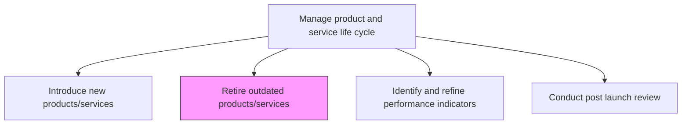
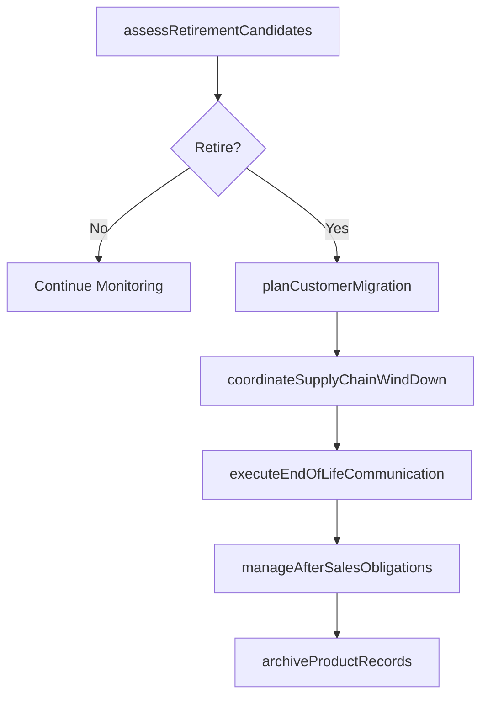

# Retire outdated products/services

> Business-as-Code definition for retiring outdated products and services. Models end-of-life planning, customer migration, supply chain wind-down, and brand preservation.

## Overview

Removing nonconforming products and services. Withdraw those products/services that do not conform to market realities and are not positioned to take advantage of prevailing opportunities. Coordinate with processing/delivery teams within the organization and key stakeholders in the supply chain. Create mechanisms for continued after-sales servicing, as well as deploy effective public relations efforts in order to preserve the image and goodwill of the organization through the process.

## Process Hierarchy



## GraphDL

```yaml
retire:
  object: Outdated Products/services
  actor: ProductLifecycleManager
  result: RetirementRecord
```

## Actions

| Action | Description |
|--------|-------------|
| assessRetirementCandidates | Evaluate underperforming products against retirement criteria |
| planCustomerMigration | Design transition paths for customers moving to successor offerings |
| coordinateSupplyChainWindDown | Align suppliers, distributors, and retailers on phase-out timeline |
| executeEndOfLifeCommunication | Notify customers, partners, and stakeholders of product retirement |
| manageAfterSalesObligations | Ensure continued warranty, support, and spare parts availability |
| archiveProductRecords | Preserve product documentation, specifications, and performance history |

## Events

| Event | Description |
|-------|-------------|
| retirementCandidatesAssessed | Products evaluated and retirement decisions made |
| customerMigrationPlanned | Customer transition pathways defined and communicated |
| supplyChainWindDownCoordinated | Supply chain partners aligned on phase-out schedule |
| endOfLifeCommunicated | Retirement notifications distributed to all stakeholders |
| afterSalesObligationsManaged | Post-retirement service commitments established |
| productRecordsArchived | Product documentation preserved for compliance and reference |

## Searches

| Search | Description |
|--------|-------------|
| getRetirementCandidates | List products flagged for potential retirement |
| getMigrationPaths | Retrieve customer migration options for a retiring product |
| getWindDownSchedule | Access supply chain phase-out timeline and milestones |
| getAfterSalesCommitments | Retrieve post-retirement service obligations |

## Process Flow



## RACI Matrix

| Activity | Responsible | Accountable | Consulted | Informed |
|----------|-------------|-------------|-----------|----------|
| assessRetirementCandidates | ProductLifecycleManager | VP Product | Finance, Sales | Executive |
| planCustomerMigration | CustomerSuccessManager | VP Product | Sales, Support | Marketing |
| coordinateSupplyChainWindDown | SupplyChainManager | VP Operations | Procurement, Logistics | Finance |
| executeEndOfLifeCommunication | CommunicationsManager | CMO | Product, Legal | AllStakeholders |

## Related Processes

| Process | Relationship |
|---------|-------------|
| 2.1.2.2 Introduce new products/services | Parallel - retirements often coordinated with new introductions |
| 2.1.2.4 Identify and refine performance indicators | Upstream - performance metrics trigger retirement evaluation |
| 2.1.1.1 Evaluate performance of existing products/services against market opportunities | Upstream - performance evaluation identifies retirement candidates |

## Related Departments

| Department | Role |
|-----------|------|
| Product Management | Leads retirement decision-making and planning |
| Customer Success | Manages customer migration to successor products |
| Supply Chain | Coordinates supplier and distributor phase-out |
| Legal | Ensures compliance with warranty and contractual obligations |
| Communications | Manages external messaging to preserve brand image |

## Related Occupations

| Occupation | Involvement |
|-----------|-------------|
| Product Lifecycle Manager | Leads end-of-life planning and execution |
| Customer Success Manager | Guides customer transitions |
| Supply Chain Manager | Manages inventory and supplier wind-down |

## KPIs

| KPI | Description | Unit |
|-----|-------------|------|
| Customer Migration Rate | Percentage of customers transitioned to successor products | % |
| Retirement Cycle Time | Duration from retirement decision to full market withdrawal | Months |
| After-Sales Compliance | Percentage of post-retirement service obligations met | % |
| Inventory Liquidation Rate | Percentage of remaining inventory sold or recycled at retirement | % |

## Usage

```typescript
import { retireOutdatedProductsServices } from '@headlessly/retire-outdated-products-services'

const lifecycle = retireOutdatedProductsServices()

// Assess products for potential retirement
const candidates = await lifecycle.assessRetirementCandidates({
  portfolioId: 'portfolio-2024',
  criteria: {
    revenueThreshold: 50000,
    marginFloor: 0.05,
    marketShareMinimum: 0.02
  }
})

// Plan customer migration for a retiring product
const migration = await lifecycle.planCustomerMigration({
  productId: candidates[0].id,
  successorProductId: 'prod-2025-next',
  migrationDeadline: '2025-12-31'
})
```
