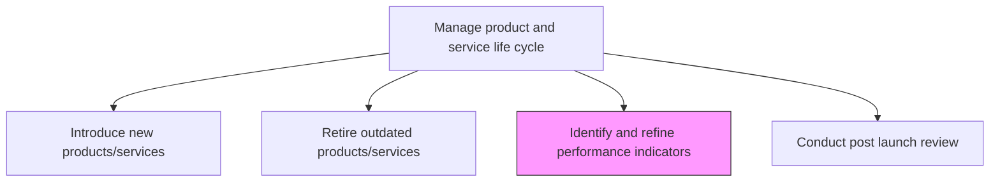
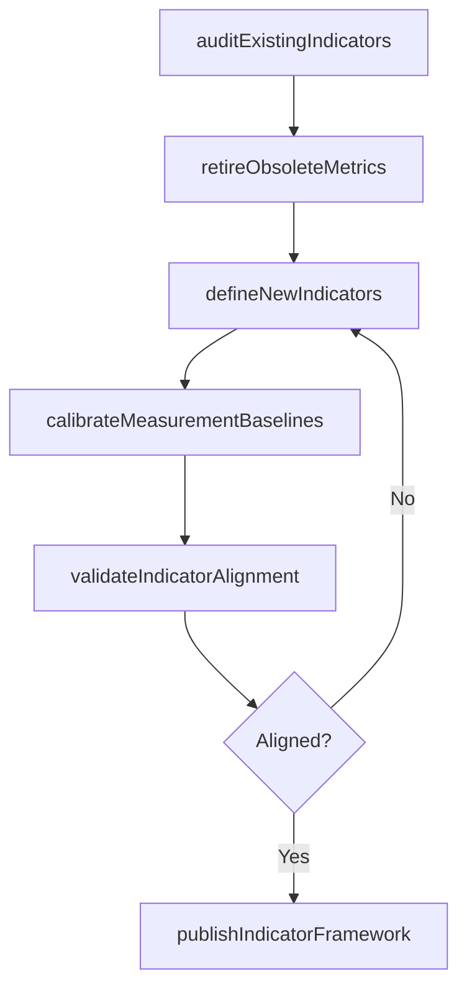

# Identify and refine performance indicators

> Business-as-Code definition for identifying and refining product performance indicators. Models KPI definition, measurement calibration, and metrics framework governance for evolving product portfolios.

## Overview

Attuning the performance measures of products/services to better reflect the revamped portfolio of solution offerings. Revise the parameters used to measure performance, apropos the organization's product/service offerings. (Modify these standards in consideration of the changes made to the portfolio by Introduce new products/services [10077] and Retire outdated products/services [10078].)

## Process Hierarchy



## GraphDL

```yaml
identify:
  object: And Refine Performance Indicators
  actor: PerformanceAnalyst
  result: PerformanceIndicatorFramework
```

## Actions

| Action | Description |
|--------|-------------|
| auditExistingIndicators | Review current KPIs for relevance against the updated portfolio |
| defineNewIndicators | Create performance metrics for newly introduced products/services |
| calibrateMeasurementBaselines | Set benchmarks and targets for each indicator |
| validateIndicatorAlignment | Confirm indicators reflect strategic objectives and portfolio changes |
| retireObsoleteMetrics | Remove KPIs tied to retired products or outdated business conditions |
| publishIndicatorFramework | Distribute the finalized performance measurement framework |

## Events

| Event | Description |
|-------|-------------|
| existingIndicatorsAudited | Current KPIs reviewed for relevance and accuracy |
| newIndicatorsDefined | Performance metrics established for new portfolio items |
| baselinesCalibrated | Measurement benchmarks and targets set for all indicators |
| indicatorAlignmentValidated | KPIs confirmed aligned with strategy and portfolio composition |
| obsoleteMetricsRetired | Outdated performance indicators decommissioned |
| indicatorFrameworkPublished | Updated measurement framework distributed to stakeholders |

## Searches

| Search | Description |
|--------|-------------|
| getPerformanceIndicators | Retrieve active KPIs by product, category, or portfolio segment |
| getIndicatorBaselines | Access benchmark values and targets for specific indicators |
| findObsoleteIndicators | List KPIs no longer aligned with the current portfolio |
| getIndicatorHistory | Retrieve historical performance data for trend analysis |

## Process Flow



## RACI Matrix

| Activity | Responsible | Accountable | Consulted | Informed |
|----------|-------------|-------------|-----------|----------|
| auditExistingIndicators | PerformanceAnalyst | VP Product | Finance, Quality | Executive |
| defineNewIndicators | PerformanceAnalyst | VP Product | Marketing, Engineering | Sales |
| calibrateMeasurementBaselines | DataAnalyst | VP Product | Finance, Operations | AllDepartments |
| publishIndicatorFramework | PerformanceAnalyst | CPO | Strategy | Board |

## Related Processes

| Process | Relationship |
|---------|-------------|
| 2.1.2.2 Introduce new products/services | Upstream - new introductions require new performance indicators |
| 2.1.2.3 Retire outdated products/services | Upstream - retirements trigger indicator decommissioning |
| 2.1.2.5 Conduct post launch review | Downstream - refined indicators support post-launch evaluation |

## Related Departments

| Department | Role |
|-----------|------|
| Product Management | Owns performance indicator definition and governance |
| Finance | Provides financial performance metrics and targets |
| Quality Assurance | Contributes quality and reliability indicators |
| Data Analytics | Supports baseline calibration and measurement validation |

## Related Occupations

| Occupation | Involvement |
|-----------|-------------|
| Performance Analyst | Leads indicator audit and definition |
| Data Analyst | Calibrates baselines and validates measurement accuracy |
| Product Manager | Ensures indicators reflect portfolio strategy |

## KPIs

| KPI | Description | Unit |
|-----|-------------|------|
| Indicator Coverage | Percentage of active products with defined performance indicators | % |
| Metric Relevance Score | Stakeholder rating of indicator usefulness | Score (1-10) |
| Baseline Accuracy | Variance between projected and actual indicator baselines | % |
| Framework Update Frequency | How often the indicator framework is reviewed and updated | Per Year |

## Usage

```typescript
import { identifyAndRefinePerformanceIndicators } from '@headlessly/identify-and-refine-performance-indicators'

const indicators = identifyAndRefinePerformanceIndicators()

// Audit existing indicators for the updated portfolio
const audit = await indicators.auditExistingIndicators({
  portfolioId: 'portfolio-2024',
  includeRetiredProducts: false
})

// Define new indicators for a recently launched product
const newKpis = await indicators.defineNewIndicators({
  productId: 'prod-2025-a',
  categories: ['revenue', 'adoption', 'quality', 'satisfaction'],
  targetPeriod: 'Q1-2025'
})
```
