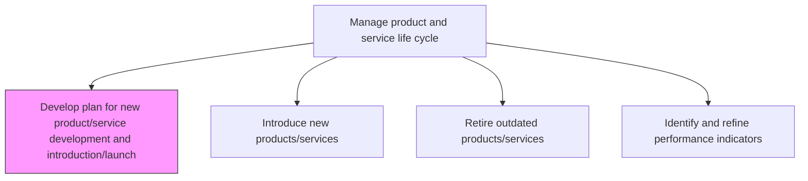
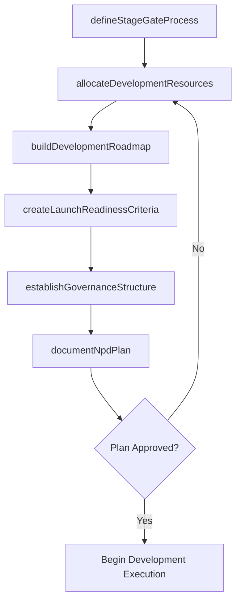

# Develop plan for new product/service development and introduction/launch

> Business-as-Code definition for developing plans for new product and service development and launch. Models stage-gate planning, resource allocation, and launch readiness governance.

## Overview

Developing a program and managing a perspective for new product/service introduction and launch.

## Process Hierarchy



## GraphDL

```yaml
develop:
  object: Plan For New Product/service Development And Introduction/launch
  actor: NewProductDevelopmentManager
  result: NpdLaunchPlan
```

## Actions

| Action | Description |
|--------|-------------|
| defineStageGateProcess | Establish the phased development process with decision gates |
| allocateDevelopmentResources | Assign teams, budgets, and facilities to development initiatives |
| createLaunchReadinessCriteria | Define the conditions that must be met before market introduction |
| buildDevelopmentRoadmap | Construct the timeline linking concept to market availability |
| establishGovernanceStructure | Set up steering committees and review cadences for oversight |
| documentNpdPlan | Compile the complete development and launch plan document |

## Events

| Event | Description |
|-------|-------------|
| stageGateProcessDefined | Phased development process with gates documented |
| developmentResourcesAllocated | Teams, budgets, and facilities assigned to initiatives |
| launchReadinessCriteriaDefined | Market introduction prerequisites established |
| developmentRoadmapBuilt | Timeline from concept through launch finalized |
| governanceStructureEstablished | Steering committees and review cadences set up |
| npdPlanDocumented | Complete development and launch plan approved |

## Searches

| Search | Description |
|--------|-------------|
| getNpdPlans | Retrieve development and launch plans by product or initiative |
| getStageGateStatus | Access current stage-gate progress for each development project |
| getResourceAllocations | List resource assignments across development initiatives |
| getLaunchReadiness | Retrieve launch readiness assessment for a specific product |

## Process Flow



## RACI Matrix

| Activity | Responsible | Accountable | Consulted | Informed |
|----------|-------------|-------------|-----------|----------|
| defineStageGateProcess | NpdManager | VP Product | Engineering, Quality | Executive |
| allocateDevelopmentResources | ProgramManager | CFO | HR, Engineering | Finance |
| buildDevelopmentRoadmap | NpdManager | VP Product | Marketing, Operations | Sales |
| documentNpdPlan | NpdManager | CPO | AllDepartments | Board |

## Related Processes

| Process | Relationship |
|---------|-------------|
| 2.1.2.2 Introduce new products/services | Downstream - launch plan guides market introduction |
| 2.1.1.3 Prioritize and select new product/service concepts | Upstream - selected concepts enter NPD planning |
| 2.3.1 Design and prototype products and services | Downstream - development plan drives design activities |

## Related Departments

| Department | Role |
|-----------|------|
| Product Management | Leads NPD plan development and governance |
| Engineering | Provides technical feasibility and resource estimates |
| Marketing | Defines market requirements and launch timing |
| Finance | Approves budgets and resource allocations |

## Related Occupations

| Occupation | Involvement |
|-----------|-------------|
| NPD Manager | Leads plan creation and stage-gate design |
| Program Manager | Manages resource allocation and roadmap construction |
| Marketing Director | Defines launch criteria and market timing |

## KPIs

| KPI | Description | Unit |
|-----|-------------|------|
| Plan Approval Cycle Time | Duration from plan drafting to formal approval | Days |
| Stage Gate Pass Rate | Percentage of projects passing each development gate | % |
| Resource Utilization | Percentage of allocated resources actively deployed | % |
| Launch Readiness Score | Composite score of launch criteria met at go/no-go decision | Score (0-100) |

## Usage

```typescript
import { developPlanForNewProductServiceDevelopmentAndIntroductionLaunch } from '@headlessly/develop-plan-for-new-product-service-development-and-introduction-launch'

const npdPlanner = developPlanForNewProductServiceDevelopmentAndIntroductionLaunch()

// Define the stage-gate process for a new product
const process = await npdPlanner.defineStageGateProcess({
  productId: 'prod-2025-concept',
  stages: ['discovery', 'scoping', 'businessCase', 'development', 'testing', 'launch'],
  gateApprovers: ['VP Product', 'CFO', 'CTO']
})

// Build the development roadmap
const roadmap = await npdPlanner.buildDevelopmentRoadmap({
  productId: 'prod-2025-concept',
  startDate: '2025-01-15',
  targetLaunchDate: '2025-09-01'
})
```
