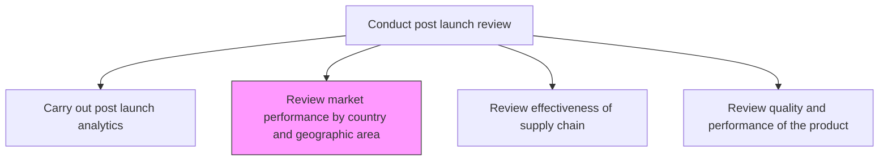
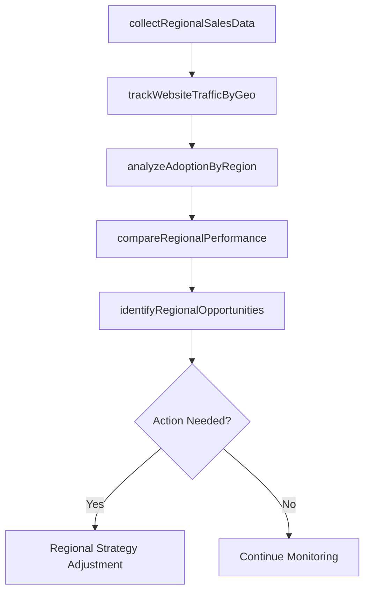

# Review market performance by country and geographic area

> Business-as-Code definition for reviewing market performance by country and geographic area. Models regional sales analysis, geographic adoption tracking, and market position assessment.

## Overview

Conducting customer and market analysis to review progress and identify opportunities for increasing market position. Track and review product/service response through sales reports, website statistics, direct response from customers, and survey reports.

## Process Hierarchy



## GraphDL

```yaml
review:
  object: Market Performance By Country And Geographic Area
  actor: RegionalMarketAnalyst
  result: RegionalPerformanceReport
```

## Actions

| Action | Description |
|--------|-------------|
| collectRegionalSalesData | Gather sales reports segmented by country and geography |
| analyzeAdoptionByRegion | Measure product adoption rates across geographic markets |
| trackWebsiteTrafficByGeo | Monitor digital engagement metrics by country and region |
| compareRegionalPerformance | Benchmark performance across geographic areas |
| identifyRegionalOpportunities | Detect underperforming or high-potential geographic markets |

## Events

| Event | Description |
|-------|-------------|
| regionalSalesDataCollected | Sales data compiled for all target geographies |
| adoptionByRegionAnalyzed | Regional adoption analysis completed |
| websiteTrafficTracked | Digital engagement metrics collected by geography |
| regionalPerformanceCompared | Cross-geography performance benchmarking finalized |
| regionalOpportunitiesIdentified | High-potential and underperforming regions documented |

## Searches

| Search | Description |
|--------|-------------|
| getSalesByRegion | Retrieve sales performance data filtered by country or region |
| getAdoptionMetrics | Access product adoption rates by geographic area |
| getRegionalBenchmarks | Retrieve cross-geography performance comparisons |

## Process Flow



## RACI Matrix

| Activity | Responsible | Accountable | Consulted | Informed |
|----------|-------------|-------------|-----------|----------|
| collectRegionalSalesData | RegionalMarketAnalyst | VP Marketing | Sales | Finance |
| analyzeAdoptionByRegion | RegionalMarketAnalyst | VP Marketing | Product | Executive |
| compareRegionalPerformance | MarketResearcher | VP Marketing | RegionalManagers | Strategy |

## Related Processes

| Process | Relationship |
|---------|-------------|
| 2.1.2.5.1 Carry out post launch analytics to test the acceptability in the market | Parallel - market analytics complement geographic analysis |
| 2.1.2.5.6 Conduct financial review | Downstream - regional performance feeds financial review |
| 2.1.2.2 Introduce new products/services | Upstream - launched products enter regional performance tracking |

## Related Departments

| Department | Role |
|-----------|------|
| Marketing | Leads regional market analysis and opportunity identification |
| Sales | Provides regional sales data and field intelligence |
| Business Intelligence | Supports data collection and analytics infrastructure |

## Related Occupations

| Occupation | Involvement |
|-----------|-------------|
| Regional Market Analyst | Conducts geographic performance analysis |
| Market Researcher | Gathers customer survey and adoption data |
| Sales Operations Analyst | Compiles regional sales reports |

## KPIs

| KPI | Description | Unit |
|-----|-------------|------|
| Regional Revenue Variance | Deviation between projected and actual revenue by region | % |
| Geographic Market Share | Market share captured in each target country or region | % |
| Regional Adoption Rate | Product adoption rate within each geographic market | % |
| Cross-Region Growth Spread | Difference between highest and lowest regional growth rates | Percentage Points |

## Usage

```typescript
import { reviewMarketPerformanceByCountryAndGeographicArea } from '@headlessly/review-market-performance-by-country-and-geographic-area'

const reviewer = reviewMarketPerformanceByCountryAndGeographicArea()

// Collect regional sales data
const salesData = await reviewer.collectRegionalSalesData({
  productId: 'prod-2025-a',
  regions: ['north-america', 'europe', 'asia-pacific'],
  period: 'Q1-2025'
})

// Compare performance across regions
const comparison = await reviewer.compareRegionalPerformance({
  productId: 'prod-2025-a',
  metrics: ['revenue', 'adoption', 'marketShare']
})
```
