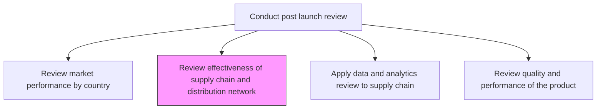
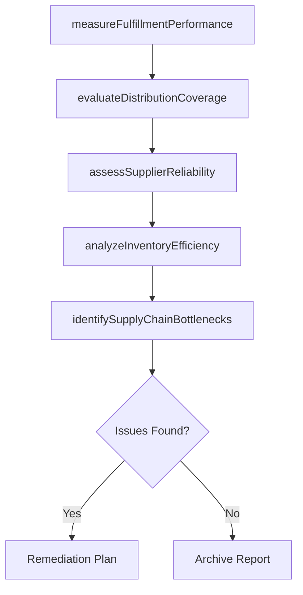

# Review effectiveness of supply chain and distribution network

> Business-as-Code definition for reviewing supply chain and distribution network effectiveness post-launch. Models logistics performance assessment, fulfillment analysis, and distribution optimization.

## Overview

Determining the performance of supply chain to all departments and logistics from input to shop floor. Seeking performance reviews at each intersection and communication channels. Review effectiveness of supply chain and distribution to check if it is meeting the demands of the various groups and organizations that are concerned with its activities (groups might include customers, partners, suppliers, and vendors).

## Process Hierarchy



## GraphDL

```yaml
review:
  object: Effectiveness Of Supply Chain And Distribution Network
  actor: SupplyChainAnalyst
  result: SupplyChainEffectivenessReport
```

## Actions

| Action | Description |
|--------|-------------|
| measureFulfillmentPerformance | Assess order fulfillment rates, accuracy, and delivery timeliness |
| evaluateDistributionCoverage | Analyze geographic and channel coverage of the distribution network |
| assessSupplierReliability | Review supplier on-time delivery, quality, and responsiveness |
| analyzeInventoryEfficiency | Evaluate inventory levels, turnover, and stockout frequency |
| identifySupplyChainBottlenecks | Detect constraints and inefficiencies in the supply chain |

## Events

| Event | Description |
|-------|-------------|
| fulfillmentPerformanceMeasured | Order fulfillment metrics compiled and analyzed |
| distributionCoverageEvaluated | Network coverage assessment completed |
| supplierReliabilityAssessed | Supplier performance review finalized |
| inventoryEfficiencyAnalyzed | Inventory performance metrics evaluated |
| supplyChainBottlenecksIdentified | Constraints and inefficiencies documented |

## Searches

| Search | Description |
|--------|-------------|
| getFulfillmentMetrics | Retrieve order fulfillment rates and delivery performance |
| getDistributionCoverage | Access distribution network reach by geography and channel |
| getSupplierScorecard | Retrieve supplier reliability and quality scores |
| getInventoryTurnover | Access inventory turnover and stockout data |

## Process Flow



## RACI Matrix

| Activity | Responsible | Accountable | Consulted | Informed |
|----------|-------------|-------------|-----------|----------|
| measureFulfillmentPerformance | SupplyChainAnalyst | VP Operations | Logistics | Product |
| evaluateDistributionCoverage | DistributionManager | VP Operations | Sales | Marketing |
| assessSupplierReliability | ProcurementManager | VP Operations | Quality | Finance |

## Related Processes

| Process | Relationship |
|---------|-------------|
| 2.1.2.5.4 Apply data and analytics review to supply chain methodologies | Downstream - effectiveness review feeds analytics-driven improvements |
| 2.1.2.5.2 Review market performance by country and geographic area | Parallel - distribution effectiveness impacts regional performance |
| 4.3.4 Manage logistics and warehousing | Related - logistics performance data feeds this review |

## Related Departments

| Department | Role |
|-----------|------|
| Supply Chain | Primary owner of effectiveness review |
| Logistics | Provides fulfillment and delivery performance data |
| Procurement | Contributes supplier reliability assessments |

## Related Occupations

| Occupation | Involvement |
|-----------|-------------|
| Supply Chain Analyst | Leads effectiveness assessment |
| Logistics Manager | Provides distribution performance data |
| Procurement Specialist | Assesses supplier performance |

## KPIs

| KPI | Description | Unit |
|-----|-------------|------|
| Order Fulfillment Rate | Percentage of orders fulfilled completely and on time | % |
| Distribution Coverage | Percentage of target markets served by distribution network | % |
| Supplier On-Time Delivery | Percentage of supplier deliveries received on schedule | % |
| Inventory Turnover | Number of times inventory is sold and replaced per period | Turns/Year |

## Usage

```typescript
import { reviewEffectivenessOfSupplyChainAndDistributionNetwork } from '@headlessly/review-effectiveness-of-supply-chain-and-distribution-network'

const reviewer = reviewEffectivenessOfSupplyChainAndDistributionNetwork()

// Measure fulfillment performance for a launched product
const fulfillment = await reviewer.measureFulfillmentPerformance({
  productId: 'prod-2025-a',
  period: 'Q1-2025',
  metrics: ['fillRate', 'onTimeDelivery', 'orderAccuracy']
})

// Identify bottlenecks in the supply chain
const bottlenecks = await reviewer.identifySupplyChainBottlenecks({
  productId: 'prod-2025-a',
  thresholds: { fulfillmentRate: 0.95, deliveryTime: 48 }
})
```
