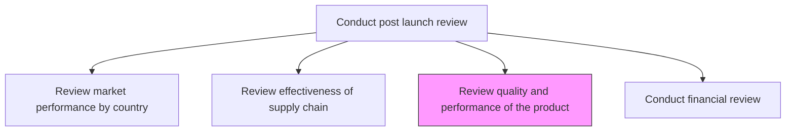
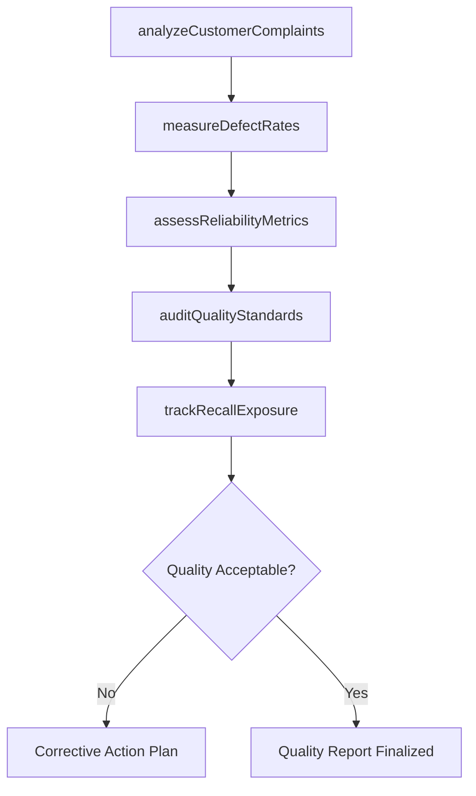

# Review quality and performance of the product

> Business-as-Code definition for reviewing product quality and performance post-launch. Models quality metrics analysis, customer complaint tracking, and reliability assessment.

## Overview

Identifying the quality and performance of the product/service delivered to customers. Analyze data from the customer feedback, audits, measures of customer satisfaction (such as product quality complaints and recalls), and organizational policies on delivery.

## Process Hierarchy



## GraphDL

```yaml
review:
  object: Quality And Performance Of Product
  actor: QualityAnalyst
  result: ProductQualityReport
```

## Actions

| Action | Description |
|--------|-------------|
| analyzeCustomerComplaints | Review customer feedback, complaints, and product return data |
| measureDefectRates | Calculate defect frequency and severity across production batches |
| assessReliabilityMetrics | Evaluate product reliability including failure rates and mean time between failures |
| auditQualityStandards | Verify delivered products meet defined quality specifications |
| trackRecallExposure | Monitor and assess potential or active product recall situations |

## Events

| Event | Description |
|-------|-------------|
| customerComplaintsAnalyzed | Customer feedback and complaint data reviewed and categorized |
| defectRatesMeasured | Defect frequency and severity calculations completed |
| reliabilityMetricsAssessed | Product reliability evaluation finalized |
| qualityStandardsAudited | Quality specification compliance verified |
| recallExposureTracked | Recall risk assessment updated |

## Searches

| Search | Description |
|--------|-------------|
| getQualityMetrics | Retrieve defect rates, failure data, and quality scores by product |
| getCustomerComplaints | Access customer complaint records filtered by type and severity |
| getReliabilityData | Retrieve product reliability and failure analysis data |

## Process Flow



## RACI Matrix

| Activity | Responsible | Accountable | Consulted | Informed |
|----------|-------------|-------------|-----------|----------|
| analyzeCustomerComplaints | QualityAnalyst | VP Quality | CustomerSupport | Product |
| measureDefectRates | QualityEngineer | VP Quality | Manufacturing | Engineering |
| auditQualityStandards | QualityAuditor | VP Quality | Regulatory | Executive |

## Related Processes

| Process | Relationship |
|---------|-------------|
| 2.1.2.5.6 Conduct financial review | Downstream - quality costs feed financial review |
| 2.1.2.5.7 Conduct NPD process assessment | Downstream - quality issues inform NPD process improvements |
| 2.3.1.5 Eliminate quality and reliability problems | Downstream - identified problems trigger corrective action |

## Related Departments

| Department | Role |
|-----------|------|
| Quality Assurance | Leads product quality and reliability assessment |
| Customer Support | Provides complaint and return data |
| Manufacturing | Contributes defect and production quality data |

## Related Occupations

| Occupation | Involvement |
|-----------|-------------|
| Quality Analyst | Leads post-launch quality assessment |
| Quality Engineer | Conducts defect and reliability analysis |
| Customer Support Manager | Provides customer feedback and complaint data |

## KPIs

| KPI | Description | Unit |
|-----|-------------|------|
| Defect Rate | Number of defects per thousand units produced | Defects/1000 Units |
| Customer Satisfaction Score | Post-purchase customer satisfaction rating | Score (1-10) |
| Complaint Resolution Time | Average time to resolve quality-related complaints | Hours |
| Recall Incident Rate | Number of recall events per product line per year | Incidents/Year |

## Usage

```typescript
import { reviewQualityAndPerformanceOfProduct } from '@headlessly/review-quality-and-performance-of-product'

const qualityReviewer = reviewQualityAndPerformanceOfProduct()

// Analyze customer complaints for a launched product
const complaints = await qualityReviewer.analyzeCustomerComplaints({
  productId: 'prod-2025-a',
  period: 'Q1-2025',
  categories: ['defect', 'performance', 'safety']
})

// Measure defect rates across production batches
const defects = await qualityReviewer.measureDefectRates({
  productId: 'prod-2025-a',
  batchRange: { from: 'batch-001', to: 'batch-050' }
})
```
