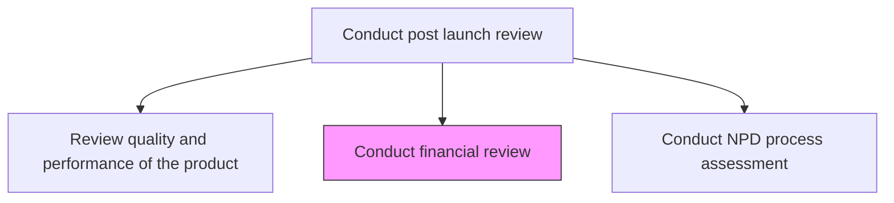
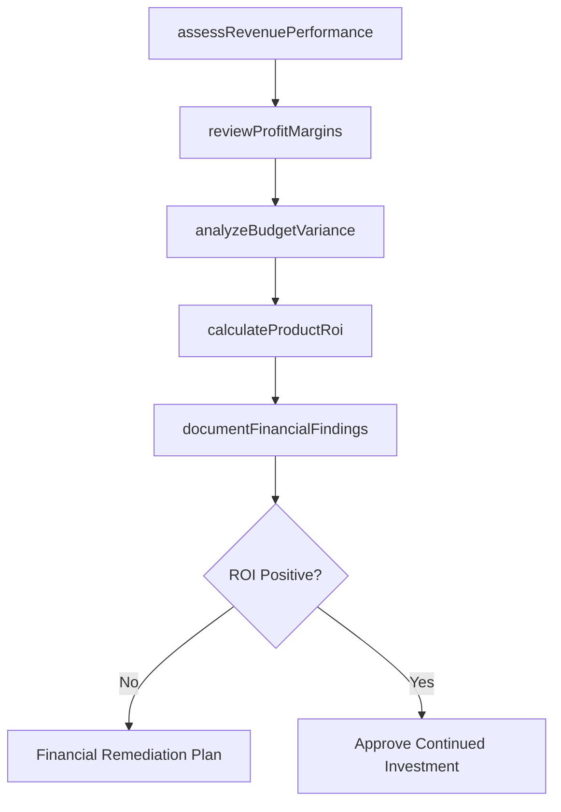

# Conduct financial review

> Business-as-Code definition for conducting post-launch financial review. Models ROI analysis, budget variance assessment, and financial performance comparison against the business case.

## Overview

Evaluating organization's financial reports and financial reporting processes. Review and document the ROI catered by the product/service delivery to the customer in the market.

## Process Hierarchy



## GraphDL

```yaml
conduct:
  object: Financial Review
  actor: FinanceAnalyst
  result: FinancialReviewReport
```

## Actions

| Action | Description |
|--------|-------------|
| calculateProductRoi | Compute return on investment for the launched product/service |
| analyzeBudgetVariance | Compare actual development and launch costs against approved budgets |
| assessRevenuePerformance | Evaluate actual revenue against business case projections |
| reviewProfitMargins | Analyze gross and net margins for the new product/service |
| documentFinancialFindings | Compile financial review findings and recommendations |

## Events

| Event | Description |
|-------|-------------|
| productRoiCalculated | Product ROI computation completed |
| budgetVarianceAnalyzed | Actual vs. budgeted cost comparison finalized |
| revenuePerformanceAssessed | Revenue actuals compared against projections |
| profitMarginsReviewed | Margin analysis completed and documented |
| financialFindingsDocumented | Financial review report compiled and distributed |

## Searches

| Search | Description |
|--------|-------------|
| getProductRoi | Retrieve ROI calculations for a specific product |
| getBudgetVariance | Access cost variance data between plan and actuals |
| getRevenueActuals | Retrieve actual revenue performance versus projections |

## Process Flow



## RACI Matrix

| Activity | Responsible | Accountable | Consulted | Informed |
|----------|-------------|-------------|-----------|----------|
| calculateProductRoi | FinanceAnalyst | CFO | Product | Board |
| analyzeBudgetVariance | FinanceAnalyst | CFO | ProgramManager | Executive |
| assessRevenuePerformance | FinanceAnalyst | CFO | Sales, Marketing | Product |

## Related Processes

| Process | Relationship |
|---------|-------------|
| 2.1.2.5.5 Review quality and performance of the product | Upstream - quality costs affect financial outcomes |
| 2.1.2.5.7 Conduct NPD process assessment | Parallel - financial data informs NPD process evaluation |
| 2.1.1.4 Plan and develop cost and quality targets | Related - financial review validates original cost targets |

## Related Departments

| Department | Role |
|-----------|------|
| Finance | Leads financial review and ROI analysis |
| Product Management | Provides business case and revenue projections |
| Sales | Contributes actual revenue and pipeline data |

## Related Occupations

| Occupation | Involvement |
|-----------|-------------|
| Financial Analyst | Conducts ROI and budget variance analysis |
| Controller | Validates financial data accuracy |
| Product Manager | Provides business case context for comparison |

## KPIs

| KPI | Description | Unit |
|-----|-------------|------|
| Product ROI | Return on investment for the launched product | % |
| Budget Variance | Percentage deviation between actual and budgeted costs | % |
| Revenue vs. Forecast | Actual revenue as a percentage of business case projection | % |
| Gross Margin | Gross profit margin for the new product/service | % |

## Usage

```typescript
import { conductFinancialReview } from '@headlessly/conduct-financial-review'

const finReview = conductFinancialReview()

// Calculate ROI for the launched product
const roi = await finReview.calculateProductRoi({
  productId: 'prod-2025-a',
  investmentPeriod: '2024-01-01/2025-03-31',
  includeIndirectCosts: true
})

// Analyze budget variance
const variance = await finReview.analyzeBudgetVariance({
  productId: 'prod-2025-a',
  categories: ['development', 'marketing', 'operations']
})
```
