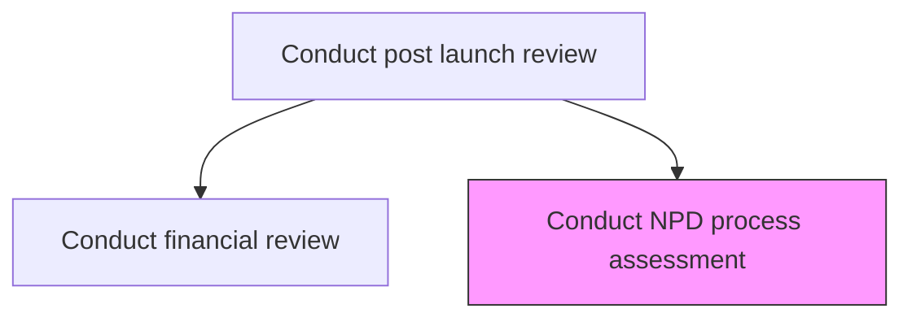
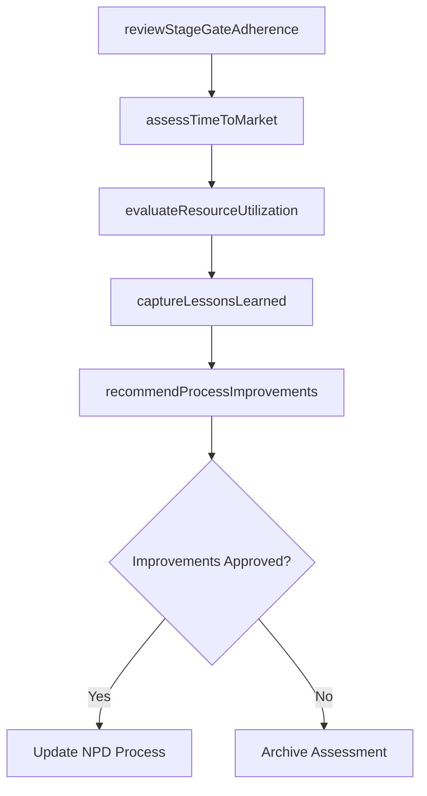

# Conduct NPD process assessment

> Business-as-Code definition for conducting NPD process assessment. Models development process evaluation, lessons learned capture, and continuous improvement of new product development methodology.

## Overview

Analyzing the steps involved in the development of new product, its effect on existing product, resources, and functions related to the development of the new product until its sale in the competitive market place.

## Process Hierarchy



## GraphDL

```yaml
conduct:
  object: NPD Process Assessment
  actor: NpdProcessManager
  result: NpdAssessmentReport
```

## Actions

| Action | Description |
|--------|-------------|
| reviewStageGateAdherence | Assess compliance with the defined stage-gate development process |
| evaluateResourceUtilization | Analyze how effectively development resources were deployed |
| captureLessonsLearned | Document successes, failures, and improvement opportunities from the NPD cycle |
| assessTimeToMarket | Compare actual development timeline against original targets |
| recommendProcessImprovements | Propose changes to the NPD process for future initiatives |

## Events

| Event | Description |
|-------|-------------|
| stageGateAdherenceReviewed | Stage-gate compliance assessment completed |
| resourceUtilizationEvaluated | Development resource deployment analysis finalized |
| lessonsLearnedCaptured | NPD cycle learnings documented and categorized |
| timeToMarketAssessed | Actual vs. planned timeline comparison completed |
| processImprovementsRecommended | NPD process enhancement proposals submitted |

## Searches

| Search | Description |
|--------|-------------|
| getNpdAssessments | Retrieve NPD process assessment reports by product or cycle |
| getLessonsLearned | Access documented lessons learned from past NPD initiatives |
| getProcessMetrics | Retrieve NPD process efficiency and effectiveness metrics |

## Process Flow



## RACI Matrix

| Activity | Responsible | Accountable | Consulted | Informed |
|----------|-------------|-------------|-----------|----------|
| reviewStageGateAdherence | NpdProcessManager | VP Product | Engineering, Quality | Executive |
| captureLessonsLearned | ProjectManager | VP Product | AllTeams | Strategy |
| recommendProcessImprovements | NpdProcessManager | CPO | Engineering, Operations | Board |

## Related Processes

| Process | Relationship |
|---------|-------------|
| 2.1.2.5.6 Conduct financial review | Upstream - financial results inform process efficiency assessment |
| 2.1.2.1 Develop plan for new product/service development and introduction/launch | Related - assessment findings improve future NPD planning |
| 2.3.1 Design and prototype products and services | Related - design process effectiveness evaluated |

## Related Departments

| Department | Role |
|-----------|------|
| Product Management | Leads NPD process assessment |
| Engineering | Provides development process feedback and metrics |
| Quality Assurance | Contributes quality gate compliance data |

## Related Occupations

| Occupation | Involvement |
|-----------|-------------|
| NPD Process Manager | Leads the process assessment |
| Project Manager | Provides timeline and resource utilization data |
| Quality Assurance Manager | Evaluates gate compliance |

## KPIs

| KPI | Description | Unit |
|-----|-------------|------|
| Stage Gate Pass Rate | Percentage of gates passed on first attempt | % |
| Time-to-Market Variance | Deviation between planned and actual development duration | Days |
| Resource Utilization Rate | Percentage of allocated resources effectively utilized | % |
| Lessons Implemented Rate | Percentage of documented lessons applied to subsequent projects | % |

## Usage

```typescript
import { conductNpdProcessAssessment } from '@headlessly/conduct-npd-process-assessment'

const npdAssessor = conductNpdProcessAssessment()

// Review stage-gate adherence for a completed NPD cycle
const adherence = await npdAssessor.reviewStageGateAdherence({
  productId: 'prod-2025-a',
  gates: ['discovery', 'scoping', 'development', 'testing', 'launch']
})

// Capture lessons learned
const lessons = await npdAssessor.captureLessonsLearned({
  productId: 'prod-2025-a',
  categories: ['process', 'resource', 'quality', 'timeline']
})
```
