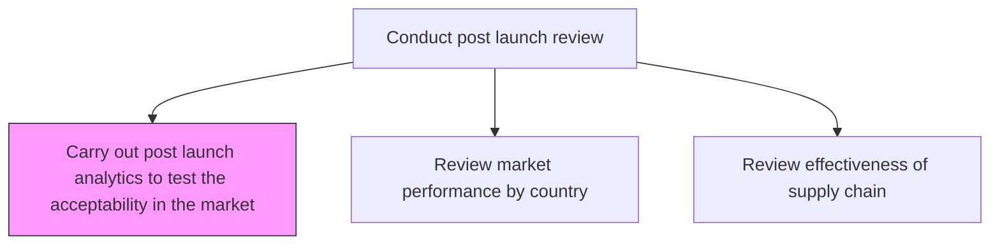
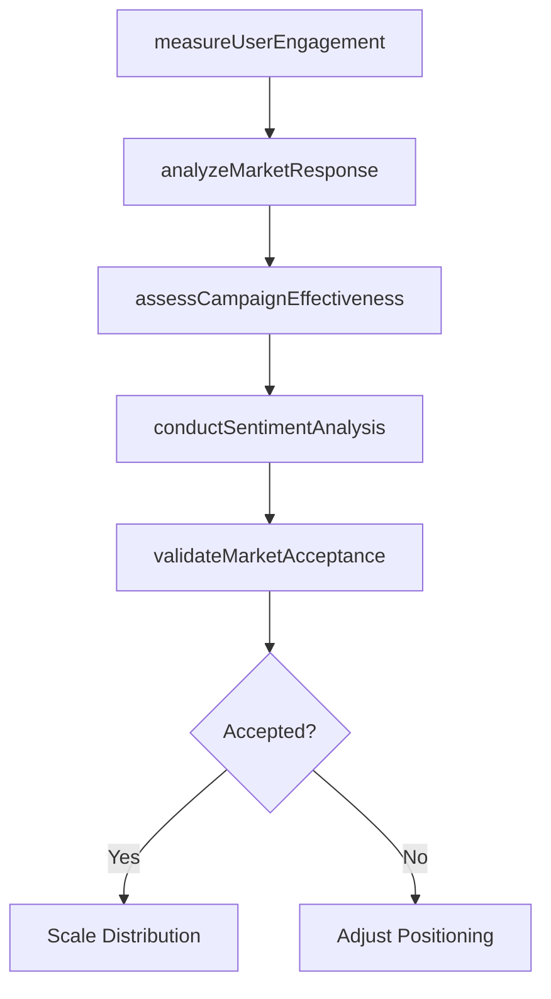

# Carry out post launch analytics to test the acceptability in the market

> Business-as-Code definition for carrying out post-launch analytics to test market acceptability. Models user engagement measurement, market response analysis, and acceptance validation.

## Overview

Measuring the performance of marketing once the product/services are launched. This broadly covers measuring user engagement and product's/service's performance in the market.

## Process Hierarchy



## GraphDL

```yaml
carry:
  object: Out Post Launch Analytics To Test Acceptability In Market
  actor: MarketingAnalyst
  result: MarketAcceptanceReport
```

## Actions

| Action | Description |
|--------|-------------|
| measureUserEngagement | Track user interaction metrics including activation, retention, and usage patterns |
| analyzeMarketResponse | Evaluate initial market reaction through sales velocity and demand signals |
| assessCampaignEffectiveness | Measure marketing campaign performance against launch objectives |
| conductSentimentAnalysis | Analyze customer sentiment from reviews, social media, and surveys |
| validateMarketAcceptance | Determine whether the product meets acceptance thresholds |

## Events

| Event | Description |
|-------|-------------|
| userEngagementMeasured | User interaction and engagement metrics compiled |
| marketResponseAnalyzed | Initial market response data evaluated |
| campaignEffectivenessAssessed | Marketing campaign performance metrics finalized |
| sentimentAnalysisCompleted | Customer sentiment data analyzed and reported |
| marketAcceptanceValidated | Product acceptance determination made |

## Searches

| Search | Description |
|--------|-------------|
| getEngagementMetrics | Retrieve user engagement data for the launched product |
| getMarketResponseData | Access initial sales velocity and demand signal data |
| getSentimentScores | Retrieve customer sentiment analysis results |

## Process Flow



## RACI Matrix

| Activity | Responsible | Accountable | Consulted | Informed |
|----------|-------------|-------------|-----------|----------|
| measureUserEngagement | MarketingAnalyst | VP Marketing | Product | Sales |
| analyzeMarketResponse | MarketingAnalyst | VP Marketing | Sales | Executive |
| validateMarketAcceptance | ProductManager | VP Product | Marketing, Finance | Board |

## Related Processes

| Process | Relationship |
|---------|-------------|
| 2.1.2.5.2 Review market performance by country and geographic area | Downstream - acceptance data feeds regional performance review |
| 2.1.2.2 Introduce new products/services | Upstream - launched products enter acceptance testing |
| 3.5.3 Manage marketing campaigns | Related - campaign effectiveness data feeds this analysis |

## Related Departments

| Department | Role |
|-----------|------|
| Marketing | Leads post-launch analytics and campaign assessment |
| Product Management | Validates market acceptance against product goals |
| Data Analytics | Supports engagement measurement and sentiment analysis |

## Related Occupations

| Occupation | Involvement |
|-----------|-------------|
| Marketing Analyst | Executes post-launch analytics |
| Data Scientist | Conducts engagement and sentiment analysis |
| Product Manager | Interprets acceptance results |

## KPIs

| KPI | Description | Unit |
|-----|-------------|------|
| User Activation Rate | Percentage of new users who complete key onboarding actions | % |
| Net Promoter Score | Customer willingness to recommend the product | Score (-100 to 100) |
| Campaign Conversion Rate | Percentage of marketing leads converting to customers | % |
| Market Acceptance Score | Composite score measuring overall market reception | Score (0-100) |

## Usage

```typescript
import { carryOutPostLaunchAnalyticsToTestAcceptabilityInMarket } from '@headlessly/carry-out-post-launch-analytics-to-test-acceptability-in-market'

const analytics = carryOutPostLaunchAnalyticsToTestAcceptabilityInMarket()

// Measure user engagement post-launch
const engagement = await analytics.measureUserEngagement({
  productId: 'prod-2025-a',
  period: 'first-30-days',
  metrics: ['activation', 'retention', 'dailyActiveUsers']
})

// Validate market acceptance
const acceptance = await analytics.validateMarketAcceptance({
  productId: 'prod-2025-a',
  thresholds: { activationRate: 0.60, nps: 30, conversionRate: 0.05 }
})
```
