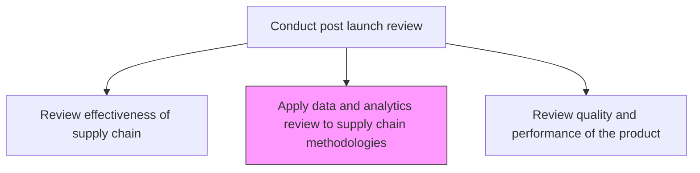
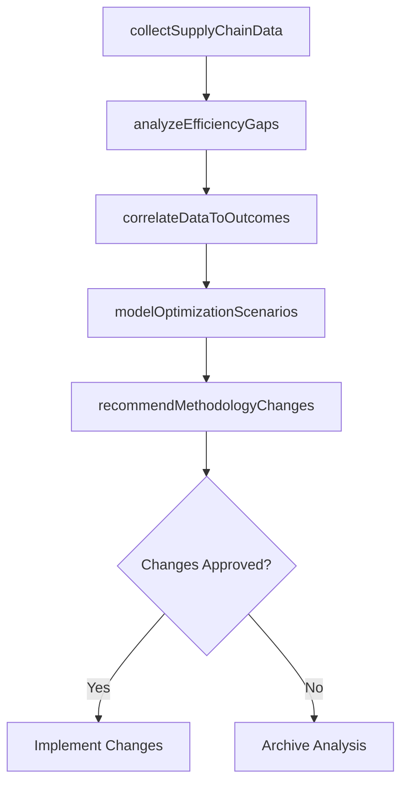

# Apply data and analytics review to supply chain methodologies

> Business-as-Code definition for applying data and analytics to supply chain methodology improvements. Models data-driven supply chain optimization, gap analysis, and efficiency enhancement.

## Overview

Collecting and examining raw data with the purpose of drawing conclusions about that information and correlate gaps and efficiencies to the existing supply chain channels. Apply the information to make better business decisions to the related supply chain methodologies to meet efficiency.

## Process Hierarchy



## GraphDL

```yaml
apply:
  object: Data And Analytics Review To Supply Chain Methodologies
  actor: SupplyChainDataAnalyst
  result: SupplyChainOptimizationPlan
```

## Actions

| Action | Description |
|--------|-------------|
| collectSupplyChainData | Gather operational data across procurement, logistics, and distribution channels |
| analyzeEfficiencyGaps | Identify inefficiencies and bottlenecks in current supply chain methodologies |
| correlateDataToOutcomes | Link supply chain performance data to business results and customer satisfaction |
| modelOptimizationScenarios | Simulate alternative supply chain configurations for improved efficiency |
| recommendMethodologyChanges | Propose data-backed changes to supply chain processes and methods |

## Events

| Event | Description |
|-------|-------------|
| supplyChainDataCollected | Operational data gathered from all supply chain touchpoints |
| efficiencyGapsAnalyzed | Supply chain inefficiencies identified and quantified |
| dataCorrelatedToOutcomes | Performance data linked to business outcomes |
| optimizationScenariosModeled | Alternative configurations simulated and compared |
| methodologyChangesRecommended | Data-driven improvement proposals submitted |

## Searches

| Search | Description |
|--------|-------------|
| getSupplyChainAnalytics | Retrieve analytics data across supply chain operations |
| getEfficiencyGaps | Access identified gaps and their estimated impact |
| getOptimizationScenarios | Retrieve modeled supply chain optimization scenarios |

## Process Flow



## RACI Matrix

| Activity | Responsible | Accountable | Consulted | Informed |
|----------|-------------|-------------|-----------|----------|
| collectSupplyChainData | SupplyChainDataAnalyst | VP Operations | IT, Logistics | Procurement |
| analyzeEfficiencyGaps | SupplyChainDataAnalyst | VP Operations | Manufacturing | Finance |
| recommendMethodologyChanges | SupplyChainManager | VP Operations | Product, Procurement | Executive |

## Related Processes

| Process | Relationship |
|---------|-------------|
| 2.1.2.5.3 Review effectiveness of supply chain and distribution network | Upstream - effectiveness review data feeds analytics |
| 2.1.2.5.6 Conduct financial review | Related - supply chain efficiency impacts financial outcomes |
| 4.3 Manage logistics and warehousing | Related - logistics operations provide source data |

## Related Departments

| Department | Role |
|-----------|------|
| Supply Chain | Leads data collection and methodology optimization |
| Data Analytics | Supports data modeling and scenario analysis |
| Operations | Implements approved methodology changes |

## Related Occupations

| Occupation | Involvement |
|-----------|-------------|
| Supply Chain Data Analyst | Leads analytics and gap analysis |
| Operations Research Analyst | Models optimization scenarios |
| Supply Chain Manager | Approves and implements methodology changes |

## KPIs

| KPI | Description | Unit |
|-----|-------------|------|
| Supply Chain Cost Reduction | Percentage reduction in supply chain costs from analytics-driven changes | % |
| Efficiency Improvement Rate | Measurable throughput improvement after methodology changes | % |
| Data Coverage | Percentage of supply chain touchpoints with analytics instrumentation | % |
| Recommendation Implementation Rate | Percentage of analytics recommendations adopted | % |

## Usage

```typescript
import { applyDataAndAnalyticsReviewToSupplyChainMethodologies } from '@headlessly/apply-data-and-analytics-review-to-supply-chain-methodologies'

const scAnalytics = applyDataAndAnalyticsReviewToSupplyChainMethodologies()

// Analyze efficiency gaps in the supply chain
const gaps = await scAnalytics.analyzeEfficiencyGaps({
  productId: 'prod-2025-a',
  channels: ['directShip', 'warehouse', 'dropShip'],
  period: 'Q1-2025'
})

// Model optimization scenarios
const scenarios = await scAnalytics.modelOptimizationScenarios({
  currentState: gaps.baseline,
  variables: ['leadTime', 'inventoryLevels', 'transportMode']
})
```
